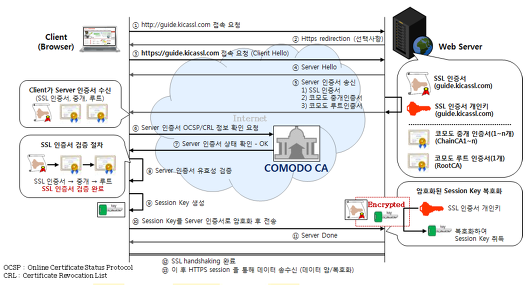

## 🌕 F-lab 멘토링 기록

멘토링 이후 부족한 부분을 채우기 위한 기록

### ❔ 옵저버 패턴이란

옵저버 패턴(observer pattern)은 객체의 상태 변화를 관찰하는 관찰자들, 즉 옵저버들의 목록을 객체에 등록하여 상태 변화가 있을 때마다 메서드 등을 통해 객체가 직접 목록의 각 옵저버에게 통지하도록 하는 디자인 패턴이다. 주로 분산 이벤트 핸들링 시스템을 구현하는 데 사용된다. 발행/구독 모델로 알려져 있기도 하다.<br/>
좀더 단순하게 생각하면 `어떤 객체(A)의 상태가 변할 때, 그와 연관된 객체들(B)에게 알림을 보냄으로써 객체 간의 의존성을 낮추는 디자인 패턴`이다.<br/>
B는 A를 구독함으로써 , A에서 어떤 이벤트를 발행할 때 B의 상태가 변경되게끔 하는 디자인 패턴이다.<br/>
A는 Observable, Subject 등으로 불리고 Model이 그 역할을 한다. B는 Observer이며 View에 해당한다.

```js
class Observable {
  constructor() {
    this._observers = new Set();
  }
  subscribe(observer) {
    this._observers.add(observer);
  }
  unsubscribe(observer) {
    this._observers = [...this._observers].filter((subscriber) => subscriber !== observer);
  }
  notify(data) {
    this._observers.forEach((observer) => observer(data));
  }
}
```

#### 옵저버 패턴을 이용해 해결하려는 상태 변경?

한 객체의 상태가 변경되었을 때, 이 객체에게 의존하고 있는 모든 객체들에게 상태 변경에 대해 알리면서 동시에 어떤 행동을 취하게 하는 것<br/>
`느슨한 결합`: 두 객체가 상호작용을 하지만, 서로에 대해서는 잘 모르게 하는 결합

- 상태가 변경되는 객체(Subject)는 Observer들의 정보를 구체적으로 알 필요없이 정보 전달을 할 수 있다.

### ❔ immutable을 유지하면서 객체를 변경하는 방법

```js
const a = {
  name: 'hodu',
  others: { age: 2, favorite: 'walking' },
};

// age만 변경하여 다른 객체 만들기

// 1) Object.assign() 이용
const b = Object.assign({}, a, {
  others: Object.assign({}, { age: 2, favorite: 'walking' }, { age: 31 }),
});

// 2) spread 연산자 이용
const b = { ...a, others: { ...a.others, age: 31 } };
```

### ❔ SPA 그리고 라우팅

#### SPA

SPA란 Single Page Application의 약자로, 하나의 페이지에서 동적으로 원하는 부분만 데이터를 바인딩하며 화면을 바꿔가며 표현하는 것이다.<br/>
클릭, 스크롤 등의 상호작용을 위한 최소한의 요소 변경이 일어나고 유저의 눈에 페이지 변경이 일어난다고 보여지는 것 또한 최초 로드된 자바스크립트를 통해 동적으로 변경되는 것이다.(서버에서 새로운 html을 요청하는 것이 아니다.)

##### SPA의 단점

- 자바스크립트가 동적으로 화면 혹은 데이터를 다루기 때문에, 일반적인 html을 크롤링하는 검색 엔진에 있어 최적화가 어려울 수 있다.
- 페이지 초기 로드 시, 웹과 관련한 파일들이 번들되어 전송되기에 초기 로드 속도가 느릴 수 있다.
  - 이를 극복하기 위해 코드 스플리팅, gzip 압축 등의 방법이 있으며 이마저도 해결이 힘들면 SSR(Server Side Rendering)로 넘어간다.

#### 라우팅

SPA를 통해 UX(User Experience; 사용자 경험)를 높인 것은 좋았다. 그런데 단일 페이지이다 보니 상식적으로 생각해봐도 페이지의 `앞, 뒤`를 오갈 수 있는 앞으로가기, 뒤로가기가 불가능하다. 즉, 사용자 경험이 떨어지게 된 것이다.<br/>
이를 해결하기 위해 등장한 것이 client routing 개념이며, 단순하게 생각하면 클라이언트 영역에서 가상의 페이지 주소(route)를 만들어 화면 이동이 일어난 것처럼 작동하게 하는 것이다. 이 때, 브라우저에서 제공하는 `history API`를 활용하게 된다.

- history.back(): 세션 기록 바로 이전 페이지로 이동하는 비동기 메서드. `뒤로 가기`
- history.forward(): 세션 기록 바로 이후 페이지로 이동하는 비동기 메서드. `앞으로 가기`
- history.go(): 특정 세션 기록으로 이동하게 해주는 메서드. 0은 현재 위치이며 -1은 이전, 1은 이후 페이지로 이동한다.
- history.pushState(): 주어진 데이터를 세션 기록 스택에 담는다. 직렬화 가능한 모든 JavaScript 객체를 저장 가능하다.
- history.replaceState(): 최근 세션 기록 스택의 내용을 주어진 데이터로 교체한다.

> 즉, history API를 이용하여 주소를 인위적으로 변경하고, 서버로 새로운 페이지를 요청하는 것이 아니라 history.state에 담아둔 정보로 ajax 요청을 보내 화면을 갱신할 수 있게 된다.

### ❔ Test 3가지

#### 유닛 테스트(unit test)

- 전체 코드 중 작은 단위를 다루는 테스트(주로 함수 단위)
- 테스트에 네트웤, DB와 같은 외부 리소스가 포함된다면 유닛 테스트가 아니다.
- 유닛 테스트는 간단하고 명확해야한다. 예측값과 입력값에 대한 함수의 출력값을 비교
- 코드 자체의 설계가 좋지 못하다면, 유닛 테스트를 작성하는 것도 어려워진다.
- 어떠한 부분에서 문제가 있고 고칠 부분이 어디인지 명확하게 해준다.

#### 통합 테스트(Integration test)

- 각각의 시스템들이 서로 어떻게 상호작용하고, 제대로 작동하는지 테스트하는 것
- 유닛 테스트와 유사하지만, 유닛 테스트는 다른 컴포넌트들과 독립적으로 테스트하는 반면 통합 테스트는 그렇지 않다.
- 일반적으로 유닛 테스트로 충분하지 않다고 느낄 때 사용하며, 대게 유닛 테스트보다 복잡하고 오랜 시간이 걸리기 떄문에 유닛 테스트에 집중하는 것이 좋다.

#### 시스템 테스트(System test)

- 소프트웨어(제품)가 완전히 통합되어 구축된 상태에서 제품의 기능을 총체적으로 검사하는 것
- 각각의 통합된 모듈들이 원래 계획했던 대로 작동하는지, 스스템의 실제 동작과 의도와는 차이가 없는지 등을 판단한다.
- 시스템의 내부적인 구현 방식, 설계에 대한 지식과 관계없이 테스트를 수행하기 때문에 블랙박스 테스트의 일종으로 분류된다.

> 블랙박스 테스트: 소프트웨어에 대한 `내부 구조나 작동 원리를 모르는 상태`에서 소프트웨어의 동작을 검사하는 방법<br/>
> 주로 올바른/올바르지 않은 입력을 하나하나 동원하여 올바른 출력을 판별하는 방식으로 이루어진다.

### ❔ OOP의 4대 핵심 개념(feat. JavaScript)

캡슐화(Encapsulation)

- 내부에서만 알고 있어도 되는 정보는 외부에 공개하지 않는다.(`정보은닉`)
- 단, 필요한 부분에 한해서만 외부의 접근은 허용한다.
- 공식적으로 JavaScript는 지원하지는 않는지만, 클로저나 module pattern 등의 방식으로 구현은 가능

상속(Inheritance)

- 상위 클래스의 프로퍼티, 메서드를 하위 클래스에서도 사용
- 즉, 코드의 `재사용`하기 위한 목적
- ES6의 Class에는 extends, super()을 통해 상속이 가능
- 단, 이 또한 JavaScript의 prototype chain을 통해 구현되어있는 것이다.

추상화(Abstraction)

- 구현하려는 실체에 대해서 필요한 부분만을 선택하여 클래스로 만들 수 있는 것
- '차'는 '버스'와 '중장비' 클래스로 구분지을 수 있다. 허나, 버스와 중장비는 서로 다른 프로퍼티와 메서드가 필요하다. 즉, 이렇게 필요한 부분을 선택하여 클래스를 만들 수 있는 것이 추상화
- 당연히 JavaScript에서도 추상화 가능!

다형성(Polymorphism)

- 다양한 성질로 동작할 수 있는 것
- Java에서의 예시
  - 오버라이딩(overriding): A라는 클래스를 상속하는 a라는 하위 클래스가 있을 때, A의 메서드를 a에서 재정의하는 것
  - 오버로딩(overloading): B라는 클래스내에 add(x, y)라는 메서드를 정의할 때 x와 y가 int 자료형일 때의 add와 str 자료형일 때의 add를 같은 이름의 메서드로 구현할 수 있는 것(즉, add(x, y)는 x와 y가 int든, str이든 상관없이 해당하는 메서드를 실행할 수 있게 된다.)
- JavaScript에서는 prototype chain으로 오버라이딩을 구현할 수 있다.
- 다만, overloading의 경우 공식적인 지원은 없다.(굳이 억지로 하자면, 변수의 타입을 체크하고 다른 메서드를 호출해서 실행하는 방법이 있긴하다.)
- JavaScript에 다형성이 존재하는가? 는 중요한 논쟁거리는 아니다!

### ❔ CORS란 무엇이고 어떻게 해결할 수 있을까

CORS 정책이란 단순하게 생각하면 SOP(Same-Origin Policy)에 대한 예외 조항이다.<br/>
기본적으로 웹 브라우저는 SOP에 따라, 동일한 출처(출처 = 프로토콜 + 호스트 + 포트)의 리소스만 공유 가능하다. 하지만 웹 페이지를 구성 시 외부의 리소스를 사용할 수 밖에 없으므로 이에 대한 예외조항으로 CORS(Cross-Origin Resource Sharing)를 두고 있다.

#### CORS 해결 방법

- 동일 출처로 이동: 아주 단순하게 같은 출처로 이동시킨다.
- 서버에서 Access-Control-Allow-Origin 헤더를 추가한다.
  - 리소스의 출처가 되는 서버에, 모든 클라이언트 요청에 대한 cross-origin http 요청을 허가하는 `Access-Control-Allow-Origin` 헤더를 추가해준다. 다만, 전체 호스트에 대한 요청을 허용하게 되기에 보안에 취약해진다.
- Proxy: Proxy Server는 헤더를 추가하거나 요청을 허용 및 거부하는 역할을 중간에서 해줄 수 있기 때문에 프록시 서버에서 `Access-Control-Allow-Origin` 헤더를 담아 응답해 주면 된다.
  - proxy는 필수적이진 않지만, 백엔드에서 개발서버를 위한 CORS를 설정을 안해도 되기에 불필요한 코드를 아낄 수 있다.
  - 프론트엔드에선 `webpack-dev-server proxy`를 사용하여 서버쪽 코드를 수정하지 않고 해결할 수 있다.

### ❔ http에서 https로 s가 붙는 과정(ssl 인증서 발급의 일련 과정)

인터넷 상에서 웹 브라우저(Client)와 웹 서버(Server)간에 데이터를 안전하게 주고 받기 위해서는 서로 암호화하여 통신을 해야한다.<br/>
`SSL(Secure Socket Layer)`은 웹 브라우저와 서버간 암호화 통신을 위한 프로토콜이며, SSL인증서는 SSL 기반하에서 브라우저와 서버가 암호화 통신을 가능하게 하는 인증서(제3의 신뢰기간이 인증한)를 의미한다.<br/>

#### SSL인증서의 3가지 기능

- 정보 유출 방지: 표준 암호화 기법을 통해 전송자의 정보를 안전하게 전송
- 기업 실체성 확인: 예를 들어, 쿠팡에 주문을 할 때 쿠팡이라는 기업의 실체성(사업자 등록과 같은)을 확인 후에 쿠팡에 SSL 인증서를 발급
- 위조사이트 방지: 사이트의 진위 여부를 판단

#### 암호화

브라우저가 메시지를 암호화하여 서버에 전송하면, 서버는 암호화키(비밀키)로 암호화된 메시지를 해독(복호화)하는 과정이 이뤄진다.<br/>

- 대칭키 암호화: 메시지를 암호화할 때 사용하는 비밀키와 메시지를 복호화할 때 사용하는 비밀키가 같은 경우

> 이 때, 그렇다면 같은 비밀키를 어떻게 브라우저와 서버가 전달할지에 대한 문제가 발생한다.<br/>
> USB 등의 저장장치로 전달하는 방법, 비밀키 자체를 암호화하여 전달하는 방법 등이 있는데 이는 현실적으로 해결책이 아니다.<br/>
> 해서 등장한 것이 `비대칭키 암호화` 혹은 `공개키 암호화`라고 불리는 방식이다.

- 비대칭키 암호화(공개키 암호화): 송신자와 수신자가 각각 2개의 키를 생성하는데, 하나는 `개인키`이고 나머지 하나는 `공개키`
  - 공개키로 암호화하면 개인키로 복호화가 가능하고, 개인키로 암호화하면 공개키로 복호화가 가능하다.
  - 즉, 브라우저가 서버의 공개키로 암호화를 하여 메시지를 보내고, 서버는 서버의 개인키로 복호화를 진행한다.
  - 반대로 서버는 브라우저의 공개키로 암호화, 브라우저는 브라우저의 개인키로 복호화하여 더 안전한게 데이터를 주고받을 수 있다.



- 서버가 서버의 공개키(SSL 인증서) 송신
- 브라우저가 서버의 공개키를 검증(인증기관에 검증을 요청)
  > ------검증 완료 후-------
- 브라우저가 대칭키 생성
- 브라우저는 `검증된 서버의 공개키`로 대칭키를 암호화 및 송신
- 서버는 `서버의 개인키`로 대칭키를 복호화
  > ------브라우저와 서버가 대칭키를 안전하게 교환-------
- 이제 브라우저는 대칭키로 메시지 암호화 및 전송
- 서버는 대칭키로 수신한 메시지를 복호화

##### 🚗 Reference

[위키백과-옵저버 패턴](https://ko.wikipedia.org/wiki/%EC%98%B5%EC%84%9C%EB%B2%84_%ED%8C%A8%ED%84%B4)<br/>
[옵저버패턴](https://pjh3749.tistory.com/266)<br/>
[테스트(1)](https://cjwoov.tistory.com/9)<br/>
[테스트(2)](https://testmanager.tistory.com/189)<br/>
[위키백과-시스템 테스트](https://ko.wikipedia.org/wiki/%EC%8B%9C%EC%8A%A4%ED%85%9C_%EA%B2%80%EC%82%AC)<br/>
[위키백과-블랙박스 테스트](https://ko.wikipedia.org/wiki/%EB%B8%94%EB%9E%99%EB%B0%95%EC%8A%A4_%EA%B2%80%EC%82%AC)<br/>
[SOP와 CORS](https://velog.io/@jesop/SOP%EC%99%80-CORS)<br/>
[SSL, 그리고 암호화](https://yoonsj.tistory.com/12)

```toc

```
