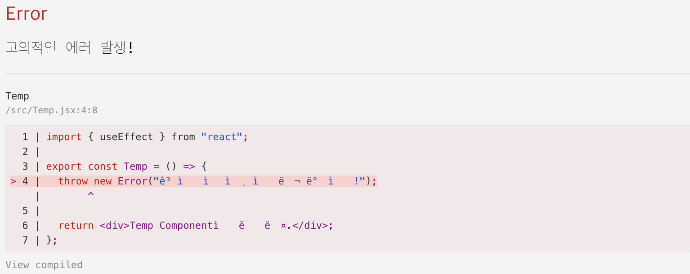

## 📦 잡동사니

하나의 키워드를 잡고 좀 편하게 정리하고 싶어 만든 `잡동사니`<br/>

> 잡동사니는 조선 후기 학자 `안정복`이 편찬한 `잡동산이(雜同散異)`에서 유래된 말이다.<br/>
> 잡동산이는 `잡기(雜記)`의 형태를 빌려온 책으로 구체적인 체계가 잡혀있지 않은 형식이다.<br/>
> 항목이 다소 난잡하고 내용의 구분이 혼동되어있다고 한다. 🤣

## 🗂️ Error Boundary

Error Boundary란 `에러에 대한 경계`를 의미한다. 즉, 특정 Error Boundary로 감싸여진 구간에서 에러가 발생하면 그 에러를 잡아내서 처리할 수 있다는 것이다. 이에 대한 개념을 적용한 Error Boundary 컴포넌트를 리액트에서는 공식문서를 통해 제공하고 있다. 먼저 리액트 공식문서에서 설명하는 Error Boundary를 살펴보자.

> 아래는 리액트 공식문서를 번역하여 정리한 내용이다.

리액트는 기본적으로 어플리케이션에서 `렌더링 중에` 에러를 던진다면 화면으로부터 UI를 지울 것이다. 이것을 방지하기 위해서는 컴포넌트들을 Error Boundary로 감싸야한다. Error Boundary는 특별한 컴포넌트이다. 이 컴포넌트는 에러로 인한 충돌일 발생했을 때, 에러를 잡아내서 fallback UI를 보여줄 수 있다.

Error Boundary는 클래스 컴포넌트로 구현된다. 이 때, `static getDerivedStateFromError()` 메서드를 제공해야 한다. 이 메서드를 통해 에러가 발생했을 때, 에러에 대한 응답으로 state를 업데이트할 수 있다. 또한 선택적으로 `componentDidCatch()`를 통해서 에러가 발생했을 때, 에러를 기록하거나 에러 리포팅 서비스에 에러를 기록할 수 있다.(에러에 관한 어떤 행위를 할 수 있다.)

아래는 Error Boundary를 구현한 예시이다.

```jsx
class ErrorBoundary extends React.Component {
  constructor(props) {
    super(props);
    this.state = { hasError: false };
  }

  static getDerivedStateFromError(error) {
    // Update state so the next render will show the fallback UI.
    return { hasError: true };
  }

  componentDidCatch(error, info) {
    // optional
    // Example "componentStack":
    //   in ComponentThatThrows (created by App)
    //   in ErrorBoundary (created by App)
    //   in div (created by App)
    //   in App
    // ex) logErrorToMyService(error, info.componentStack);
  }

  render() {
    if (this.state.hasError) {
      // You can render any custom fallback UI
      return this.props.fallback;
    }

    return this.props.children;
  }
}
```

> 현재는 함수 컴포넌트로 Error Boundary를 구현할 수 없다. 만약 매번 직접 위의 class component를 작성하고 싶지 않다면 [react-error-boundary](https://github.com/bvaughn/react-error-boundary) 라이브러리를 사용하면 된다.

## 🗂️ Error Boundary 적용해보기

Error Boundary를 적용해보기 위해 아주아주 간단한 예제를 만들어보았다.

App.jsx

```jsx
import { ErrorBoundary } from './ErrorBoundary';
import { Temp } from './Temp';

export default function App() {
  return (
    <div className="App">
      <ErrorBoundary>
        <h1>Hello CodeSandbox</h1>
        <h2>Start editing to see some magic happen!</h2>
        <Temp />
      </ErrorBoundary>
    </div>
  );
}
```

ErrorBoundary.jsx

```jsx
import React from 'react';

export class ErrorBoundary extends React.Component {
  constructor(props) {
    super(props);
    this.state = { hasError: false };
  }

  static getDerivedStateFromError(error) {
    return { hasError: true };
  }

  componentDidCatch(error, info) {
    console.log('error: ', error);
    console.log('info: ', info);
  }

  render() {
    if (this.state.hasError) {
      return <div>에러입니다!!!</div>;
    }

    return this.props.children;
  }
}
```

Temp.jsx

```jsx
export const Temp = () => {
  throw new Error('고의적인 에러 발생!');

  return <div>Temp Component입니다.</div>;
};
```

위의 코드를 실행하면 아래와 같은 화면을 볼 수 있다.



그리고 이 에러 iframe을 닫으면 아래와 같이 fallback UI가 렌더링된 것을 볼 수 있다.


위와 같이 우리가 원하는 컴포넌트가 렌더링된 것을 확인할 수 있다. 그런데 client 단의 에러가 아니라 서버와의 통신에서 발생하는 에러라면 어떻게 해야할까?

## 🗂️ Error Boundary의 한계

위의 예제에서 Temp 컴포넌트에서 의도적으로 비동기 통신에 대한 에러를 발생시켜보자.

Temp.jsx

```jsx
import { useEffect } from 'react';

export const Temp = () => {
  useEffect(() => {
    async function temp() {
      throw new Error('고의적인 에러 발생!');
    }
    temp();
  }, []);
  return <div>Temp Component입니다.</div>;
};
```

그럼 마찬가지로 에러 iframe이 보인다. 그런데 이를 닫으면 아래와 같이 그냥 정상적인 화면이 렌더링되는 것을 볼 수 있다.


분명히 에러는 발생했다. 그런데 왜 우리가 전달한 fallback UI가 아니라 정상적인 화면이 렌더링되어있는 것일까???

2가지를 생각해볼 수 있다.

1. Error Boundary의 설명을 다시 살펴보자. Error Boundary는 `렌더링 중에` 에러를 잡아낸다고 했다. 그런데 우리가 발생시킨 에러는 `렌더링 중이 아닌` 비동기 통신 중에 발생한 에러이다. 그렇기 때문에 Error Boundary가 잡아낼 수 없는 것이다.

2. useEffect는 비동기 통신을 위한 훅이라기보단, 렌더링이 끝난 후에 실행되는 훅이다. 그렇기 때문에 useEffect 내부에서 발생한 에러는 Error Boundary가 잡아낼 수 없는 것이다.(렌더링 중이 아니기 때문에)

그렇다면 이를 해결하기 위해서는 어떻게 해야할까? 간단하게 드는 생각은 어떤 상태를 두고 비동기 통신이 실패했을 때, 그 상태를 변경하는 방법이다. 그리고 그 상태를 Error Boundary에서 감지하여 fallback UI를 렌더링하면 될 것이다.

아래와 같이 코드를 수정해볼 수 있다.

Temp.jsx

```jsx
import { useEffect, useState } from 'react';

export const Temp = () => {
  const [isError, setIsError] = useState(false);
  useEffect(() => {
    async function temp() {
      try {
        throw new Error('고의적인 에러 발생!');
      } catch (error) {
        setIsError(true);
      }
    }
    temp();
  }, []);

  if (isError) throw new Error('여기도 고의적인 에러 발생!');
  return <div>Temp Component입니다.</div>;
};
```

위와 같이 수정하면 Error Boundary를 통해 fallback UI가 잘 렌더링되는 것을 볼 수 있다. 여기까지만 보면 뭔가 그럴싸하지만, 어느정도 리액트를 개발해봤다면 `뭔가 이상하다..?` 싶을 것이다. 위의 로직을 자세히 살펴보면 try, catch 구문을 통해서 에러를 잘 잡아놓고 다시 throw를 통해 에러를 발생시키고 있다. 이 흐름이 어딘가 어색하고 불필요하다고 느껴지지않는가? 해서 리액트의 구버전 공식문서를 살펴보았다.

## 🗂️ Error Boundary의 한계(feat. 리액트 구버전)

리액트의 구버전 공식문서를 살펴보면 아래와 같이 나와있다.

과거에는 컴포넌트 내부의 자바스크립트 로직 에러가 React의 내부 상태를 훼손하고 앱을 불안정하게 만들었다. 이런 문제를 해결하기 위해 React 16부터는 컴포넌트 내부의 자바스크립트 로직 에러가 React의 내부 상태를 훼손하지 않도록 에러 경계(Error Boundary)를 도입했다.(또한 React 16부터는 렌더링 중 에러가 발생하면 전체 컴포넌트 트리의 마운트가 해제된다.)

Error Boundary는 아래의 에러는 포착하지 않는다.

- 이벤트 핸들러(예를 들어, `onClick` 속성으로 전달된 함수)
- 비동기 코드(예를 들어, `setTimeout` 또는 `requestAnimationFrame` 콜백 함수, 서버 통신 라이브러리의 콜백 함수)
- 서버 사이드 렌더링
- 자식 컴포넌트가 아닌 Error Boundary 자체에서 발생하는 에러

즉, Error Boundary는 그저 컴포넌트 트리가 렌더링과 관련된 에러를 포착하고 처리하기 위해 사용된다. 이 본연의 취지에 맞게 바로 위의 Temp.jsx를 수정하면 아래와 같다.

Temp.jsx

```jsx
import { useEffect, useState } from 'react';

export const Temp = () => {
  const [isError, setIsError] = useState(false);
  useEffect(() => {
    async function temp() {
      try {
        throw new Error('고의적인 에러 발생!');
      } catch (error) {
        setIsError(true);
      }
    }
    temp();
  }, []);

  if (isError) return <div>에러입니다!!!</div>;

  return <div>Temp Component입니다.</div>;
};
```

위의 코드가 일반적인 fetch, axios를 통한 커스텀 훅의 isError를 통한 에러 처리 방법이고 tanstack/react-query의 useQuery를 통한 에러 처리 방법이다. 이 방법이 Error Boundary를 사용하는 것보다 더 깔끔하고, 더욱 더 효율적이다.

## 🗂️ (추가) react-router에서의 route 에러 처리

react-router에서는 errorElement를 사용하여 특정 경로에서 에러가 발생했을 때, 특정 컴포넌트를 렌더링할 수 있다. [react-router-dom의 공식문서](https://reactrouter.com/en/main/route/error-element)와 [github 코드](https://github.com/remix-run/react-router/blob/main/examples/error-boundaries/src/routes.tsx)를 살펴보면 아래와 같이 사용할 수 있다.

```jsx
let router = createBrowserRouter([
  {
    path: '/',
    element: <Layout />,
    children: [
      {
        path: '',
        element: <Outlet />,
        errorElement: <RootErrorBoundary />, // RootErrorBoundary 컴포넌트를 통해 에러를 잡아낸다.
        children: [
          {
            path: 'projects/:projectId',
            element: <Project />,
            errorElement: <ProjectErrorBoundary />, // ProjectErrorBoundary 컴포넌트를 통해 에러를 잡아낸다.
            loader: projectLoader,
          },
        ],
      },
    ],
  },
]);

export default function App() {
  return <RouterProvider router={router} fallbackElement={<Fallback />} />;
}
```

RootErrorBoundary.jsx

```jsx
export function RootErrorBoundary() {
  let error = useRouteError() as Error;
  return (
    <div>
      <h1>Uh oh, something went terribly wrong 😩</h1>
      <pre>{error.message || JSON.stringify(error)}</pre>
      <button onClick={() => (window.location.href = "/")}>
        Click here to reload the app
      </button>
    </div>
  );
}
```

ProjectErrorBoundary.jsx

```jsx
export function ProjectErrorBoundary() {
  let error = useRouteError();

  // We only care to handle 401's at this level, so if this is not a 401
  // ErrorResponse, re-throw to let the RootErrorBoundary handle it
  if (!isRouteErrorResponse(error) || error.status !== 401) {
    throw error;
  }

  return (
    <>
      <h1>You do not have access to this project</h1>
      <p>
        Please reach out to{' '}
        <a href={`mailto:${error.data.contactEmail}`}>{error.data.contactEmail}</a> to obtain
        access.
      </p>
    </>
  );
}
```

## 🚀 정리

결국 React의 Error Boundary는 렌더링 과정에서 일어나는, 예상치 못한 에러를 핸들링하기 위함이고 서버 통신에서 발생하는 에러는 결국 비동기 통신을 위한 훅을 통해 핸들링해야한다. 또, react-router를 통한 routing에서 발생하는 에러(ex. 유저가 존재하지 않는 path를 통해 접근하는 경우)는 errorElement와 useRouteError를 통해 라우터 별로 에러 바운더리를 만들어서 핸들링하면 된다!

### 참고

- [리액트 공식문서: 에러바운더리](https://react.dev/reference/react/Component#catching-rendering-errors-with-an-error-boundary)
- [벨로그: 에러 바운더리(Error Boundary)](https://velog.io/@bbaa3218/React-%EC%97%90%EB%9F%AC-%EB%B0%94%EC%9A%B4%EB%8D%94%EB%A6%ACError-Boundary)
- [카카오: React의 Error Boundary를 이용하여 효과적으로 에러 처리하기](https://fe-developers.kakaoent.com/2022/221110-error-boundary/)
- [react-router-dom의 공식문서](https://reactrouter.com/en/main/route/error-element)
- [github 코드](https://github.com/remix-run/react-router/blob/main/examples/error-boundaries/src/routes.tsx)

```toc

```
