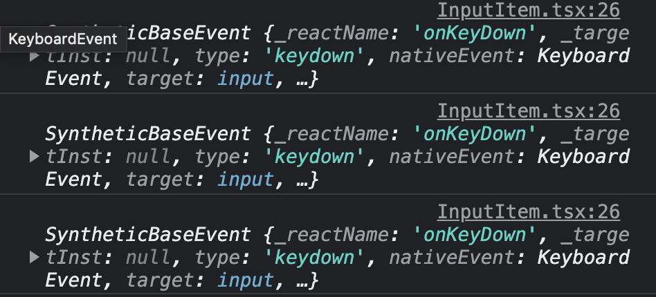
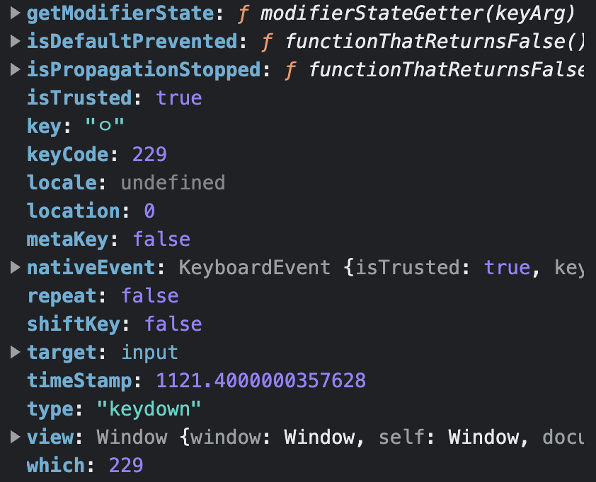
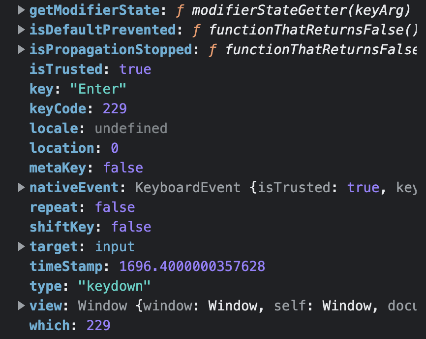
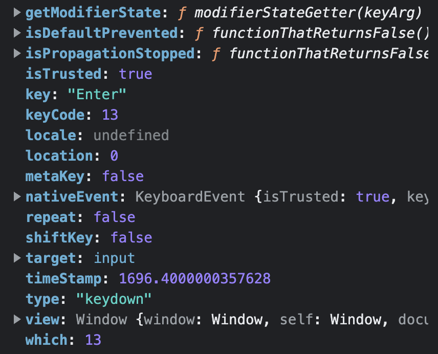

## 📦 잡동사니

하나의 키워드를 잡고 좀 편하게 정리하고 싶어 만든 `잡동사니`<br/>

> 잡동사니는 조선 후기 학자 `안정복`이 편찬한 `잡동산이(雜同散異)`에서 유래된 말이다.
> 잡동산이는 `잡기(雜記)`의 형태를 빌려온 책으로 구체적인 체계가 잡혀있지 않은 형식이다.
> 항목이 다소 난잡하고 내용의 구분이 혼동되어있다고 한다. 🤣

## 🗂️ onKeyDown in Korean

리액트에서 onKeyDown 이벤트를 사용하다가 한글 입력 시 이벤트가 두번 발생하는 문제가 있었다.<br/>
먼저 코드는 아래와 같다.

```jsx
// 윗부분은 생략...

return (
  <div className={styles['input-item']}>
    <input
      type="text"
      placeholder="할 일을 입력해주세요."
      value={inputText}
      onChange={handleInput}
      onKeyDown={(e) => {
        console.log(e);
        // 문제가 되는 곳은 여기다.
        if (e.key === 'Enter') {
          handleAdd();
          (inputRef.current as HTMLInputElement).focus();
        }
      }}
      ref={inputRef}
    />
    <button
      onClick={() => {
        handleAdd();
        (inputRef.current as HTMLInputElement).focus();
      }}
    >
      Add
    </button>
  </div>
);
```

위 처럼 `onKeyDown` 이벤트가 발생했을 때, 이벤트(e)의 key값이 `Enter`인 경우에만 `handleAdd` 함수를 실행하도록 했다.<br/>
그런데 문제는 한글을 적고 `Enter`를 입력하면 한글 한번, 그 한글의 끝 글자 하나가 또 입력되는 것이었다.<br/>
해서 위와 같이 이벤트를 콘솔로 찍어보았다.<br/>

아래는 `ㅇ`만 입력 후, `Enter`를 눌렀을 때의 콘솔이다.



분명 `ㅇ`과 `Enter`만 했는데, event 객체는 3개가 찍혀있다. 3개의 객체를 좀더 자세히 살펴보자.

순서대로 객체의 이미지를 나열하면

- `ㅇ-229`


- `Enter-229`


- `Enter-13`


뭔가 이상하다. 첫번째 `ㅇ`과 두번째 `Enter`가 분명히 다른 키인데 왜 같은 key 값을 갖는걸까?

이를 알기 위해서는 [IME KeyCode 229 Issue(feat. Chrome + 한글)](https://minjung-jeon.github.io/IME-keyCode-229-issue/)를 참고하자.

정말 간단하게 설명하면 한글과 같이 문자들의 조합으로 새로운 문자가 되는 언어의 경우에는 key를 입력 시에, 브라우저의 IME(Input Method Editor)가 입력을 받고
`isComposing = true` 상태가 된다. 즉, `아직 문자를 조합하고 있는 중`이라는 의미이다. 이 단계에서는 모든 key 값이 `229`로 나오게 된다.<br/>
결국 마지막 `Enter`를 입력 시, `isComposing`이 true인 이벤트, false인 이벤트가 2번 발생하는 것이다.<br/>

그렇다면 이제 해결책은 간단해보인다! if 조건문으로 keyCode 혹은 which 값이 229인 경우 `early return` 시키면 된다.

이렇게 해결은 됐지만, 경고가 하나 등장한다. 바로 keyCode와 whice는 곧 deprecated 될 예정이라는 경고이다.
그렇다면 마지막 남은 수단이 있다. 바로 `e.isComposing`을 사용하는 것이다. 그런데 또 하나 주의할 점은, 리액트 `onKeyDown` 이벤트는 한번 감싸진 상태이기 때문에
`e.nativeEvent.isComposing`을 통해 접근하면 된다.

아래는 해결한 예시 코드이다.

```jsx
return (
  <div className={styles['input-item']}>
    <input
      type="text"
      placeholder="할 일을 입력해주세요."
      value={inputText}
      onChange={handleInput}
      onKeyDown={(e) => {
        // 아래와 같이 isComposing이 true인 경우는 early return 시킨다.
        if (e.nativeEvent.isComposing) return;
        if (e.key === 'Enter') {
          handleAdd();
          (inputRef.current as HTMLInputElement).focus();
        }
      }}
      ref={inputRef}
    />
    <button
      onClick={() => {
        handleAdd();
        (inputRef.current as HTMLInputElement).focus();
      }}
    >
      Add
    </button>
  </div>
);
```

### 참고

- [인프런 - 한글 입력 시 이벤트가 두번 발생 문의](https://www.inflearn.com/questions/9010/%ED%95%9C%EA%B8%80-%EC%9E%85%EB%A0%A5%EC%8B%9C-%EC%9D%B4%EB%B2%A4%ED%8A%B8%EA%B0%80-%EB%91%90%EB%B2%88-%EB%B0%9C%EC%83%9D%EB%90%A9%EB%8B%88%EB%8B%A4)
- [IME KeyCode 229 Issue(feat. Chrome + 한글)](https://minjung-jeon.github.io/IME-keyCode-229-issue/)

```toc

```
