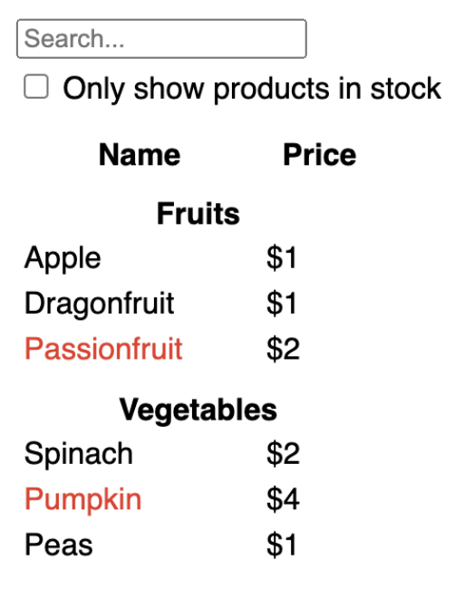
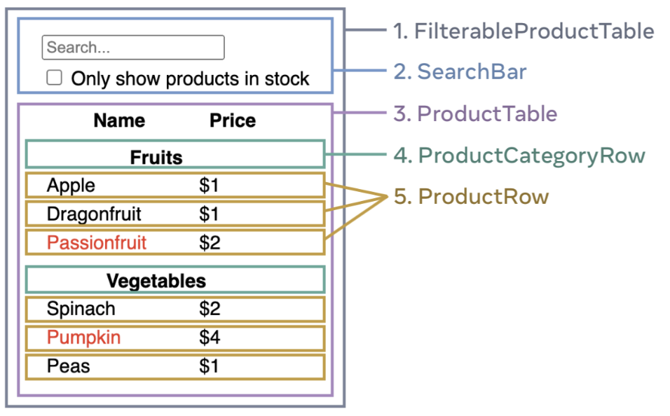

## 📎 React

이 글은 [리액트 공식문서 - 함수 컴포넌트](https://react.dev/)를 읽고 작성한 글입니다. 모든 내용을 다루지는 않고 개인적으로 부족했다고 느꼈던 부분, 새롭게
알게 된 부분들을 간단하게 정리할 예정입니다.

## Get Started - Quick start

아래와 같은 것을 배울 수 있다.

- How to create and nest components - 컴포넌트 생성하는 방법
- How to add markup and styles - 마크업과 스타일을 추가하는 방법
- How to display data - 데이터를 표시하는 방법
- How to render conditions and lists - 조건과 리스트를 렌더링하는 방법
- How to respond to events and update the screen - 이벤트에 응답하고 화면을 업데이트하는 방법
- How to share data between components - 컴포넌트 간 데이터를 공유하는 방법

### Creating and nesting components

```jsx
function MyButton() {
  return (
    <button>I'm a button</button>
  );
}

export default function MyApp() {
  return (
    <div>
      <h1>Welcome to my app</h1>
      {/* 아래와 같이 MyButton 컴포넌트를 다른 컴포넌트에서 사용할 수 있다. */}
      <MyButton />
    </div>
  );
}
```

React Component는 반드시 첫글자가 대문자여야 한다.(HTML 태그가 소문자인 반면에)

### Writing markup with JSX

```jsx
function AboutPage() {
  return (
    <>
      <h1>About</h1>
      <p>Hello there.<br />How do you do?</p>
    </>
  );
}
```

JSX는 HTML보다 더 엄격하다. 반드시 닫는 태그(/)가 있어야 한다. 또한 React Component는 한번에 여러개의 JSX 태그를 반환할 수 없다.
즉, 최상위에 하나의 태그만 존재해야 한다. 주로 `<div></div>` 혹은 `<></>`(Fragment) 를 사용한다.

### Adding styles

```jsx

```

```css
.avatar {
    border-radius: 50%;
}
```

html 태그에서의 class와 다르게 className을 사용한다. 이는 class가 자바스크립트의 예약어이기 때문이다.<br/>
리액트는 CSS 파일을 추가하는 특정 방법을 규정하지 않는다. 가장 간단하게는 html에 link 태그를 추가하는 방법이 있고 각 컴포넌트에서 css를 import하기도 한다.
혹은 CSS-in-JS 방식으로 스타일을 작성하기도 한다. 참고로 `create-react-app`에는 tailwindCSS가 기본으로 포함되어 있다.

### Displaying data

```jsx
function MyComponent() {
  const user = {
    name: 'jayden',
    imageUrl: 'https://~~~'
  };
  return (
    <>
      <h1>{user.name}</h1>
      
    </>
  );
}
```

JSX는 JavaScript 안에서 마크업을 할 수 있게 해준다. 또한 `{}`를 사용하면 다시 JS 코드로 돌아올 수 있다.(JS 코드를 사용하기 위해서 중괄호를 사용하는 것을 반드시 기억하자.)

```jsx
const user = {
  name: 'Hedy Lamarr',
  imageUrl: 'https://i.imgur.com/yXOvdOSs.jpg',
  imageSize: 90,
};

export default function Profile() {
  return (
    <>
      <h1>{user.name}</h1>
      
    </>
  );
}
```

### Conditional rendering

```jsx
let content;
if (isLoggedIn) {
  content = <AdminPanel />;
} else {
  content = <LoginForm />;
}
return (
  <div>
    {content}
  </div>
);
```

```jsx
<div>
  {isLoggedIn ? (
    <AdminPanel />
  ) : (
    <LoginForm />
  )}
</div>
```

```jsx
<div>
  {/* 필수는 아니지만 &&와 ||를 통한 조건부 렌더링을 자주 사용한다. */}
  {isLoggedIn && <AdminPanel />}
</div>
```

### Rendering lists

```jsx
const products = [
  { title: 'Cabbage', id: 1 },
  { title: 'Garlic', id: 2 },
  { title: 'Apple', id: 3 },
];

const listItems = products.map(product =>
  <li key={product.id}>
    {product.title}
  </li>
);

return (
  <ul>{listItems}</ul>
);
```

listItems는 `<li></li>` 형태의 배열이다. 이 배열 형태를 JSX에 전달하면 알아서 여러개의 리스트 태그로 렌더링된다.

> 이렇게 배열을 전달할 때는 key prop을 꼭 사용해야 한다. 이는 React가 각각의 리스트 아이템을 구분할 수 있게 해주는 역할을 한다.

### Responding to events

```jsx
function MyButton() {
  function handleClick() {
    alert('You clicked me!');
  }

  return (
    <button onClick={handleClick}>
      Click me
    </button>
  );
}
```

JSX에서 어떤 이벤트에 대한 내용을 전달할 때, 약속된 이름을 사용한다. 예를 들어 onClick, onMouseOver 등이 있다. 또한, 이벤트 핸들러는 함수로 전달해야 한다.(호출하지 않고 함수 자체를 전달하는 점 유의!)

### Updating the screen

```jsx
import { useState } from 'react';

function MyButton() {
  const [count, setCount] = useState(0);

  function handleClick() {
    setCount(count + 1);
  }

  return (
    <button onClick={handleClick}>
      Clicked {count} times
    </button>
  );
}
```

어떤 값(상태; state)을 기억하고 이 값의 변화에 따라 UI를 다르게 하고 싶다면 `useState` 훅을 사용한다.
`useState`는 배열을 반환하는데, 첫번째 원소는 상태 값이고 두번째 원소는 상태 값을 변경하는 함수이다. 이 함수를 호출하면 상태 값이 변경되고 컴포넌트가 다시 렌더링된다.

```jsx
import { useState } from 'react';

export default function MyApp() {
  return (
    <div>
      <h1>Counters that update separately</h1>
      <MyButton />
      <MyButton />
    </div>
  );
}
```

위와 같이 컴포넌트를 여러번 사용하면 각각의 컴포넌트는 독립적인 상태를 가지게 된다.(서로 상태를 공유하지 않는다. 당연한 것같지만 다시 한번 기억할 것!)

### Using Hooks

`use`로 시작하는 함수들을 `Hooks`라고 부른다. `useState`는 가장 기본적인 Hook이다. 이 외에도 `useEffect`, `useContext`, `useReducer` 등이 있다.([참고](https://react.dev/reference/react))
또한, 존재하는 훅들을 조합하여 커스텀 훅을 만들 수도 있다.

훅들은 다른 함수들보다 더 제한적이다. 반드시 컴포넌트(혹은 커스텀 훅)의 최상단에서 호출해야만 한다. 또한 조건문이나 반복문 안에서 호출하면 안된다. 이는 훅이 컴포넌트의 상태를 기억하기 때문이다. 만약 조건문이나 반복문 안에서 호출하면, 컴포넌트의 상태가 변경되어도 훅이 이를 감지하지 못한다.
그러므로 조건문이나 반복문 안에서 훅을 호출하고 싶다면, 조건문이나 반복문을 컴포넌트로 추출한 후 훅을 호출하면 된다.

### Sharing data between components

앞에서 살펴봤듯이 동일한 컴포넌트여도 각각의 컴포넌트는 독립적인 상태를 가진다. 그렇다면 컴포넌트 간에 상태를 공유하려면 어떻게 해야 할까?

가장 단순한 방법은 상태를 공유하고자 하는 컴포넌트들의 상위 컴포넌트에서 state를 관리하는 것이다.

```jsx
export default function MyApp() {
  const [count, setCount] = useState(0);

  function handleClick() {
    setCount(count + 1);
  }

  return (
    <div>
      <h1>Counters that update together</h1>
      <MyButton count={count} onClick={handleClick} />
      <MyButton count={count} onClick={handleClick} />
    </div>
  );
}

function MyButton({ count, onClick }) {
  return (
    <button onClick={onClick}>
      Clicked {count} times
    </button>
  );
}
```

위와 같은 방법을 `lifting state up`(상태 끌어올리기)라고 한다. 이 방법은 컴포넌트 간에 상태를 공유할 수 있게 해주지만, 컴포넌트 간의 관계가 복잡해지면 상태를 공유하기 위해 상위 컴포넌트를 거쳐야 하는 번거로움이 생긴다.

## Get Started - Quick start - Tutorial: Tic-Tac-Toe

튜토리얼은 하나하나 따라가기 보단 전체 코드를 두고 참고할만한 내용을 주석으로 작성하려 한다.

```jsx
import { useState } from 'react';

function Square({ value, onSquareClick }) {
  return (
    <button className="square" onClick={onSquareClick}>
      {value}
    </button>
  );
}

function Board({ xIsNext, squares, onPlay }) {
  // setState가 사용되는 함수를 정의할 때는 보통 `handle~` 컨벤션을 따른다.
  function handleClick(i) {
    if (calculateWinner(squares) || squares[i]) {
      return;
    }
    const nextSquares = squares.slice();
    if (xIsNext) {
      nextSquares[i] = 'X';
    } else {
      nextSquares[i] = 'O';
    }
    onPlay(nextSquares);
  }

  const winner = calculateWinner(squares);
  let status;
  if (winner) {
    status = 'Winner: ' + winner;
  } else {
    status = 'Next player: ' + (xIsNext ? 'X' : 'O');
  }

  return (
    <>
      <div className="status">{status}</div>
      <div className="board-row">
        {/* props로 전달되는 setState관련 함수(주로 handle~ 형태)는 on~ 네임 컨벤션을 가진 prop으로 전달한다. */}
        <Square value={squares[0]} onSquareClick={() => handleClick(0)} />
        <Square value={squares[1]} onSquareClick={() => handleClick(1)} />
        <Square value={squares[2]} onSquareClick={() => handleClick(2)} />
      </div>
      <div className="board-row">
        <Square value={squares[3]} onSquareClick={() => handleClick(3)} />
        <Square value={squares[4]} onSquareClick={() => handleClick(4)} />
        <Square value={squares[5]} onSquareClick={() => handleClick(5)} />
      </div>
      <div className="board-row">
        <Square value={squares[6]} onSquareClick={() => handleClick(6)} />
        <Square value={squares[7]} onSquareClick={() => handleClick(7)} />
        <Square value={squares[8]} onSquareClick={() => handleClick(8)} />
      </div>
    </>
  );
}

export default function Game() {
  const [history, setHistory] = useState([Array(9).fill(null)]);
  const [currentMove, setCurrentMove] = useState(0);
  const xIsNext = currentMove % 2 === 0;
  const currentSquares = history[currentMove];

  function handlePlay(nextSquares) {
    const nextHistory = [...history.slice(0, currentMove + 1), nextSquares];
    setHistory(nextHistory);
    setCurrentMove(nextHistory.length - 1);
  }

  function jumpTo(nextMove) {
    setCurrentMove(nextMove);
  }

  const moves = history.map((squares, move) => {
    let description;
    if (move > 0) {
      description = 'Go to move #' + move;
    } else {
      description = 'Go to game start';
    }
    return (
      <li key={move}>
        <button onClick={() => jumpTo(move)}>{description}</button>
      </li>
    );
  });

  return (
    <div className="game">
      <div className="game-board">
        <Board xIsNext={xIsNext} squares={currentSquares} onPlay={handlePlay} />
      </div>
      <div className="game-info">
        <ol>{moves}</ol>
      </div>
    </div>
  );
}

function calculateWinner(squares) {
  const lines = [
    [0, 1, 2],
    [3, 4, 5],
    [6, 7, 8],
    [0, 3, 6],
    [1, 4, 7],
    [2, 5, 8],
    [0, 4, 8],
    [2, 4, 6],
  ];
  for (let i = 0; i < lines.length; i++) {
    const [a, b, c] = lines[i];
    if (squares[a] && squares[a] === squares[b] && squares[a] === squares[c]) {
      return squares[a];
    }
  }
  return null;
}
```

### Note 1

The DOM `<button>` element’s onClick attribute has a special meaning to React because it is a built-in component.
For custom components like Square, the naming is up to you.
You could give any name to the Square’s onSquareClick prop or Board’s handleClick function, and the code would work the same.
`In React, it’s conventional to use onSomething names for props which represent events and handleSomething for the function definitions which handle those events.`

> props로 전달 시, `onSomething` 형태 / 함수에서 사용 시, `handleSomething` 형태를 사용하는 것이 컨벤션이다.

### Note 2

It’s strongly recommended that you assign proper keys whenever you build dynamic lists. If you don’t have an appropriate key, you may want to consider restructuring your data so that you do.
If no key is specified, React will report an error and use the array index as a key by default. Using the array index as a key is problematic when trying to re-order a list’s items or inserting/removing list items.
Explicitly passing key={i} silences the error but has the same problems as array indices and is not recommended in most cases.
Keys do not need to be globally unique; they only need to be unique between components and their siblings.

> 동적으로 li 태그들을 만들 때, 반드시 key를 지정해야 한다. key가 없을 경우, React는 에러를 발생시키고 배열의 인덱스를 기본값으로 사용한다. 배열의 인덱스를 key로 사용하는 것은 리스트 아이템의 순서를 재정렬하거나 리스트 아이템을 삽입/제거할 때 문제가 발생한다. key는 전역적으로 고유할 필요는 없고, 컴포넌트와 형제 사이에서만 고유하면 된다.

## Get Started - Quick start - Thinking in React

리액트는 당신이 보길 원하는 디자인과 당신이 만들기 원하는 어플리케이션에 관한 당신의 생각을 바꿀 수 있다. 처음 리액트로 UI를 만들면 그게 바로 component가 된다.
그리고 당신은 컴포넌트 각각에 시각적인 state를 다르게 할당할 수 있다. 

### Start with the mockup

아래와 같은 목업 데이터가 있다고 가정하자.

```js
[
  { category: "Fruits", price: "$1", stocked: true, name: "Apple" },
  { category: "Fruits", price: "$1", stocked: true, name: "Dragonfruit" },
  { category: "Fruits", price: "$2", stocked: false, name: "Passionfruit" },
  { category: "Vegetables", price: "$2", stocked: true, name: "Spinach" },
  { category: "Vegetables", price: "$4", stocked: false, name: "Pumpkin" },
  { category: "Vegetables", price: "$1", stocked: true, name: "Peas" }
]
```

위의 데이터를 아래와 같이 표현하고 싶다.(그리고 싶다.)



리액트에서 위의 UI를 구현하기 위해, 다음 5단계를 따를 것이다.

#### Step 1: Break the UI into a component hierarchy

모든 컴포넌트, 상위/하위 컴포넌트에 대해서 박스를 그리고 이름을 붙인다.

다양한 방법으로 컴포넌트를 나눌 수 있다.

- Programming: 새로운 함수 혹은 객체를 만든다는 관점. 각 컴포넌트마다 `단일 책임 원칙`에 입각하여 나눌 것이다. 이상적으로는 컴포넌트는 하나의 일만 하는 게 좋다.
- CSS: class 선택자에 대해 고려하면서 컴포넌트를 나눈다. 
- Design: 디자인 층을 조직하는 관점.

JSON이 잘 구성되어있을수록 UI 구조와 자연스럽게 데이터가 매핑된다.(UI와 데이터가 비교적 일대일 대응이 된다는 이야기) UI와 데이터 모델이 같은 정보를 가진 아키텍져인 경우가
많기 때문이다. 컴포넌트로 UI들을 나누고 각 컴포넌트가 당신의 데이터 각각에 어떻게 매치되는지 나눠보아라.



- FilterableProductTable (grey): 전체 App
  - SearchBar (blue): 유저 input을 받는다.
  - ProductTable (lavender): 유저 input에 따라 리스트를 필터링하여 보여준다.
    - ProductCategoryRow (green): 각 카테고리의 제목을 보여준다.
    - ProductRow (yellow): 각 상품의 행을 보여준다.

> 위의 이미지에서 보라색 부분의 header 격인 `Name`과 `Price`는 따로 컴포넌트로 나누지 않았다. 이는 순전히 본인의 몫이다. 따로 component로 빼주어도 되고
> 지금처럼 `ProductTable`로 묶어도 된다. 단, 만약 `Name`과 `Price` 부분이 복잡하거나 다른 컴포넌트에서도 사용된다면 따로 빼주는 것이 좋다.

#### Step 2: Build a static version in React

이제 컴포넌트 계층구조를 갖게 되었다. 가장 빠르게 리액트로 UI를 구현하는 방법은 어떠한 상호작용 없이 단순한 컴포넌트를 구현하는 것이다. 
정적인 버전의 앱을 먼저 구현하고 추후에 상호작용을 추가하는 방법은 좋은 방법이다. 정적인 버전을 구현하기 위해서는 타이핑은 많이, 생각은 적게 필요하다.
반면 상호작용을 더하는 것은 적은 타이핑, 많은 생각을 요구한다.

당신의 데이터 모델로부터 정적인 버전의 앱을 구현하기 위해서, 당신은 재사용 가능하고 props를 통해 데이터를 전달받는 `components`를 만들고 싶을 것이다.
`Props`는 부모에서 자식으로 데이터를 전달할 수 있는 방법이다. (당신이 `state`에 익숙하더라도, 정적인 버전의 앱을 구현할 때는 state는 일체 사용하지 말아라.)
state는 오직 상호작용을 위해서 존재한다.(즉, 시간에 따라 변하는 데이터) 때문에 정적인 버전의 앱을 구현할 때는 state는 필요치 않다.

당신은 거대한 컴포넌트부터 개발하기 시작하는 `Top-down` 방식과 작은 컴포넌트부터 개발하기 시작하는 `Bottom-up` 방식 중 하나를 선택할 수 있다.
일반적으로 `Top-down` 방식이 더 쉽다. 한편, 거대한 프로젝트에서는 `Bottom-up` 방식이 더 쉽다.(작은 컴포넌트를 개발하고 이를 조합하여 거대한 컴포넌트를 만들기 때문이다.)

[code-sandbox 참고](https://codesandbox.io/s/18nfmd?file=/App.js&utm_medium=sandpack)

위와 같은 방식을 `one-way data flow`라고 한다. 최상단 컴포넌트에서 아래로만 data flow가 이루어지기 때문이다.(props를 통해)

> 여기서 핵심은 state 없이 오직 props만을 이용해 components의 data flow를 구현한 것이다!

#### Step 3: Find the minimal but complete representation of UI state

UI가 상호작용하게 만들기 위해서, 당신은 사용자가 당신의 data model을 변경할 수 있게 해야한다. 이를 위해 `state`를 사용한다.

`state`를 `당신의 앱이 기억할 필요가 있는 최소한의 변하는 데이터`로 생각해라. state를 구축하는데 가장 중요한 원칙은 [DRY(Don't Repeat Yourself)](https://en.wikipedia.org/wiki/Don%27t_repeat_yourself)하게
유지하는 것이다. 당신의 앱이 필요로 하는 state를 절대적으로 최소화하고 그 외의 모든 것들은 요구될 때 계산해라. 예를 들어 당신이 쇼핑 리스트를 구현할 때, 
당신은 items를 state로서 배열로 저장할 수 있다. 그리고 items의 갯수를 화면에 보여주고 싶을 때, items의 갯수를 또다른 state로 두지 말아라. 그저 items의 길이를 계산하여 보여주면 된다.

> 최소한의 state로 최대한의 UI를 표현하라는 말 같다. state가 쓸데없이 많아져봐야 복잡해지고 불필요한 계산이 많아지기 때문일 것이다.

아래 4개의 예시를 두고 state인지 아닌지 판단해보자.

1. The search text the user has entered
2. The original list of products
3. The value of the checkbox
4. The filtered list of products

어느게 state일까? state가 아닌 것을 먼저 찾아보자.

- 시간이 흘러도 변하지 않는가? 그렇다면 state가 아니다.
- 부모로부터 props를 통해 전달되는가? 그렇다면 state가 아니다.
  - (Q). 부모의 state가 자식에게 props로 전달되는 경우는? (A). 자식 컴포넌트를 기준으로 본인의 state가 아니다.
- 컴포넌트 내부에서 존재하는 state나 props를 기반으로 계산될 수 있는가? 그렇다면 state가 아니다.

다시 위의 예시를 보자.

1. The search text the user has entered: 시간에 따라 변하고 다른 것으로부터 계산될 수 없다. state이다.
2. The original list of products: 부모로부터 props로 전달되었을 가능성이 크다. state가 아니다.
3. The value of the checkbox: 시간에 따라 변하고 다른 것으로부터 계산될 수 없다. state이다.
4. The filtered list of products: 다른 original list를 가져와서 어떤 search text에 따라 filtering된 것이라면 state가 아니다.

> Props vs State<br/>
> Props: 함수를 통과하는 인자와 같다. 부모에서 자식으로 전달되며 그 모양(외관)을 사용자가 변경할 수 있다.<br/> 
> State: 컴포넌트가 정보를 추적하고 상호 작용에 따라 변경할 수 있다.<br/>
> 
> Props오 State는 다르지만 함께 작동한다. 부모 컴포넌트는 몇몇 정보를 state로 두고 이를 자식 컴포넌트에게 props로 전달한다.

#### Step 4: Identify where your state should live

이제 당신은 어떤 컴포넌트가 state를 가지고 있어야 하는지 알게 되었다. 다음으로는 어떤 컴포넌트가 그 state에 대한 책임이 있고 가지고 있어야 하는지 알아야 한다.
`기억하자: 리액트는 데이터가 상위에서 하위로 전달되는 `one-way data flow`를 따른다. 지금 당장은 어떤 컴포넌트에서 해당 state에 대한 책임이 있는지 모호할 수 있다.
그렇다면 아래와 같은 단계로 생각해보자.

1. 그 state를 기반으로 무언가를 렌더링하는 모든 컴포넌트를 찾아라.
2. 그들의 가장 가까운 부모 컴포넌트를 찾아라.
3. 그 state가 어디에 있어야되는지 결정해라.
   - 종종 당신은 그 state를 그들의 공통된 부모 컴포넌트에 둘 수 있다.
   - 또한 그들의 공통된 부모 컴포넌트 위에 둘 수도 있다.(props로 전달만 되면 되니까)
   - 그 state를 어디에 둬야할지 찾지 못하겠다면, 그 state를 가지고 있는 컴포넌트를 만들어라. 그리고 그 state를 가지고 있는 컴포넌트의 상위 컴포넌트에게 props로 전달하라.

다시 위의 예제로 돌아와서 위의 방법을 적용해보자.

1. `search text`와 `checkbox value`를 state로 둘 수 있다.
   - `ProductTable`: state(search text와 checkbox value)를 기반으로 products를 filter해야 한다.
   - `SearchBar`: state(search text와 checkbox value)를 ui로 보여줘야 한다.

2. 위 둘의 가장 가까운 첫번째 부모 컴포넌트: `FilterableProductTable`
3. 따라서 state는 `FilterableProductTable`에 둘 수 있다.

[code-sandbox 참고](https://codesandbox.io/s/4p46zu?file=%2FApp.js&utm_medium=sandpack)

그러나 아래와 같은 에러가 발생한다.

```shell
You provided a `value` prop to a form field without an `onChange` handler. This will render a read-only field.
```

`SearchBar`의 input 태그의 value로 `filterText`를 전달했지만, 유저에 의해 input 값이 변할 때마다 해당 value가 변하지 않기 때문에 발생하는 에러이다.

#### Step 5: Add inverse data flow

전체적으로 앱은 props와 state를 계층에 따라 아래로 잘 전달하여 렌더링되었다. 그러나 user input에 따른 state 변화를 위해서는 다른 방법으로 data flow를 
지원해야한다. 계층의 거의 맨 아래에 있는 form 컴포넌트에서 `FilterableProductTable`의 state를 변경해야한다.

리액트는 이 data flow를 명시적으로 만들었지만, 이는 양방향보단 약간의 더 많은 타이핑을 요구한다. 당신이 input에 타이핑하거나
checkbox를 클릭해도 아무 일도 일어나지 않는다.(리액트가 당신의 input을 무시한다.) 당신이 `<input value={filterText} />`라고 썼기 때문에, filterText가
바뀌지 않는한 input의 value 또한 변경되지 않는다. 마찬가지로 stockOnly도 그렇다. 이 2개의 state를 변경하는 방법은 각각의 `setState`뿐이다. 

```jsx
function FilterableProductTable({ products }) {
  const [filterText, setFilterText] = useState('');
  const [inStockOnly, setInStockOnly] = useState(false);
  
  const handleFilterTextChange = (e) => {
    setFilterText(e.target.value);
  };
  
  const handleInStockOnly = () => {
    setInStockOnly(!inStockOnly);
  };

  return (
    <div>
      <SearchBar 
        filterText={filterText} 
        inStockOnly={inStockOnly}
        onFilterTextChange={handleFilterTextChange}
        onInStockOnlyChange={handleInStockOnly} />
// 생략
```

[code-sandbox 참고](https://codesandbox.io/s/w337n9?file=%2FApp.js&utm_medium=sandpack)

> 위의 참고 코드에서는 `handle` 함수를 따로 만들어두지 않았지만, 가능하면 따로 만들어두는 것이 좋다.

```toc

```