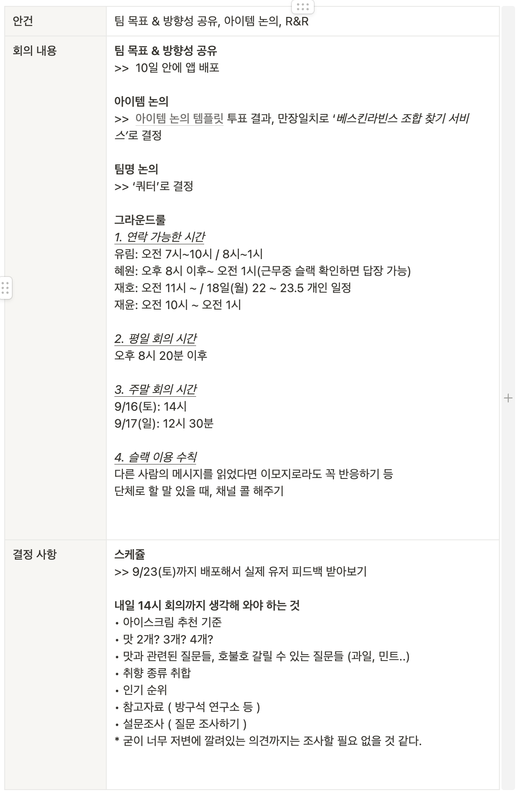
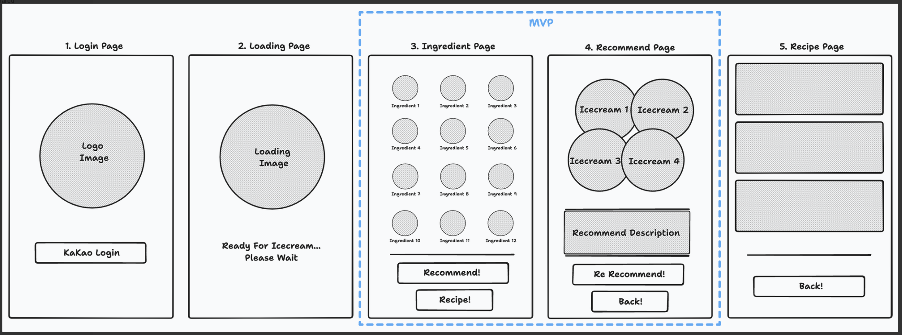
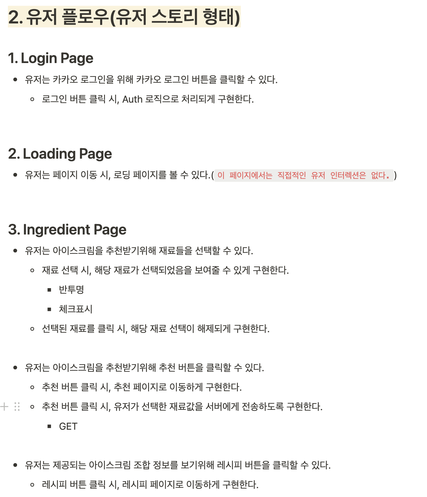
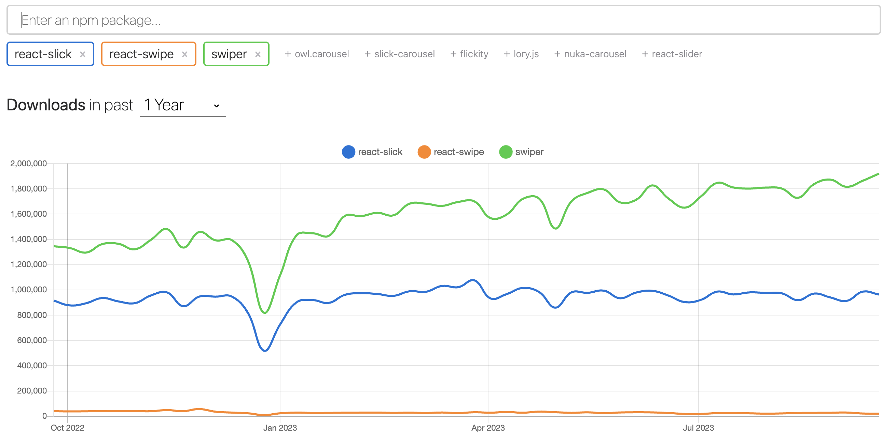

# 🍨 베스트라빈스 프로젝트

약 10일동안 기획부터 디자인, 개발까지 진행한 베스트라빈스 프로젝트. 동료에게 추천받아 알게된 [포텐데이](https://bside.best/potenday)를 통해 지원했고 좋은 기획자분과 디자이너분을 만나서 열심히 달려볼 수 있었다. 사실 매일매일 회고를 작성하려했는데, 10일이라는 짧은 시간동안 하나의 서비스를 MVP까지 완성하는 게 쉬운 일이 아니었다. 해서 우리 팀이 10일 동안 어떤 과정을 거쳐서 프로젝트를 진행했는지, 그리고 나는 어떤 역할을 맡아서 어떤 공부를 했는지에 대해 회고해보려고 한다.(1차 회고인 이유는 이후에도 몇몇 기능을 더하고 리팩토링을 진행할 예정이기 때문이다!)

[베스트 라빈스: 배포 링크](https://quarter-fe.vercel.app/)

## 1. 아이디어 회의 및 팀 목표 설정

각자 어떤 서비스를 하고 싶은지 생각해오기로 했다. 여러가지 아이디어들 중 우선 10일 안에 MVP 기획 및 디자인, 개발이 가능하고 추후 확장이 가능한 아이템을 고르기로 했고 그 결과 `사람들에게 배스킨 라빈스 아이스크림 조합을 추천해주는 서비스`를 개발하기로 했다. 구체적인 기획과 디자인, 추천 방법은 정해지지 않았지만, 우선적으로 10일 안에 MVP를 완성하는 것을 최우선으로 하기로 했다.



## 2. 기획 및 디자인

각자 본인이 생각하는 우리 서비스의 기획과 모습을 생각하고 가져오기로 했다! 나 같은 경우, 아이스크림 목록을 보여주고 유저가 선택을 하면 해당 아이스크림들의 조합의 능력치(?)를 보여줌으로써 해당 조합을 추천하는지 그렇지 않은지를 보여주는 서비스를 생각했다. 하지만 그것보다는 배스킨 라빈스를 몰라도 서비스를 이용할 수 있게 재료를 선택하면 해당 재료가 포함된 아이스크림 조합을 추천해주자는 의견이 나왔고 그렇게 서비스를 만들기로 했다. 아래는 내 나름 열심히 만든 와이어프레임이다!



그리고 아래는 프론트엔드 개발자 입장에서 와이어 프레임을 따라 작성해본 유저 플로우이다.



## 3. 개발

### 개발 포인트

이제 본격적으로 디자이너분께서 실시간으로 작업해주시는 피그마를 보면서 개발에 들어갔다! 이번 서비스에서 개발적으로 가장 중요하게 생각했던 부분은 단순히 웹으로 그치지 않고 PWA(Progressive Web App) 형태의 서비스를 배포하는 것이었다. 아주 대단한 무언가를 하는 건 아니지만, pwa가 무엇인지 공부할 수 있었고 평소에는 거의 신경도 쓰지 않았던 html의 `head` 태그에 대해서도 자연스럽게 신경쓸 수 있었다. 그 다음으로는 코드의 재활용 및 규칙성을 신경쓰려고 했다. 너무 작고 일반화된 컴포넌트가 아니라 주어진 짧은 시간 안에(개발 시간 자체는 거의 4~5일) 최대한 효율적으로 재활용 가능한 컴포넌트들을 작성하려 했다.

먼저 PWA에 대한 내용은 [여기](https://jaydenlee1116.github.io/steadily/growth-diary/2023/9/19/)에 간단히 작성해두었고 참고자료도 두었다.

### 기술 스택

사실 처음엔 요즘 열심히 배우고 있는 `Next`를 사용해보려 했다. 하지만 지금 프로젝트의 규모에서 굳이 Next를 사용할 필요가 없을 것 같았고, 너무 짧은 시간이라 내가 익숙한 React를 사용하는 게 나을 것 같다는 판단 하에 React를 사용하기로 했다. 그리고 처음엔 안좋아했지만, 지금은 너무 편하게 잘 쓰는 중인 styled-components, 언제 써도 참 잘 만들었다고 생각이 드는 react-query를 기반으로 개발하기로 했다. (이외에도 axios, react-router-dom 등을 사용했다.)

### 개발 과정

#### 브랜치 전략

후... 브랜치 전략도 정말 할 말이 많다. 처음엔 보통 이전에 했던 팀 협업과 비슷하게 `main`으로 배포하고, `develop`에 개발 기능들을 모으고 각 기능 별로 브랜치를 따서 작업했다. 하지만 FE 개발자는 나 혼자인 상태에서 코드리뷰도 없는 환경에 매번 기능들마다 브랜치를 따고 혼자 푸쉬하고 머지하는 건 생각보다 비효율적이고 의미가 없다고 느꼈다. 해서 develop 브랜치에서 모든 개발을 진행하되 커밋 메시지를 아주 작게작게 작성하여 최대한 기능 별 코드를 분리하고자 했다. 이 방법이 아주 좋은 방법은 아니지만, 혼자 빠르게 치고 나가기엔 가장 효율적인 방법같다.

#### 개발 순서

철저히 페이지 단위로 작업을 해보고자 했다. 사실 개발을 할 때마다, 어떤 기준에서 뭐부터 해야할지 막막할 때가 종종 있는데, 이번엔 정말 확실하게 그 우선순위를 정하려고 했다. 가능하면 모든 기술 스택과 글로벌 설정들을 처음에 다 잡아두었고(라우터 포함) 이후에 우리 서비스에서 중요한 페이지부터 쳐내가면서 UI 컴포넌트를 빠르게 개발했다. 이 때, 스토리북을 사용해서 작업하는 게 정말 큰 도움이 많이 되었다.(왜 UI 테스팅 툴이라고도 부르는지 알겠더라..!)

> 하지만 중간에 페이지 컴포넌트들이 router 설정, react-query와 충돌하는 부분들이 있어서 스토리 작성을 중간에 멈췄다. 시간만 좀더 있다면 해당 내용을 해결하고 싶은데, 당장 빠르게 개발해야하는 상황에서는 과감하게 선택과 집중을 하는 게 도움이 될 거라 생각했기 때문이다.

#### 개발 내용

##### 1. 캐로셀 컴포넌트

우리 서비스의 메인 페이지에 들어갈 캐로셀 슬라이드 컴포넌트이다. 처음엔 당연히 라이브러리를 가져다 쓰려고 했다.



위의 라이브러리들말고도 UI 라이브러리(Material, Chakra, Mantine, Ant 등등)도 고려해보았지만, 적용해보면 UI가 깨진다든가 슬라이드가 제대로 되지 않는다든가... 혹은 내가가 원하는 캐로셀이 아니든가 다양한 문제가 하나씩은 있었다. 참... 사람이 시간이 없으면 어떻게든 한다고, 빠르게 라이브러리 사용을 포기하고(혼자 거의 하루종일 싸매다가 눈물을 머금고 포기함) 직접 캐로셀 컴포넌트를 작성하기로 했다. 이전에 진행했던 당근마켓 클론 프로젝트에서 슬라이드 컴포넌트를 작성해본 경험이 있어서 조금 익숙하게 작성할 수 있었다.

```tsx
import React, { useEffect, useRef } from 'react';
import { useTheme } from 'styled-components';

import { isMobile } from '../../utils/isMobile';
import { ReactComponent as ButtonLeft } from '../../assets/icons/common/chevron_left.svg';
import { ReactComponent as ButtonRight } from '../../assets/icons/common/chevron_right.svg';
import * as S from './Carousel.styled';

type CarouselProps = {
  children: React.ReactNode;
  currentSlideIndex: number;
  changeSlide: (index: number) => void;
};

type SlideProps = {
  children: React.ReactNode;
  isCurrentSlide?: boolean;
};

const Carousel = ({ children, currentSlideIndex, changeSlide }: CarouselProps) => {
  const touchStartPositionX = useRef(0);
  const touchEndPositionX = useRef(0);
  const handleSlideClick = (index: number) => {
    changeSlide(index);
  };

  useEffect(() => {
    const timer = setInterval(() => {
      if (currentSlideIndex >= React.Children.count(children) - 1) {
        changeSlide(0);
        return;
      }
      changeSlide(currentSlideIndex + 1);
    }, 4000);
    return () => {
      clearInterval(timer);
    };
  }, [currentSlideIndex, children]);

  const theme = useTheme();
  return (
    <S.CarouselContainer>
      <S.SlideContainer
        $currentSlideIndex={currentSlideIndex}
        onTouchStart={(e) => {
          touchStartPositionX.current = e.touches[0].clientX;
        }}
        onTouchEnd={(e) => {
          touchEndPositionX.current = e.changedTouches[0].clientX;
          const touchPositionDifference = touchStartPositionX.current - touchEndPositionX.current;

          if (touchPositionDifference > 5) {
            if (currentSlideIndex >= React.Children.count(children) - 1) {
              return;
            }
            handleSlideClick(currentSlideIndex + 1);
          }
          if (touchPositionDifference < -5) {
            if (currentSlideIndex <= 0) {
              return;
            }
            handleSlideClick(currentSlideIndex - 1);
          }
        }}
      >
        {children}
      </S.SlideContainer>
      {isMobile() || (
        <>
          {currentSlideIndex <= 0 || (
            <S.ArrowLeftButton
              onClick={() => {
                if (currentSlideIndex <= 0) {
                  return;
                }
                handleSlideClick(currentSlideIndex - 1);
              }}
            >
              <ButtonLeft fill={theme.colors.gray_05} />
            </S.ArrowLeftButton>
          )}
          {currentSlideIndex >= React.Children.count(children) - 1 || (
            <S.ArrowRightButton
              onClick={() => {
                if (currentSlideIndex >= React.Children.count(children) - 1) {
                  return;
                }
                handleSlideClick(currentSlideIndex + 1);
              }}
            >
              <ButtonRight fill={theme.colors.gray_05} />
            </S.ArrowRightButton>
          )}
        </>
      )}
    </S.CarouselContainer>
  );
};

const Slide = ({ children, isCurrentSlide }: SlideProps) => {
  return <S.SlideWrapper $isCurrentSlide={isCurrentSlide}>{children}</S.SlideWrapper>;
};

Carousel.Slide = Slide;

export default Carousel;
```

코드가 다소 길지만, 우선 슬라이드를 담고 있는 Carousel 컴포넌트와 그 내부에 Slide 속성으로 존재하는 Slide 컴포넌트가 있도록 개발했다.(지금 다시 보니 4000과 같은 매직 넘버가 존재하네... 허헣) 또, 터치한 순간부터 떼기까지의 거리가 5px 이상 차이가 나면 슬라이드를 넘기도록 구현했다. 그리고 문제는 웹에서는 touch 이벤트 자체가 되지 않기 때문에 `isMobile()`이라는 유틸함수로 현재 유저의 실행 환경에 따라 캐로셀 화살표를 렌더링하도록 했다.(데스크탑에서 볼 때는 양 옆의 화살표를 클릭하여 슬라이드를 움직일 수 있도록!)

##### 2. react-query service

API 통신에 대한 설정은 `api`폴더에서 작성하고 각 api 요청에 대한 함수들은 `service` 폴더에 분리하여 작성하였다. 예를 들면 아래와 같다.

api/apiConfig.ts

```ts
export const API_BASE_URL = process.env.REACT_APP_API_BASE_URL;
```

api/apiClient.ts

```ts
import axios from 'axios';

import { API_BASE_URL } from './apiConfig';

export const axiosFetch = axios.create({
  baseURL: API_BASE_URL,
  headers: {
    'Content-Type': 'application/json',
  },
});
```

service/useGetRecipe.ts

```ts
import { useQuery } from '@tanstack/react-query';
import { axiosFetch } from '../../api/apiClient';

type Flavor = {
  id: number;
  flavorName: string;
  imageUrl: string;
};

export type Recipe = {
  id: number;
  recipeName: string;
  flavors: Flavor[];
};

export const useGetRecipe = (id: number) => {
  return useQuery<{ recipe: Recipe; message: string }>(['recipe', id], async () => {
    const { data } = await axiosFetch(`/recipes/${id}`);
    const { body: recipe, message } = data;
    return { recipe, message };
  });
};
```

위와 같은 식으로 api 통신에 대한 설정과 실제 api 요청 함수를 분리하여 작성하였다. 이렇게 분리하면 추후에 api 통신에 대한 설정을 변경하거나, api 요청 함수를 변경할 때에도 편리하게 작업할 수 있다.

##### 3. Page 컴포넌트

개발 초기엔 최대한 Page 컴포넌트들은 api 통신하는 로직과 페이지에 대한 레이아웃을 잡는 용도로만 존재하게 하려 했다. 그런데 개발을 하다보니 생각보다 상태 자체를 끌어올려야하는 경우가 많아졌고 그러다보니 Page 컴포넌트들에 존재하는 책임고 역할이 너무 많아지게 되었다... depth가 그렇기 깊지 않은 상태들은 굳이 Context API를 사용하지 않으려다보니까 이런 일이 생긴 것 같다.

```tsx
import React from 'react';
import { useNavigate } from 'react-router-dom';

import { routes } from '../../router';
import SubGlobalNavBar from '../../components/SubGlobalNavBar';
import FootButton from '../../components/FootButton';
import Text from '../../components/Text';
import { PROGRESS_BAR_WIDTH } from '../../constants';
import { useGetIngredients } from '../../services/useGetIngredients';
import { usePostRecipe } from '../../services/usePostRecipe';
import { useUserItem, useChangeIngredientIds } from '../../contexts/UserItemContext';
import LoadingPage from '../LoadingPage';
import * as S from './IngredientSelectPage.styled';

const IngredientSelectPage = () => {
  const { data, isLoading } = useGetIngredients();
  const { size, ingredientIds } = useUserItem();
  const changeIngredientIds = useChangeIngredientIds();
  const mutation = usePostRecipe();

  const allFlavorIdList = ingredientIds
    .map((id) => {
      const flavorIdList = data?.ingredients?.find((ingredient) => ingredient.id === id)
        ?.flavorIdList;
      return flavorIdList;
    })
    .flat();
  const flavorIdList = allFlavorIdList.filter(
    (item, index) => allFlavorIdList.indexOf(item) === index,
  );
  const isAbleToRecommend = flavorIdList.length >= size.value;
  const navigate = useNavigate();
  if (size.id === -1) {
    navigate(routes.sizePick);
  }
  return (
    <>
      {isLoading && <LoadingPage />}
      {data && (
        <S.Container>
          <S.UpperContainer>
            <S.Header>
              <SubGlobalNavBar backTo={routes.sizePick} progressWidth={PROGRESS_BAR_WIDTH.MIDDLE} />
            </S.Header>
            <S.Main>
              <Text size="large">좋아하는 재료를 선택해주세요</Text>
              <S.IngredientsContainer>
                {data?.ingredients?.map((ingredient) => (
                  <S.IngredientWrapper
                    key={ingredient.id}
                    onClick={() => {
                      if (ingredientIds.includes(ingredient.id)) {
                        changeIngredientIds(ingredientIds.filter((id) => id !== ingredient.id));
                      } else {
                        changeIngredientIds([...ingredientIds, ingredient.id]);
                      }
                    }}
                  >
                    <S.IngredientImage
                      src={ingredient.imageUrl}
                      alt={ingredient.name}
                      $isClicked={ingredientIds.includes(ingredient.id)}
                    />
                    <S.IngredientName>{ingredient.name}</S.IngredientName>
                  </S.IngredientWrapper>
                ))}
              </S.IngredientsContainer>
            </S.Main>
          </S.UpperContainer>
          <S.Footer>
            <S.BottomContainer>
              {isAbleToRecommend || ingredientIds.length === 0 || (
                <Text size="small">재료를 조금 더 골라볼까요?</Text>
              )}
              <FootButton
                onClick={() => {
                  mutation.mutate({
                    sizeId: size.id,
                    ingredientIds,
                  });
                }}
                disabled={!isAbleToRecommend}
              >
                결과보기
              </FootButton>
            </S.BottomContainer>
          </S.Footer>
        </S.Container>
      )}
    </>
  );
};

export default IngredientSelectPage;
```

##### 4. Context API와 useState

원티드 인턴십을 통해 배운 게 있었다. Context API는 전역상태 관리를 위한 api가 아니라는 것이다. 정확히 말하면 컴포넌트들의 집합에 어떤 문맥(Context)을 전달하는 용도이지, 그 혼자서는 전역 상태 관리를 할 수 없다는 의미였다. 처음엔 전역 상태 라이브러리를 사용할까 하다가, 렌더링 효율이나 최적화가 좋진 않더라도 Context API와 useState를 통한 상태관리를 직접 느껴보고 싶어서 Context API와 useState를 사용하여 전역 상태 관리를 진행했다. 그리고 이번 프로젝트를 통해 Context API와 useState를 사용한 전역 상태 관리가 어떤 식으로 이루어지는지 많이 배울 수 있었다.(코드가 지저분하긴 하다.)

아래는 유저가 선택한 값들을 전역으로 관리하기 위한 Context 코드이다.

```tsx
import React, { createContext, useContext, useState } from 'react';

type Size = {
  id: number;
  value: number;
};

type UserItem = {
  size: Size;
  ingredientIds: number[];
};

export const userItemContext = createContext<UserItem>({
  size: { id: -1, value: -1 },
  ingredientIds: [],
});
export const changeSizeContext = createContext(({ id, value }: Size) => {
  console.error(`changeSizeContext를 벗어났습니다. size: {id: ${id}, value: ${value}}`);
});
export const changeIngredientIdsContext = createContext((ingredientIds: number[]) => {
  console.error(`changeIngredientIdsContext를 벗어났습니다. ingredientIds: ${ingredientIds}`);
});
export const initUserItemContext = createContext(() => {
  console.error('initUserItemContext를 벗어났습니다.');
});

export const useUserItem = () => useContext(userItemContext);
export const useChangeSize = () => useContext(changeSizeContext);
export const useChangeIngredientIds = () => useContext(changeIngredientIdsContext);
export const useInitUserItem = () => useContext(initUserItemContext);

type Props = {
  children: React.ReactNode;
};

export const UserItemProvider = ({ children }: Props) => {
  const [userItem, setUserItem] = useState<UserItem>({
    size: { id: -1, value: -1 },
    ingredientIds: [],
  });

  const changeSize = ({ id, value }: Size) => {
    setUserItem({
      ...userItem,
      size: { id, value },
    });
  };

  const changeIngredientIds = (ingredientIds: number[]) => {
    setUserItem({
      ...userItem,
      ingredientIds,
    });
  };

  const initUserItem = () => {
    setUserItem({
      size: { id: -1, value: -1 },
      ingredientIds: [],
    });
  };

  return (
    <userItemContext.Provider value={userItem}>
      <changeSizeContext.Provider value={changeSize}>
        <changeIngredientIdsContext.Provider value={changeIngredientIds}>
          <initUserItemContext.Provider value={initUserItem}>
            {children}
          </initUserItemContext.Provider>
        </changeIngredientIdsContext.Provider>
      </changeSizeContext.Provider>
    </userItemContext.Provider>
  );
};
```

## 4. 마무리

정말 폭풍같은 10일이 지나갔다. 솔직히 초반 기획과 디자인 때는 생각보다 바쁘진 않은 느낌이었는데, 후반부에 개발을 하면서 정말 바쁘게 지나갔다. 크게 오래 걸리지 않을거라 생각했던 UI와 기능들이 내가 생각한 것보단 시간이 더 걸렸다. 이래서 현업에서 본인이 생각하는 개발 시간보다 1.5배 정도는 더 걸린다고 생각하라는거구나 느낄 수 있었다.ㅎㅎ 기획자와 함께 기능을 논의하고 시간 내에 가능한 기능부터 다소 힘들 거 같은 부분을 이야기하는 과정, 디자이너의 요구사항에 맞게 UI를 조정하는 경험 등이 스트레스가 아니라면 거짓말이지만 굉장히 유익했다. 현업에서는 이보다 더 큰 부담이 있겠지만, 막상 들이닥치면 또 어떻게는 해낼 사람이라는 걸 알기 때문에 더 열심히 임할 수 있을 것이다. 또, 아직은 많이 부족하지만 지속적으로 배포를 하고 GA도 붙여서 정말 서비스를 운영해보는 경험을 할 생각이다. 사실 이번에도 수많은 사용자 피드백들이 들어와서 이를 어떻게 반영하고 고쳐볼까 고민중이다. 이런 내용들을 바탕으로 아래와 같은 것들을 하려고 한다.

```
로그인(카카오 혹은 네이버)
북마크 기능
온보딩 페이지(북마크를 통한 앱 경험 안내가 될 것 같아요)
주위 배스킨라빈스 위치 제공 페이지
기존 코드 리팩토링(코드 정리)
```

```toc

```
