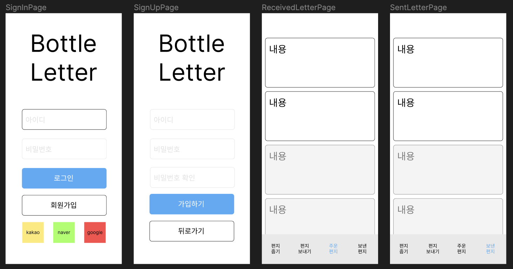

# ✉️ Bottle-Letter

어릴 적, 동화책에서 나올 법한 `물병에 담긴 편지`에서 영감을 받아 만든 프로젝트이다. 간단하게 설명하면 유저는 물병에 편지를 쓰고 해당 편지를 그저 발송한다. 그리고 유저는 `편지 줍기` 기능을 통해
다른 유저가 보낸 편지를 랜덤으로 받아서 읽어볼 수 있다. 여기까지 아주 간단한 기획으로 시작이 되었고, 이 뒤에 더욱 많은 기능들을 추가해볼 예정이다.

## 🚰 기획

아무래도 나는 프론트엔드 개발자다보니 페이지 단위로 기획을 짜보려했는데, 백엔드를 하는 동생과 논의한 끝에 객체 별 기능 단위로 초기 기획을 작성해보기로 했다.

- User

  - 회원가입
  - 로그인
    - 세션
    - Oauth
  - 로그아웃

- Letter

  - 편지 보내기
  - 편지 줍기
    - 한 번 보내진 편지는 최대 50번까지만 줍기 가능하다.(줍는 유저 중복 불가능)
  - 편지 모아보기
    - 받은 편지 모아보기
    - 보낸 편지 모아보기

- Hall of fame(명예의 전당)

  - 명예의 전당 모아보기
    - 좋아요 30번 이상 편지들 모아보기

## 🖍️ 디자인

디자인은 Figma를 사용해서 간단하게 작성해보았다. 스타일에 대한 디자인보다는 우선 레이아웃에 대한 프로토 타입만 작성했다.



## 🔨 기술 스택

사실 그동안 몇번의 프로젝트를 하면서 기술 스택에 대한 `왜?`라는 고민은 별로 해본 적이 없었다. 그저 `한 번 써보자`는 생각이나 `학습`을 위한 목적에 좀더 초점을 많이 맞췄던 것 같아서, 이번엔 정말 이 기술을 왜 사용하려는지 고민해보고 정리해보았다.

### TypeScript

인터프리터 언어인 JavaScript의 단점을 보완하기 위해 만들어진 정적 타입 언어로 컴파일 시점에 타입을 검사하여 사전에 오류를 방지할 수 있다.
따라서 코드의 안정성을 높이고, 가독성을 높이며, 개발 생산성을 높일 수 있다.

### React

순수 JavaScript보다 더욱 쉽게 UI를 구성할 수 있도록 도와주는 라이브러리로 컴포넌트 기반으로 UI를 구성할 수 있다.
다른 Vue, Angular와 같은 프레임워크와 비교했을 때, 가장 많은 사용자를 보유하고 있으며, 커뮤니티가 활발하다.
솔직히 말해서 사용하지 않을 이유가 없는 것도 사실인 것 같다.

### React Router

React에서 라우팅을 구현할 수 있도록 도와주는 라이브러리로 현재 기획 단계에서는 약 4개의 페이지 정도로 구성될 것으로 예상되기 때문에,
React Router를 사용하여 라우팅을 구현할 예정이다.

### Recoil

React에서 상태 관리를 할 수 있도록 도와주는 라이브러리로, 기존의 Redux와 같은 라이브러리보다 사용하기 쉽고, 가독성을 높일 수 있다.
또한, Redux와 같은 라이브러리보다 더욱 가볍고, 컴포넌트 간의 의존성을 낮출 수 있다.

### React Query(Tanstack Query)

React에서 API를 호출할 때 사용하는 라이브러리로, 기존의 Redux-Saga, Redux-Thunk와 같은 라이브러리보다 사용하기 쉽고,
코드의 가독성을 높일 수 있다. 또한, 캐싱 기능을 제공하기 때문에, API 호출을 최소화할 수 있다.

### styled-components

CSS-in-JS 라이브러리로, CSS를 JavaScript에서 작성할 수 있도록 도와준다. 따라서, CSS를 작성할 때 발생할 수 있는
클래스 네이밍 충돌을 방지할 수 있으며, CSS를 작성할 때 발생할 수 있는 브라우저 호환성 문제를 해결할 수 있다.

> 사실 Emotion의 styled를 사용하려 했었다. 단순하게 Emotion을 사용해본 적이 없었다는 것과 styled-components보다 성능이 좋다고 해서 Emotion을 사용하려 했었다. 헌데 몇몇 자료를 서치해보니 Emotion의 성능이 styled-components보다 좋다는 것은 사실이지만, 미미한 차이라고 한다. 그리고 사실 styled-components도 유의미하게 자주 사용해본 게 아니라서, styled-components를 사용하기로 결정했다.

### Jest

React에서 테스트를 작성할 때 사용하는 라이브러리로, 기존의 Mocha, Chai와 같은 라이브러리보다 더욱 사용하기 쉽고, 가독성이 높다.
또한, React Testing Library와 함께 사용할 때 더욱 편리하다.

### React Testing Library

React에서 테스트를 작성할 때 사용하는 라이브러리로, 기존의 Enzyme(에어비앤비에서 개발한 React Testing tool)보다 더욱 사용하기 쉽고, 가독성이 높다.
무엇보다 사용자의 관점에서 테스트를 작성할 수 있기 때문에, 사용자의 행동을 테스트하기에 더욱 적합하다.

ex. h1 태그에서 h2로 변경되었을 때, Enzyme을 사용하면 h1 태그가 존재하지 않기에 테스트가 실패하지만,
React Testing Library를 사용하면 사용자의 관점에서 테스트하기 때문에, h1 태그가 존재하지 않아도 테스트가 통과한다.
(사용자의 입장에선 지금 페이지의 heading이 h1 태그인지 h2 태그인지는 중요하지 않다. 그저 heading이 존재하여 어떤 내용을 담고 있는지만 알면 된다.)

### Storybook

React에서 컴포넌트를 개발할 때 사용하는 라이브러리로, 컴포넌트를 개발할 때 더욱 편리하게 개발할 수 있도록 도와준다. 특히 작은 단위의 컴포넌트들(주로 common)을 개발할 때 더욱 편리하다. 해서 작은 단위의 컴포넌트는 Storybook을 사용하고 큰 단위의 컴포넌트(page)들에서는 유저의 액션에 맞게 테스트를 작성할 수 있는 React Testing Library를 사용할 예정이다.

## 📡 마무리

틈틈히 매일 글을 적는 건 자주 했지만, 프로젝트 단위로 글을 적는 건 잘 못해서 이번엔 꼭 프로젝트 완성까지 의미있는 글을 써보려고 한다. 과정에 배우는 것들을 잘 기록해두고 기억하는 게 개발자로서 너무 중요하다고 느꼈기 때문이다. 다음 글에서는 AWS S3와 CloudFront, Route53 그리고 가비아로 정적 웹사이트를 배포하고 도메인까지 연결하는 과정을 정리해보려고 한다!

```toc

```
