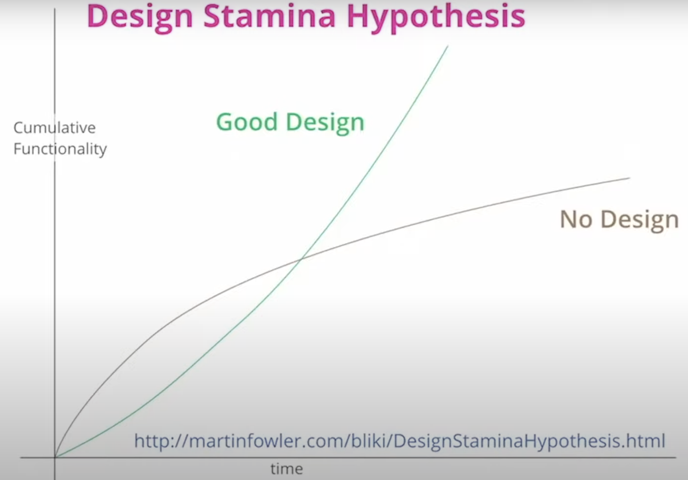
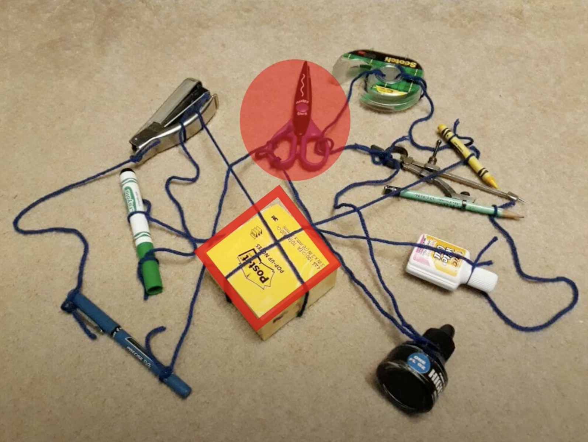
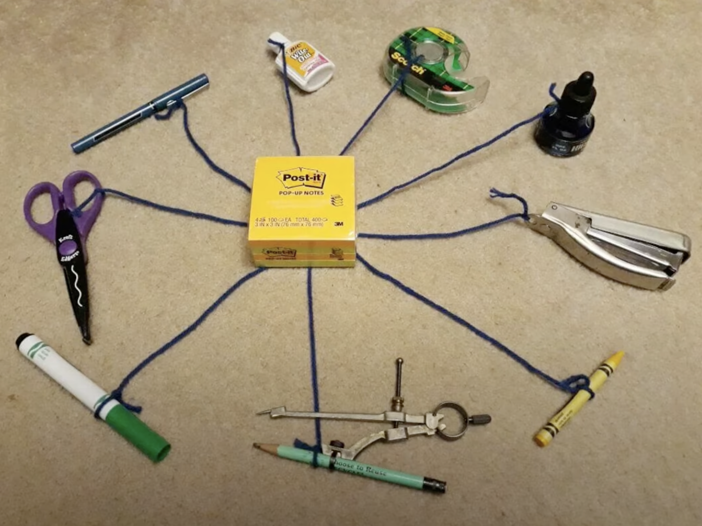
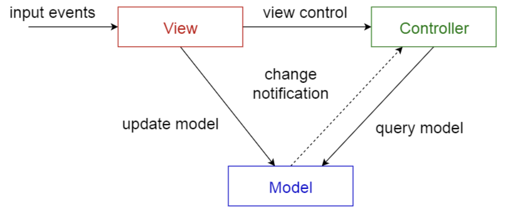
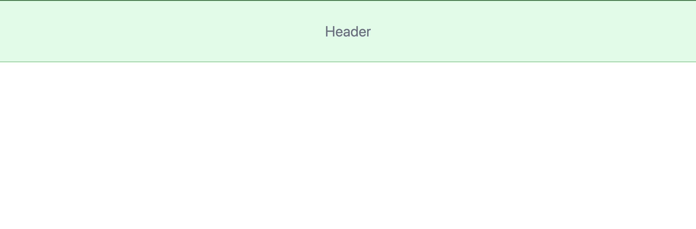

---  
emoji: 🌑  
title: 아키텍처와 디자인 패턴 in TS - 1. 아키텍처 - MVC 살펴보기
date: '2023-04-17 10:00:00'  
author: 제이든  
tags: 기록 일지 성장 발전 개발  
categories: 보름칼럼
---  

# 🌕 보름칼럼

단순 기록보단 좀 더 양질의, 정리된 글을 쓰고자 시작하는 `보름칼럼`<br/>  
부담없이 매 보름 하나의 주제를 깊게 들여다볼 수 있는 기회가 되었으면 좋겠다.<br/>  
가수 윤종신님이 월간 윤종신을 통해 꾸준히 음악을 내시는 것과 같이 보름칼럼을 적어보자!

> 보름칼럼 규칙
>
> 1. 매일을 기록하는 성장일지보다 좀더 깊은 내용의 글을 작성할 수 있도록 하자.
> 2. 너무 욕심부리지말고 하나의 주제(키워드)에 집중한다.
> 3. 2주에 한 번 다듬어진 칼럼 형태의 글을 작성한다.
> 4. 마감은 매주 일요일을 기준으로 한다.

## 📃 글또 8기

개발자들이 모여 함께 글을 쓰고 피드백하는 커뮤니티인 [글또(글쓰는 또라이가 세상을 바꾼다.)](https://www.notion.so/zzsza/ac5b18a482fb4df497d4e8257ad4d516)에서  
활동하게 되어 보름칼럼의 규칙은 글또의 규칙을 따르기로 한다.<br/>  
2주마다 글을 작성하는 규칙은 동일하며, 그 마감 날짜는 아래와 같다. 마감 날짜를 체크하며 매번 글 작성에 대해 인지하도록 하자!<br/>

## 🚈 들어가기에 앞서...

매번 작은 프로젝트 때마다 리팩토링하는 게 쉽지 않았다. 그러다 공부를 하며 아키텍처, 디자인 패턴 등을 알게 되었고 자주 사용되는 패턴을 적용하면 추후에 코드를 리팩토링하기 좋을 거라는 느낌이 왔다! 해서 이번 프로젝트를 진행하며 공부한 아키텍처와 디자인 패턴에 대한 내용들, 그리고 내가 잘못알고 있었던 부분들을 정리해보려 한다.

## 🍗 패턴???

패턴(pattern)은 프랑스어 낱말인 `patron`에서 나온 말로, `되풀이되는 사건이나 물체의 형태`를 의미한다. 즉, 개발에 있어서의 패턴은 `코드로 표현된 어떤 되풀이되는 형태`를 의미한다고 볼 수 있다.

## 🍖  소프트웨어 아키텍처..?

먼저 위키피디아 정의를 보자.

> **소프트웨어 구조** 또는 **소프트웨어 아키텍처**(software architecture)는 [소프트웨어](https://ko.wikipedia.org/wiki/%EC%86%8C%ED%94%84%ED%8A%B8%EC%9B%A8%EC%96%B4)의 구성요소들 사이에서 유기적 관계를 표현하고 소프트웨어의 설계와 업그레이드를 통제하는 지침과 원칙이다.

엄... 직접적으로 와닿지는 않지만, 대충 뭔가  알 것 같은 설명이다. `소프트웨어의 구조를 표현하고 이를 설계하는 어떤 원칙 정도`로 생각해볼 수 있을 것 같다. 좀더 상상력을 통해 덧붙여보자면 뭔가 소프트웨어를 개발하기 위한 짜여져 있는 틀(?) 정도의 느낌도 난다.

### 기본적인 원리

모듈화
- 시스템의 기능들을 모듈 단위로 나눈다.
  추상화
- 전체적이고  포괄적인 개념을 설계한다.
  단계적 분해
- 문제를 상위의 중요 개념에서부터 하위 개념으로 분할하며 구체화시킨다.
  정보 은닉
- 한 모듈 내부에 포함된 절차와 자료를 숨기며 독립적인 책임과 역할을 갖게 하고 외부에서 접근하거나 변경하지 못하게 한다.

🧐... 정의보다 기본적인 원리가 더 헷갈리는 기분이다. 정의만 봤을 때는 너무 추상적이라 구체적으로 와닿지 않았다면, 원리는 객체지향의 기본적인 개념이라 너무 당연한 느낌이 든다.

### 왜 중요한가?

왜 소프트웨어 아키텍쳐를 중요하게 생각해야할까?

아래 그림은 `마틴 파울러 - 소프트웨어 아키텍처의 중요성` 영상에서 나오는 자료이다.



아키텍처 설계가 되어있지 않은채로 개발을 진행하게 되면 단기적으로는 많은 기능들을 구현할 수 있더라도 결국에 시간이 지나면서 기능을 추가하고 관리하기 어려워진다. 즉, 유지보수가 힘들어지고 점점 더 많은 시간과 비용이 발생하게 된다. 반면, 처음부터 아키텍처를 잘 정의하고 개발을 한다면 아키텍처를 설계하는 초기 시간과 비용이 있겠지만 추후에 기능을 더하고 관리함에 있어서 훨씬 수월해진다.

> 좋은 내부 품질을 가진 소프트웨어는 기능을 추가하는데 초기 시간이 걸리더라도 추후에 더 빠르게 원하는 기능을 추가하고 더할 수 있다.

- 아키텍처가 적용되기 전




- 아키텍처가 적용된 후



위의 사진을 보면 어떨까? 누가봐도 후자의 사진이 더 추후 물건을 더하거나 제거하는 게 쉽고 편해보인다.(물론 후자의 사진도 중앙의 포스트잇에 대한 의존성이 너무 큰 문제가 있긴 하다.)

시각적인 자료로 보니 이제 조금은 알 것 같다. 결국 아키텍처란 `소프트웨어를 개발하기에 앞서 선행되는 거대한 구조 그리고 개발에 대한 지침`의 역할을 한다고 볼 수 있다. 또한, 이런 설계 패턴을 정립하고 개발을 하게 되면 그에 따른 문제들, 그리고 그 문제들에 대한 대응책들이 데이터로 쌓이게 된다. 즉, 아키텍처를 정립하고 개발하게 되면 어떤 문제를 마주하더라도 이미 존재하는 수많은 해결책들이 존재한다는 의미이다.

## 🦴 어떤 아키텍처 패턴들이 있을까?

1. Layered pattern
2. Client-server pattern
3. Master-slave pattern
4. Pipe-filter pattern
5. Broker pattern
6. Peer-to-peer pattern
7. Event-bus pattern
8. Model-view-controller pattern
9. Blackboard pattern
10. Interpreter pattern

음... 사실 나는 위의 10개 중 MVC만 알고 있었고 참고자료에서 내용을 살펴보니 Client-server pattern도 알고는 있었지만, 이게 아키텍쳐 패턴 중 하나인지는 처음 알게 되었다. 이 중 MVC 패턴이 자주 사용되고(백엔드에서 아주 중요한 패턴) 여기서 MVVM, Flux 패턴 등이 파생되었다고 해도 무방하기에 MVC 패턴에 대해서 좀더 알아보려 한다.

### MVC(Model - View - Controller) 패턴

- 모델(Model) - 소프트어의 데이터를 관리한다.
- 뷰(View) - 사용자가 볼 수 있는 화면을 담당한다.
- 컨트롤러(Controller) - 모델과 뷰 사이에서 이 둘을 관리하여 의존성을 낮추는 역할을 한다.



사실 부끄럽지만, 아키텍처의 개념이 이렇게 거대한 것인줄 모르고 이번 프로젝트에서 각 컴포넌트를 MVC 패턴으로 개발해보았다. 이 때, Controller의 역할을 Component라고 부르기로 하고 Component에서 Model과 View를 이용하여 하나의 작은 컴포넌트를 만드는 설계를 해보았다.

#### MVC 패턴으로 설계해본 컴포넌트(feat. TypeScript)

먼저 Model, View, Component(Controller)에 대한 interface이다.

```ts
export interface Model {  
setState(state: State): void;  
get state(): State;  
}  
  
export interface View {  
render(state: State): void;  
get element(): HTMLElement;  
}  
  
// Component는 좀더 유연하게 interface로만 관리  
export interface Component {  
// private _model: Model;  
// private _view: View;  
// setState를 private 처리함으로써 상위 컴포넌트에서 하위 컴포넌트의 상태를 직접 조작하지 못하게 막음.  
// private setState(state: State): void;  
get element(): HTMLElement;  
attachTo(component: Component): void;  
get state(): State;  
}
```

- Model은 state를 관리하고 setState를 통해 state를 변경하는 역할을 한다.
- View는 state를 받아 화면을 그리는 render 함수 그리고 해당 화면을 element로 반환할 수 있는 element getter를 갖고 있다.
- Component는Model과 View를 통해 state 관리와 화면을 그려주게 되며 attachTo 메서드를 통해 컴포넌트 간의 상하위 관계를 형성한다.(DOM Tree 구조를 만들기 위함)

그리고 이제 위의 interface를 통해 좀더 구체적인 추상 클래스를 작성해보았다.

```ts
export abstract class AbstractModel implements Model {  
protected _state: State;  
protected constructor() {  
this._state = {};  
}  
  
setState(newState: State) {  
this._state = { ...this._state, ...newState };  
}  
  
get state() {  
return this._state;  
}  
}  

export abstract class AbstractView implements View {  
protected _templateElement: HTMLTemplateElement;  
protected _element: HTMLElement;  
protected constructor() {  
this._templateElement = document.createElement('template');  
this._element = this._templateElement.content  
.firstElementChild as HTMLElement;  
  
this.setTemplate();  
this.setElement();  
}  
  
protected setTemplate() {  
this._templateElement.innerHTML = ``;  
}  
  
protected setElement() {  
this._element = this._templateElement.content  
.firstElementChild as HTMLElement;  
}  
  
render(state: State) {  
this.element.innerHTML = ``;  
}  
  
get element() {  
return this._element;  
}  
  
setEvent(  
selector: string,  
eventName: keyof WindowEventMap,  
handler: EventListener,  
) {  
$(selector, this.element)!.addEventListener(eventName, handler);  
}  
}
```

먼저 Model은 interface와 큰 차이가 없기에 생략하고, View를 살펴보자. 조금 지저분하지만 간단하다. 먼저 template element를 만들고 이 element에 innerHTML로 내가 원하는 element의 html 형태를 전달한다. 이후 template element의 첫번째 자식을 선택하여 template 태그를 제외한 그 내부 template literal에 해당하는 element를 얻어낸다. 그리고 해당 컴포넌트에 존재하는 element들에 어떤 이벤트 리스너를 붙여주기 위한 setEvent 메서드를 추가하였다.

> Controller의 역할을 하게 될 Component는 Model과 View를 의존성 주입 형태로 받는 게 아니라 각각의  Component마다 모듈로 받아서 처리했기에 따로 추상 클래스를 두지 않았다.

이제 어느 정도 나만의 설계는 완성되었고 이를 통해 아주 간단한 컴포넌트 예시를 하나 살펴보려 한다.

- HeaderModel
```ts
import { AbstractModel } from '@custom-types/abstracts.js';  
  
export class HeaderModel extends AbstractModel {  
constructor() {  
super();  
}  
}
```

Model은 너무 간단하다. 위의 추상 클래스를 상속하여 `header` 컴포넌트가 갖게 될 상태만을 관리한다.

- HeaderView
```ts
import { State } from '@custom-types/types';
import { AbstractView } from '@custom-types/abstracts.js';  
  
export class HeaderView extends AbstractView {  
constructor() {  
super();  
}  
  
protected setTemplate() {  
this._templateElement.innerHTML = `<header class="h-1/6 bg-green-100 border border-green-500 text-3xl text-gray-500 grid place-content-center">Header</header>`;  
}  
  
render(state: State) {  
return;  
}  
}
```

위와 같이 내가 원하는 `header`의 형태를 template literal로 전달해주고 render에서는 state를 받아 전달받은 template literal을 조작하는 작업을 한다.(추후에 이 부분이 내가 원하던 리액트스러운 설계가 아니라는 걸 알게 되어서 대규모로 리팩토링을 하게 된다...🥺 이땐 몰랐지...ㅠ)

> 참고로 html 태그의 class내에 있는 값들은 tailwindCSS를 통한 스타일 표현법이다. 이 글에서는 자세히 다루지 않겠지만, 이번 프로젝트에서는 코드의 설계에 집중하고 싶어서 비교적 style에 대한 고민을 덜할 수 있게 해주는(?) tailwindCSS를 사용하였다.

위와 같은 컴포넌트를 가장 바깥의 `root` id를 가진 태그에 붙여준다.

```ts
import { HeaderComponent } from '@components/header/HeaderComponent.js';  
import { MainComponent } from '@components/main/MainComponent.js';  
import { FooterComponent } from '@components/footer/FooterComponent.js';  
  
export class App {  
constructor(appRoot: HTMLElement) {  
const header = new HeaderComponent();  
const main = new MainComponent();  
const footer = new FooterComponent();  
  
appRoot.appendChild(header.element); // 이 녀석이 위에서 구현한 header 컴포넌트
appRoot.appendChild(main.element);  
appRoot.appendChild(footer.element);  
}  
}
```

여기서는 App 컴포넌트는 내가 설계한 component를 적용하지 않았기에 DOM api인 appendChild를 통해 자식 컴포넌트를 붙이게 된다.

위의 결과물을 살펴보자면



이런 식의 Header가 완성된다. 이제 여기에 또 자식 컴포넌트를 붙여서 하나의 큰 프로젝트를 설계할 수 있다.

## 🚉 글을 마치며...

처음 이 글의 주제는 `아키텍처 vs 디자인 패턴`이었다. 매번 설계없이 진행했던 프로젝트를 추후에 리팩토링하는 게 너무 힘들어서 이번 프로젝트에선 설계에 정말 많은 시간을 들였다. 하지만 이게 웬걸... 아키텍처와 디자인 패턴의 근복적인 차이도 모르고 그저 유명한 MVC 패턴을 적용해서 나만의 컴포넌트를 만들고 있었고, MVC와 옵저버 패턴을 동일한 선상의 개념으로 생각하고 프로젝트에 적용했다. 그러다 전공생인 동료와의 대화 중 아키텍처 패턴(ex. MVC)과 디자인 패턴(ex. 옵저버 패턴)의 차이를 알게 되었고 뭣모르고 설계한 프로젝트의 코드가 조금은 부끄러워졌다. 이런 이유로 이 둘의 차이를 확실히 알고 내가 적용했던 방법이 통용되는 방법(?)은 아니었음을 기록하기 위해 이 주제를 선정하였다.
다음에는 디자인 패턴에 대해서 알아보고 디자인 패턴 중 옵저버 패턴을 사용하여 컴포넌트를 구성한 경험을 적어보려 한다. 그리고 그 뒤에는 이 차이를 알고서 새롭게 리팩토링한 코드에 대해서도 다뤄볼 예정이다.

> 아직 많이 부족한 개발자입니다. 내용에 대한 오류가 있다면, 언제든 편하게 말씀해주세요! 감사합니다!

## 🎁 참고

- [패턴](https://ko.wikipedia.org/wiki/%ED%8C%A8%ED%84%B4)
- [소프트웨어 아키텍처 위키피디아](https://ko.wikipedia.org/wiki/%EC%86%8C%ED%94%84%ED%8A%B8%EC%9B%A8%EC%96%B4_%EA%B5%AC%EC%A1%B0)
- [디자인 패턴 - 리팩토링 구루](https://refactoring.guru/ko)
- [아키텍처 패턴과 디자인 패턴](https://velog.io/@toma/%EC%86%8C%ED%94%84%ED%8A%B8%EC%9B%A8%EC%96%B4-%EC%95%84%ED%82%A4%ED%85%8D%EC%B3%90%EB%94%94%EC%9E%90%EC%9D%B8-%ED%8C%A8%ED%84%B4%EC%9D%98-%EA%B0%9C%EB%85%90%EA%B3%BC-%EC%B0%A8%EC%9D%B4%EC%A0%90)
- [마틴 파울러 - 소프트웨어 아키텍처의 중요성](https://www.youtube.com/watch?v=4E1BHTvhB7Y)
- [우아콘 2022 - 개발자가 아키텍처에 집착하는 이유, 쉽게 알려드립니다.](https://www.youtube.com/watch?v=saxHxoUeeSw)
- [아키텍처 패턴이란](https://mingrammer.com/translation-10-common-software-architectural-patterns-in-a-nutshell/?utm_source=gaerae.com&utm_campaign=%EA%B0%9C%EB%B0%9C%EC%9E%90%EC%8A%A4%EB%9F%BD%EB%8B%A4&utm_medium=social#%EC%95%84%ED%82%A4%ED%85%8D%EC%B3%90-%ED%8C%A8%ED%84%B4%EC%9D%B4%EB%9E%80)

```toc  
  
```