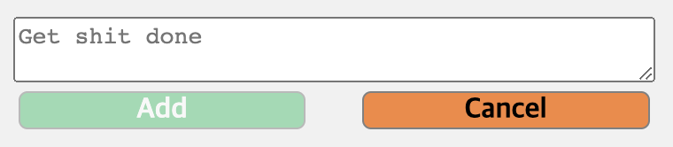

## 🔨 프로젝트 일지

> 정보 전달보단 프로젝트를 진행하며 겪은 점들, 느낀 점들을 기록한 일지

### `Project`: Get Shit Done

나만의 ToDo리스트를 만들기 위해 시작한 프로젝트<br/>
`Get Shit Done`은 `그냥 닥치고 해`라는 의미로 평상시 스스로 다짐하는 문장인데, 투두리스트와 어울린다 생각하여 프로젝트명으로 정하게 되었다.<br/>
이번 프로젝트의 가장 큰 목적과 의의는 웹팩 및 바벨을 통해 각 모듈을 `웹 컴포넌트`로 구성하여 동작하게 하는 것이다!!!

#### 🤪 컴포넌트 로직

먼저 들어가기에 앞서 컴포넌트를 나눈 부분을 다시 보자면, 크게 아래와 같이 나누었다.

- todoApp.js: 전체 앱을 나타낸다.
- todoContainer.js: 앱 내에 메모장을 나타낸다.(여러개의 메모장을 생성하게 할 예정)
- todoToolbar.js: 메모에 대한 조작을 하는 툴바 부분
- todoNote.js: 툴바 조작에 따라 메모를 입력할 수 있는 input 부분
- todoList.js: 메모 전체를 감싸고 있는 부분
- todoItem.js: 메모 컴포넌트

##### 🧭 todoNote

todoNote는 item(memo)을 추가하기 위한 컴포넌트로 memo의 내용을 입력하는 부분이다.

```js
connectedCallback() {
    // 1. Add 버튼 클릭 시 새로운 메모 생성
    const $noteAddButton = this.shadowRoot.querySelector('.note-add-button');
    const $noteInput = this.shadowRoot.querySelector('.note-input');
    $noteAddButton.addEventListener('click', (event) => {
      // 1-1. input이 없을 때는 메모 생성 막기
      if (!$noteInput.value) return;

      const $todoItem = document.createElement('todo-item');
      $todoItem.dataset.containerTitle = this.dataset.containerTitle;
      $todoItem.dataset.itemTitle = $noteInput.value;
      this.nextElementSibling.shadowRoot.append($todoItem);

      // 1-2. 메모 갯수 더하기
      const $noteCount =
        this.previousElementSibling.shadowRoot.querySelector('.count-item');
      $noteCount.textContent = +$noteCount.textContent + 1;

      // 1-3. Add 버튼 비활성화
      $noteAddButton.style.opacity = '50%';

      // 1-4. Add 사용자 활동 기록
      const $record = document.createElement('div');
      $record.className = 'record';
      $record.innerHTML = `<span class="record-important">@Jayden</span> added <span class="record-important">${$noteInput.value}</span> to <b>${this.dataset.containerTitle}</b>`;

      const now = Date.now();
      $record.dataset.timeMakeNote = now;
      activityLog.push($record);

      // 1-5. Add 버튼 클릭 후 입력칸 초기화
      $noteInput.value = '';
    });
      // 2. Cancel 버튼 클릭 시 todoNote 닫기
      const $noteCancelButton = this.shadowRoot.querySelector(
        '.note-cancel-button'
      );
      $noteCancelButton.addEventListener('click', (event) => {
        this.style.display = 'none';

        // 2-1. 메모 닫은 후 입력칸 초기화
        $noteInput.value = '';
      });

      // 3. 메모 입력 시 Add 버튼 활성화
      $noteInput.addEventListener('input', (event) => {
        $noteAddButton.style.opacity =
          event.target.value.length === 0 ? '50%' : '100%';
      });
    }
```



- 1-1. input에 값이 없는 경우는 이벤트가 발생하지 않도록 `early return`을 활용했다.
  - 이런 패턴은 원치 않은 경우에, 아예 코드를 실행하지 않기때문에 메모리적인 면으로도 굉장히 유용하니 자주 사용하도록 하자!
- 1-2. 이전 장의 todoToolbar에 있는 memo의 갯수를 더해주는 기능이다. 이 때는 다행히(?) toolbar와 note 컴포넌트가 형제관계라 접근하기 편했지만, 컴포넌트를 너무 복잡하게 나누면 더 접근하기 어려웠을 것 같다.
- 1-4. 이 부분은 최근에 새로 추가한 로직으로, 메모에 대한 추가/수정/삭제에 대한 기록을 보여주는 기능을 구현하기 위함이다.
- 1-5. 이런 게 놓치기 쉬운 것 같다. add 버튼으로 메모를 작성하고 다시 input에 값을 빈 값으로 초기화해준다. 뭔가 이런 부분이 컴퓨터이기에 하나하나 명령해줘야한다고 느끼는 부분이다.ㅋㅋ

- 3 . 메모 input에 값이 생기면 시각적으로 뚜렷하게 하고 다시 input값의 길이가 0이되면 반투명하게 만든다.

##### 🧭 todoItem

추가할 로직이 제일 많았던, 메모 그 자체 컴포넌트인 todoItem!!! 거두절미하고 바로 코드로!!!

```js
connectedCallback() {
    // 1. item이 생성되고 DOM에 추가될 때 그 안에 텍스트를 바꿔주기
    this.shadowRoot.querySelector('.item-content').textContent =
      this.dataset.itemTitle;
    // 추가) 모달 창 input value에도 같은 값 할당
    this.shadowRoot.querySelector('.modal-input').value =
      this.dataset.itemTitle;

    // 2. item X button 클릭 시 item 삭제 및 count 빼기
    const $itemDeleteButton = this.shadowRoot.querySelector(
      '.item-delete-button'
    );
    $itemDeleteButton.addEventListener('click', (event) => {
      // 2-0. 컨펌 메시지 false인 경우 early return
      if (!confirm('선택하신 카드를 삭제하시겠습니까?')) return;

      // 2-1. item 삭제
      this.remove();

      // 2-2. count 빼기
      // ✅다시: shadow dom 바깥으로 가는 다른 루트는 없는지 확인
      const containerTitle = this.dataset.containerTitle;
      const $noteCount = document
        .querySelector('todo-app')
        .shadowRoot.querySelector(
          `[
            data-container-title=${containerTitle}
          ]`
        )
        .shadowRoot.querySelector('todo-toolbar')
        .shadowRoot.querySelector('.count-item');
      $noteCount.textContent = +$noteCount.textContent - 1;

      // 2-3. 활동 기록에 삭제 활동 추가
      const $record = document.createElement('div');
      $record.className = 'record';
      $record.innerHTML = `<span class="record-important">@Jayden</span> deleted <span class="record-important">${this.dataset.itemTitle}</span> from <b>${this.dataset.containerTitle}</b>`;

      const now = Date.now();
      $record.dataset.timeMakeNote = now;
      activityLog.push($record);
    });

    // 3. 아이템 더블 클릭 시 수정 모달 생성
    this.addEventListener('dblclick', (event) => {
      this.shadowRoot.querySelector('.item-modal-outer').style.display =
        'block';
      this.shadowRoot.querySelector('.item-modal-inner').style.display = 'flex';
    });

    // 4. 모달 창 X 클릭 시 모달 닫기
    const $modalCloseButton = this.shadowRoot.querySelector(
      '.modal-close-button'
    );
    const $modalInner = this.shadowRoot.querySelector('.item-modal-inner');
    const $modalOuter = this.shadowRoot.querySelector('.item-modal-outer');

    $modalCloseButton.addEventListener('click', (event) => {
      $modalInner.style.display = 'none';
      $modalOuter.style.display = 'none';
      $modalInner.querySelector('.modal-input').value = this.dataset.itemTitle;
    });

    // 5. 모달 창 save button 클릭 시 내용 변경
    const $modalSaveButton =
      this.shadowRoot.querySelector('.modal-save-button');
    const $modalInput = this.shadowRoot.querySelector('.modal-input');
    const $itemContent = this.shadowRoot.querySelector('.item-content');
    $modalSaveButton.addEventListener('click', (event) => {
      $modalInner.style.display = 'none';
      $modalOuter.style.display = 'none';

      // 5-1. 활동 기록에 수정 활동 추가
      const $record = document.createElement('div');
      $record.className = 'record';
      $record.innerHTML = `<span class="record-important">@Jayden</span> changed <b>${$itemContent.textContent}</b> to <span class="record-important">${$modalInput.value}</span> in <b>${this.dataset.containerTitle}</b>`;

      const now = Date.now();
      $record.dataset.timeMakeNote = now;
      activityLog.push($record);

      $itemContent.textContent = $modalInput.value;
    });
}
```

- 2-0. 이 부분도 아주 유용하게 사용한 `early return` 패턴!
- 2-2. 나를 제일 고생시켰던 녀석... 컴포넌트 별로 shadow dom이 형성되다보니, 컴포넌트에서 다른 컴포넌트를 선택하는 것이 너무 까다로웠다. 특히나, 지금과 같이 컴포넌트가 서로 부모, 자식 관계일 때 자식 컴포넌트의 root 노드가 본인이다보니 그 위로 접근하는 게 불가능했다.(가능한지 정말 열심히 뒤졌지만... shadow dom의 개념을 생각해보면 안되는 게 맞다...) 그래서 결국 dataset을 통해 위에서부터 하나하나 접근하는 방법을 선택했다. 추후에 이 부분을 다르게 해결할 수는 없는지 꼭 알고싶다.
- 3 . 이제 모달 창을 만드는 부분은 쉽게 처리할 수 있게 되었다. 역시 계속 해봐야한다.

> 코멘트를 굳이 남기지 않은 부분들은 앞서 설명한 부분들을 통해 이해할 수 있거나 크게 어렵지 않았던 부분이라 생략하였다.(물론 이 코드들조차도 지저분하지만...)
> 일단 기능구현에 초점을 맞춰 프로젝트를 몇번 진행하다보니, 점점 코드 자체에 신경을 쓰고 싶어지고 더더 알아가고 싶은 게 많아진다. 사람 욕심이 참 그런 것 같다.
> 천천히 마음 잡고 내가 할 수 있는 선에서 더 나아가면 된다.
> 추가로 `드래그 앤 드랍`과 `다크모드`를 구현해볼 예정이다..!

```toc

```
