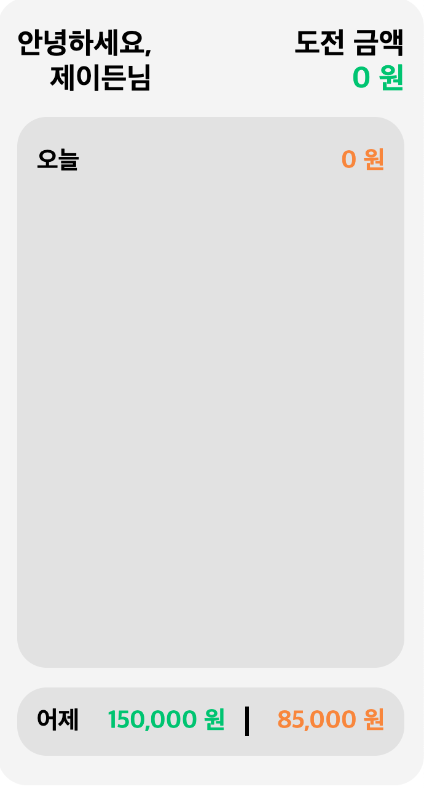
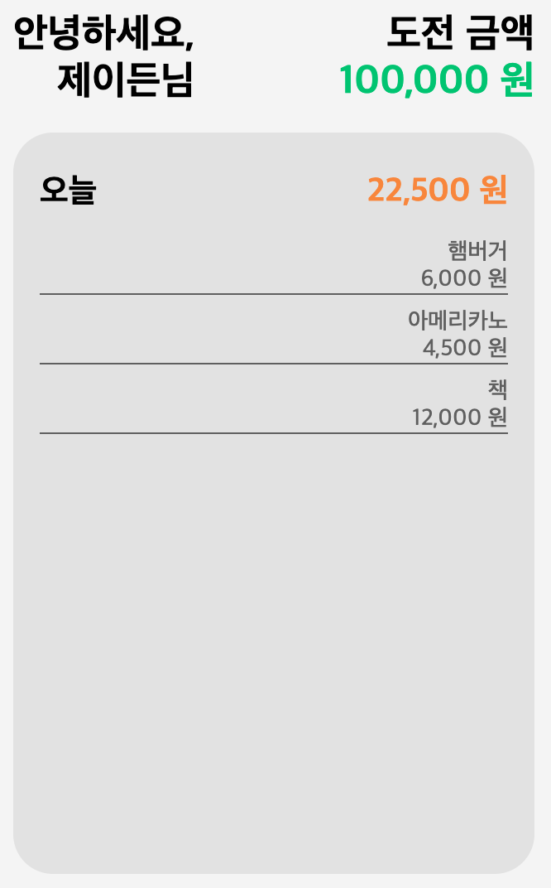

## 🔨 프로젝트 일지

> 정보 전달보단 프로젝트를 진행하며 겪은 점들, 느낀 점들을 기록한 일지

### `Project`: Yestoday(account book)

기획부터 시작해보는 프로젝트!!! 이번 프로젝트는 가계부 웹앱을 만들기로 결정했다.<br/>
다만, 이미 은행 어플을 통해 어느정도 가계부 역할을 하는 상세한 기능들이 제공되기에 새로운 기획을 생각해보았다.<br/>
간략한 컨셉은 다음과 같다.

- 유저는 오늘 `도전할 소비 금액`을 설정한다. 소비 시 해당 금액과 내용을 입력한다.
- 메인 화면에는 `어제`와 `오늘`에 대한 정보가 나온다.
- `어제`를 클릭하면 최근 1년 간의 데이터를 캘린더 뷰로 볼 수 있다.

처음 피그마로 간단하게 디자인을 만들어보았다.


#### 🦾 프로젝트 목표

- MVC 패턴 및 옵저버 패턴
- 라우터 구현
- 꼭꼭꼭 왜 이렇게 코드를 작성해야하고 어떻게 프로젝트를 구성할지 미리 생각하고 작성하도록 하자
- 가능하면 다양한 개발 환경을 시도해보자
- 욕심 더 부려서 Jest를 이용하여 테스트 코드까지 작성해보기
- 욕심 부릴 수 있는 프로젝트를 만들어보자

#### 🤑 메인 페이지 - Model, View

거두절미하고 간단하게 코드로 보자!

##### main(home) - html

```html
<div id="app-main">
  <header class="header">
    <div class="header__left">
      <p>안녕하세요,</p>
      <p>제이든님</p>
    </div>
    <div class="header__right">
      <p>도전 금액</p>
    </div>
  </header>
  <main class="main">
    <div class="main__header">
      <div>오늘</div>
    </div>
    <div class="main__body spend-list"></div>
  </main>
  <!-- footer는 추후 구현 예정이라 하드 코딩 -->
  <footer class="footer">
    <div>어제</div>
    <div class="yesterday-challenge-money">150,000 원</div>
    <div class="yesterday-total-spend-money">85,000 원</div>
  </footer>
</div>
```

- scss는 생략



먼저 html과 css를 통해 전체적인 구조를 잡고 model과 view를 이용하여 만들어줘야할 컴포넌트를 분리하였다.(위의 예시 코드에서 이미지와 다르게 빠져 있는 구조들이 추후 model의 상태(데이터)를 받아 view로 구현 에정)

##### Model - challenge money

```js
import Observable from '../interfaces/observable';

export default class ChallengeMoneyModel extends Observable {
  constructor() {
    super();
    this.money = 0;
  }
  getMoney() {
    return this.money;
  }
  setMoney(money) {
    this.money = money;
    this.notify(this.money);
  }
}
```

뭔가 설명하기 민망할 정도로 간단하다. 먼저 옵저버 패턴을 적용하여 model이 구독중인 view에게 상태 변경을 알려야하므로 미리 만들어둔 observable 모듈을 상속한다. <br/>
초기 기본 금액은 0 원이이 되고 각각 금액을 가져오는 메서드 getMoney()와 금액을 변경하는 메서드 setMoney()를 작성해준다.

##### View - challenge money

```js
export default class ChallengeMoneyView {
  constructor({ model }) {
    this.$appMain = document.querySelector('#app-main');
    this.$appChallengeInput = document.querySelector('#app-challenge-input');
    this.$target = document.createElement('div');
    this.$target.className = 'challenge-money';
    this.moneyModel = model;
    this.moneyModel.subscribe(this.render.bind(this)); //Model에 구독
    this.render();
  }
  render() {
    const money = this.moneyModel.getMoney(); //Model의 상태를 가져와서 렌더링
    this.$target.innerHTML = `${money.toLocaleString()} 원`;
    this.$target.addEventListener('click', this.hideShow.bind(this));
  }
  hideShow() {
    this.$appMain.style.display = 'none';
    this.$appChallengeInput.style.display = 'flex';
  }
}
```

모델의 getMoney()를 통해 도전 금액을 가져온다. <br/>
또한, 도전 금액을 클릭 시 금액을 입력하는 페이지로 갈 수 있게 hideShow() 메서드를 통해 각 페이지의 display를 변경해준다.<br/>
이 부분은 추후 client routing으로 페이지 별 path를 다르게 리펙토링할 예정이다.

##### Model - spend item

```js
import Observable from '../interfaces/observable';

export default class SpendItemModel extends Observable {
  constructor() {
    super();
    this.items = [];
    this.id = 1;
  }
  getItems() {
    return this.items;
  }
  setItems({ name, price }) {
    this.items.push({ id: this.id, name: name, price: price });
    this.notify(this.items);
    this.id++;
  }
  removeItem({ id }) {
    this.items = this.items.filter((item) => item.id !== +id);
    this.notify(this.items);
  }
}
```

이 부분이 재미있었다. item의 경우 위의 money와 다르게 item의 name, price 그리고 각 아이템의 고유한 id를 객체로 전달하게끔 처리해주었다.(그래야 추후 view에서 name과 price를 각각 보여줄 수 있으니)<br/>
또한, id를 통해 view로 만든 품목을 삭제할 수 있도록 removeItem() 메서드를 작성하였다.

##### View - spend money

```js
export default class ChallengeMoneyView {
  constructor({ model }) {
    this.model = model;
    this.$target = document.createElement('div');
    this.$target.className = 'spend-money';
    this.$appMain = document.querySelector('#app-main');
    this.$appItemInput = document.querySelector('#app-item-input');
    this.model.subscribe(this.render.bind(this));
    this.render();
  }
  render() {
    this.spendMoney = 0;
    const items = this.model.getItems();
    items.forEach((item) => (this.spendMoney += item.price));
    this.$target.innerHTML = `${this.spendMoney.toLocaleString()} 원`;
    this.$target.addEventListener('click', this.hideShow.bind(this));
    this.$target.addEventListener('click', this.resetInput.bind(this));
  }
  hideShow() {
    this.$appMain.style.display = 'none';
    this.$appItemInput.style.display = 'flex';
  }
  resetInput() {
    const $itemInput = document.querySelectorAll('.main-item-input input');
    $itemInput.forEach((ele) => (ele.value = ''));
  }
}
```

앞서 challenge money view를 구현하는 부분과 차이라면 아래와 같다.

- 받아오는 데이터각 객체에 대한 배열이므로 배열 내 각 객체에 대한 view를 위한 로직을 작성한 점
- 아이템을 추가할 때, 입력하는 페이지에서 이름과 금액 요소의 값을 초기화해주는 메서드 resetInput()

##### View - spend item list

```js
export default class SpendItemView {
  constructor({ model }) {
    this.model = model;
    this.model.subscribe(this.render.bind(this));
    this.$spendList = document.querySelector('.spend-list');
    this.$spendList.addEventListener('dblclick', (event) => {
      if (!event.target.classList.contains('spend-item')) return;
      this.model.removeItem({ id: event.target.classList[1].split('-')[2] });
    });
    this.render();
  }
  render() {
    this.$target = ``;
    const items = this.model.getItems();
    items.forEach(
      (item) =>
        (this.$target += `
        <div class="spend-item spend-item-${item.id}">
          <div class="item-name item-name-${item.id}">${item.name}
          </div>
          <div class="item-money item-money-${item.id}">${item.price.toLocaleString()} 원
          </div>
        </div>`),
    );
    this.$spendList.innerHTML = this.$target;
  }
}
```

여기도 구현하는데 고민이 많았지만 재미있었다!<br/>
바로 위의 spend money와 같이, 아이템 데이터를 이용하므로 SpendItem.model 모듈을 구독한다.<br/>
이 뷰에서는 각각의 품목이 보이고 그 품목을 더블 클릭 시 모델에서 삭제하는 로직도 gi구현하였다.(이 부분을 controller에서 구현하는 게 더 나을 거 같다는 생각도 든다.)



#### 🤢 여기까지 회고

후아... 바닐라 자바스크립트로 구현하는 게 쉽지 않다고 생각은 했지만, 이번 프로젝트는 특히나 개념을 코드로 옮기는 게 잘 와닿지 않아서 멘탈이 쪼메 힘들었다.<br/>
위의 코드도 패턴을 제대로 따른 것도 아니고, 의존성을 최소화한 것도 아니지만 코드를 쓰고 보이는 view를 토대로 수정하고 수정하다보니 정말 대략적으로나마 모델에서 데이터를 어떻게 관리하고 각 구독 함수(정확히는 view들의 render() 메서드)에게 어떻게 상태 변경을 알려주는지 그 흐름을 알 것 같다.<br/>

> 다음엔 이제 각각의 항목을 입력하는 model과 view에 대해 정리해보려한다!

```toc

```
