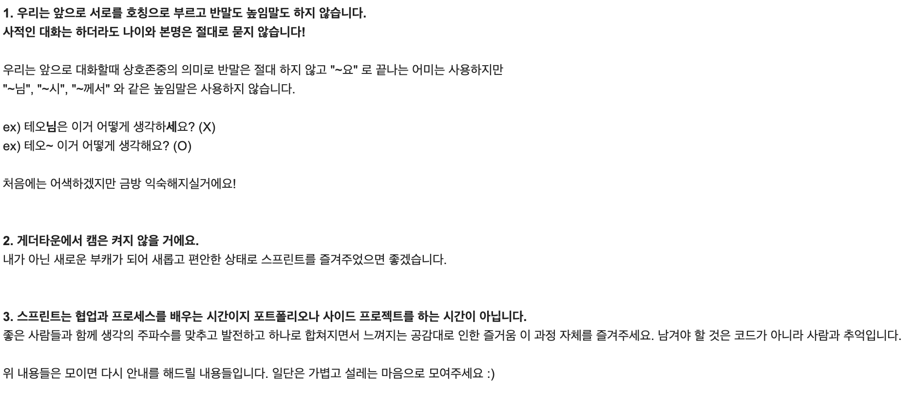
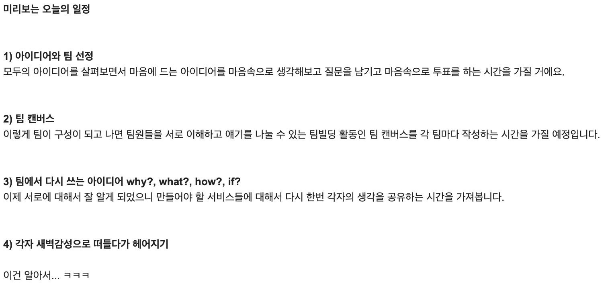
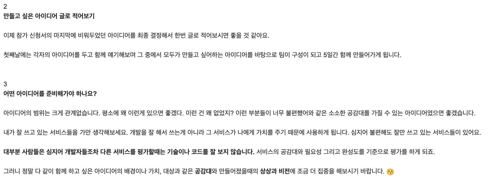
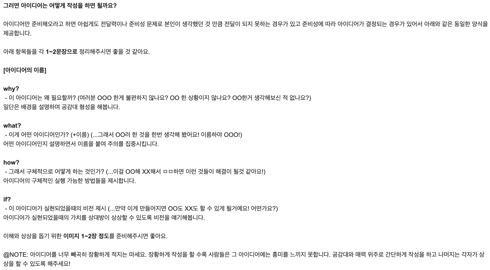
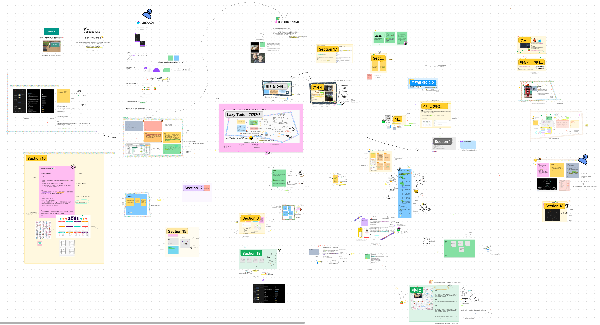
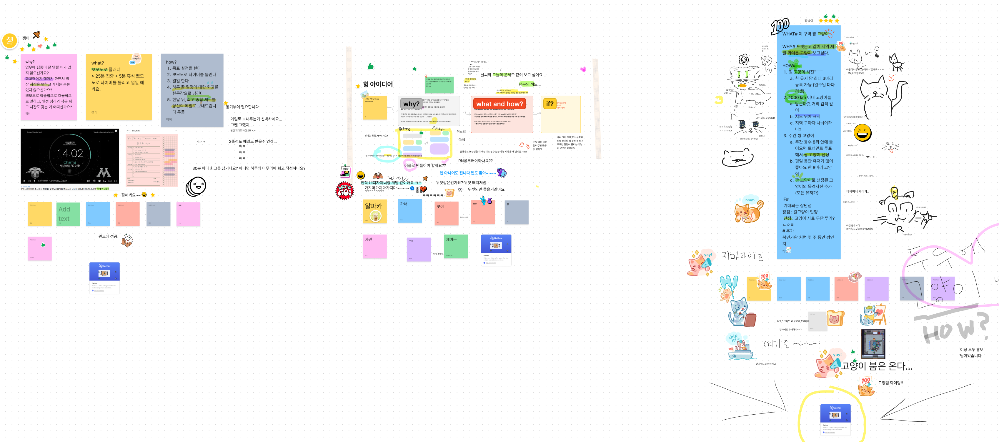
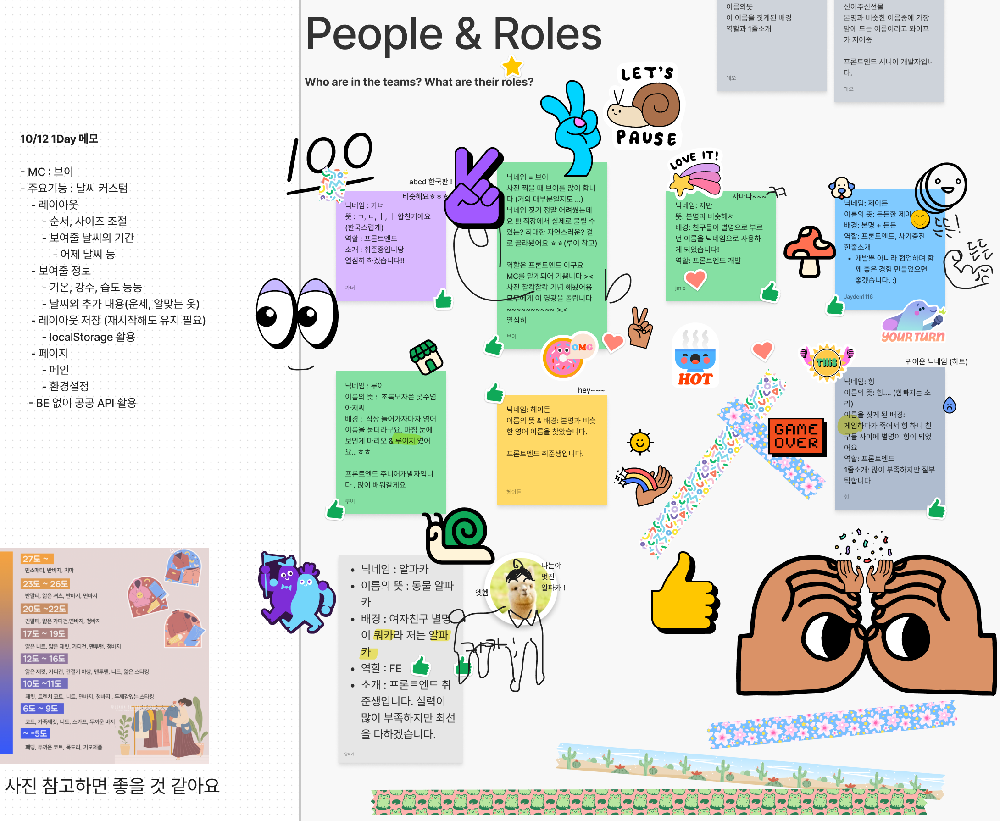

## 🔨 프로젝트 일지

> 정보 전달보단 프로젝트를 진행하며 겪은 점들, 느낀 점들을 기록한 일지

### `Project`: 테오의 스프린트 12기

프론트엔드 개발자로 구글링하다보면 누구나 한번쯤은 들어가보았을 [테오의 블로그](https://velog.io/@teo)<br/>
이번 프로젝트는 테오가 운영하는 `테오의 스프린트 12기`에 참여한 기록이다.<br/>
짧다면 짧은 5일의 기간 동안 처음 보는 사람들과 팀을 이뤄, `협업(테오가 제일 강조하는 부분)`을 배울 수 있는 좋은 기회라고 생각한다!

#### 😆 모임 전 안내 메일









위와 같이 협업을 위한 그라운드 룰과 간단한 일정을 안내받고 시작한다! <br/>

#### 😆 첫 모임

약 40~50명의 인원이 모여, 각자 작성한 아이디어를 바탕으로 투표를 진행한다!<br/>
개인 프로젝트를 할 때 피그마는 종종 사용했지만, 피그젬을 통해 함께 아이디어를 기획하고 협업하는 과정이 너무 재미있었다.





최종적으로 아이디어를 6개 선별하고 각자 투표를 통해 어떤 아이디어를 구현하고 서비스해보고 싶은지 결정하여 최종팀을 결성하게 된다.<br/>




아이스 브레이킹 타임!!! 서로를 소개하고 인사하며 알아가는 시간을 가질 수 있었다. 😁<br/>

#### 어떤 프로젝트?!

우리 팀은 `날꾸`라는 이름으로, 뻔한 날씨 웹(앱)이 아닌 유저가 직접 원하는 정보를 배치하고 커스터마이징할 수 있는 서비스를 개발하기로 했다.<br/>
누군가에게는 일사량, 누군가에게는 강수유무, 누군가에게는 일몰시각 등등 중요한 기상 정보가 다르기 때문에 커스터마이징이 가능한 날씨 웹(앱)을 통해 유저 각자의 니즈를 충족할 수 있을 것이라 생각했다.<br/>
또한, 프론트엔드 개발자들이 모인만큼 이런 커스터마이징에 있어서 UI/UX도 심플하고 재미있는 아이디어로 다뤄볼 예정이다!! 🥰

#### 회고

이제 1일차라 아직은 우리 서비스가 어떻게, 어떤 모습으로 나오게 될지 명확하진 않지만 팀원들과 함께 이야기하고 으쌰으쌰하면 무언가 의미있는 결과물이 나올 것이라는 확신이 드는 하루였다.<br/>
그리고 무엇보다 혼자하는 개발 자체가 재미있기도 하지만, 이렇게 다양한 사람들과 이야기 나누고 함께 나아간다는 사실만으로도 뭔가 가슴 한켠에 두근두근 설레는 기분이 드는 건 어쩔 수 없는 것 같다. 🤭<br/>

> 날꾸팀 화이팅!!!

```toc

```
