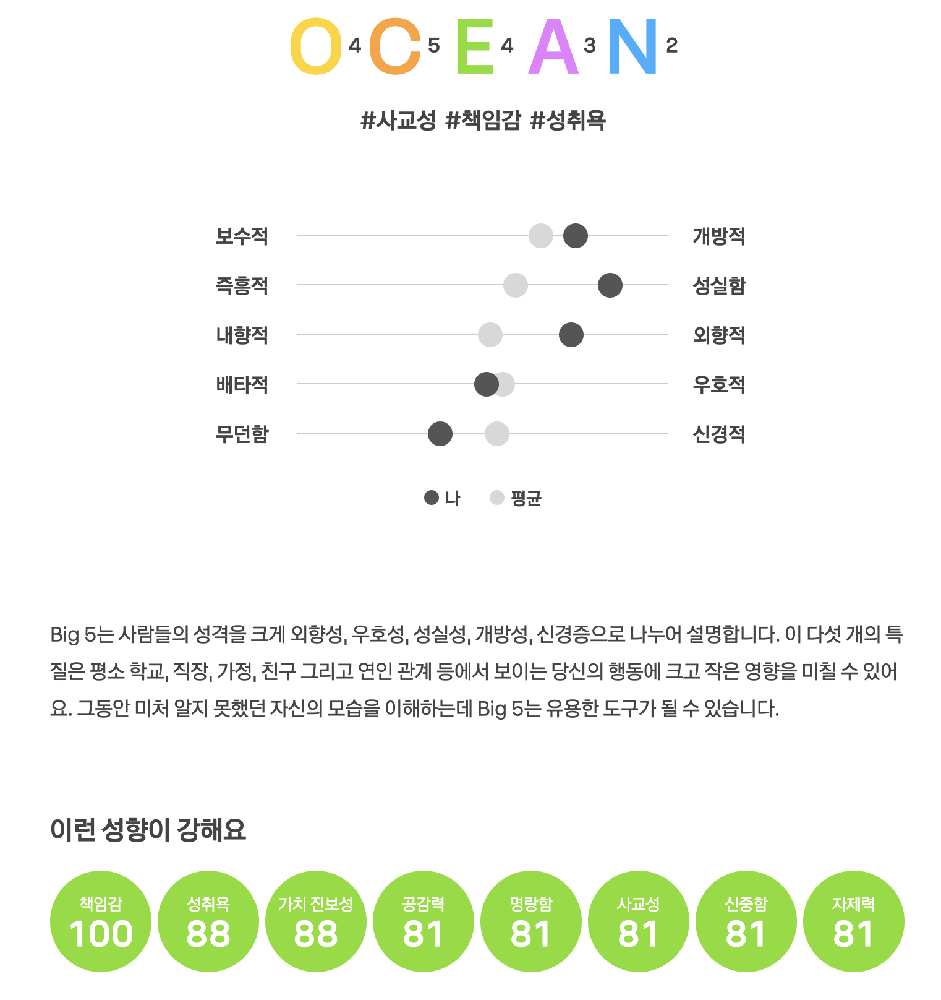

# 🌕 보름칼럼

단순 기록보단 좀 더 양질의, 정리된 글을 쓰고자 시작하는 `보름칼럼`<br/>
부담없이 매 보름 하나의 주제를 깊게 들여다볼 수 있는 기회가 되었으면 좋겠다.<br/>
가수 윤종신님이 월간 윤종신을 통해 꾸준히 음악을 내시는 것과 같이 보름칼럼을 적어보자!

> 보름칼럼 규칙
>
> 1. 매일을 기록하는 성장일지보다 좀더 깊은 내용의 글을 작성할 수 있도록 하자.
> 2. 너무 욕심부리지말고 하나의 주제(키워드)에 집중한다.
> 3. 2주에 한 번 다듬어진 칼럼 형태의 글을 작성한다.
> 4. 마감은 매주 일요일을 기준으로 한다.

## 📃 글또 8기

개발자들이 모여 함께 글을 쓰고 피드백하는 커뮤니티인 [글또(글쓰는 또라이가 세상을 바꾼다.)](https://www.notion.so/zzsza/ac5b18a482fb4df497d4e8257ad4d516)에서
활동하게 되어 보름칼럼의 규칙은 글또의 규칙을 따르기로 한다.<br/>
2주마다 글을 작성하는 규칙은 동일하며, 그 마감 날짜는 아래와 같다. 마감 날짜를 체크하며 매번 글 작성에 대해 인지하도록 하자!<br/>

# 🚂 들어가기에 앞서...

보름칼럼의 첫 주제로 어떤 글을 작성해야하나 많은 고민을 했습니다. 하루하루 배운 내용을 적는 성장일지와 차이점을 두고 싶었기에, 더 많은 고민을 했던 것 같습니다.
그러던 중 글또를 운영하시는 데이터 분석가 출신 성윤님께서 `첫 글을 다짐글로 작성하신 분들이 끝까지 활동을 완주한 경우가 많았다.`라는 말씀을 해주셨습니다. 해서 이번 첫 글은
글또 OT 후기 그리고 글또에 대한 다짐글로 장식해보려합니다.

## 👋 글또 OT


1~2주마다 칼럼 형태의 글을 작성하려던 중 글또를 발견하게 되었습니다. 마침 글또의 모집 알림이 왔고, 고민도 없이 글또에 신청서 및 자기소개서 등을 제출하여 이렇게 OT에도 참여하였습니다.
글또의 OT는 온라인으로 약 1시간 정도 진행되었는데, 생각했던 것보다 방대하고 좋은 내용들을 많이 다뤄주셔서 뜻깊은 일요일 밤을 보낼 수 있었습니다. 그 중 인상깊었던 내용 몇가지를 이야기해보려 합니다.

### 1) 글또를 운영하는 이유

> 나는 왜 사는가?<br/>
> 나는 왜 일하는가?<br/>
> 나는 어떤 사람인가?<br/>
> => `나는 살면서 얼마나 영향을 미칠 수 있을까?`

성윤님께서 글또를 운영하시는 이유에 대해 설명해주신 부분의 일부 내용입니다. 사실 우리는 대부분 위와 같은 질문들을 스스로에게 한 번쯤은 던져본 적이 있을겁니다.
그리고 말 그대로 우리는 `질문을 던져보는 것`에서 더 나아가지 않습니다. 실행하지 않습니다. 혼자 방 안에서, 때로는 친구들과의 술자리에서 위의 주제로 대화를 하고
돈, 살아남기, 존버 등의 대답으로 마무리 지으며 이런 대화라도 나눈 것에 대해 만족하기도 합니다. 하지만 이 생각에 꼬리를 물고 물어 행동을 하는 사람들이 있습니다.
그런 사람들이 되고 싶어 질문에 대한 제 나름의 간단한 답을 기록해보았습니다.

- 나는 왜 사는가?
  - 이 세상에서 어떤 역할을 할 수 있는지 고민하고 찾아가기 위해 살아갑니다. 그리고 그 역할을 수행하기 위해 살아갑니다.
  - 메타(전 페이스북)에서 개발자로 근무하셨던 천인우님의 책 `브레이킹 루틴`의 내용입니다. 해당 글을 읽고 꽤나 충격을 받았던 기억이 납니다.
- 나는 왜 일하는가?
  - 즐겁기 때문입니다. 사람들마다 다르겠지만, 많은 행복들 중 좋아하는 일을 통해 얻는 행복이 큰 사람이기에 일을 합니다.
  - 더 풍족하게 살아가기 위함입니다. 일을 하지 않는다고 해서 당장 먹고살지 못하는 것은 아닙니다. 그러나 이왕 한 번 사는 인생, 조금 더 풍족하게 살고 싶어 일을 합니다.
- 나는 어떤 사람인가?
  - 매일매일 꾸준히 할 줄 아는 사람
  - 인생을 즐기려는 사람
  - 신념이 있다면 무엇이든지 해낼 수 있다고 믿는 사람
- 나는 살면서 얼마나 영향을 미칠 수 있을까?
  - 얼마나를 정하는 다양한 기준이 있겠지만, 제가 살아가는 사회에 선한 영향을 주는 위치까지 가고싶다는 생각이 듭니다.

### 2) 습관 형성에 대한 이야기

우리는 항상 발전하기 위해서 무언가를 할 때, `습관처럼 해라`라는 말을 종종 듣습니다. 그러나 사람마다 성향은 다릅니다. 이에 대해
`각자 습관을 만드는 것, 즉 꾸준히 하는 것에 대해 스트레스가 있는지를 확인해봐라. 그리고 꾸준히 하는 것에 대해 스트레스를 많이 받는 사람이라면
그 사람만의 프로세스를 만들어서 진행하면 된다`는 내용이 기억에 남습니다.



사실 약한 점들도 나왔지만, 강한 점들만 보기로 했습니다. ㅎㅎㅎㅎㅎ

## 🙏 다짐글

- ing


```toc

```
