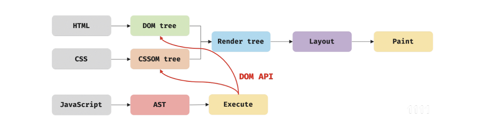

## 🌕 F-lab 멘토링 기록

멘토링 이후 부족한 부분을 채우기 위한 기록

### 이벤트 루프, 매크로/마이크로 테스크 큐


- 자바스크립트는 싱글 스레드 기반의 언어이지만, 구동되는 환경(브라우저, Node.js)는 여러 스레드를 제공한다.
- 이 때, 구동 환경과 자바스크립트 엔진을 연동하기 위해 사용되는 장치가 `이벤트 루프`
  - 이벤트 발생 시 호출되는 콜백 함수들을 관리하여 태스크 큐에 전달하고 콜스택이 비었을 때, 콜스택으로 전달한다.
- 매크로 테스크 큐: DOM, setTimeout 등의 비동기 처리 콜백함수가 담기는 큐 자료구조
- 마이크로 테스크 큐: Promise, async 등의 비동기 처리 콜백함수가 담기는 큐 자료구조
- 코드 실행 우선 순위: 콜스택(메인 스레드, 자바스크립트 엔진) > 마이크로 테스크 큐 > 매크로 테스크 큐

```js
console.log('script start'); // A

setTimeout(function () {
  // B
  console.log('setTimeout');
}, 0);

Promise.resolve()
  .then(function () {
    // C
    console.log('promise1');
  })
  .then(function () {
    // D
    console.log('promise2');
  });

console.log('script end'); // E
```

위 코드의 실행 순서: A E C D B

### Variable Environment와 Lexical Environment

- Variable Environment: 실행 컨텍스트 생성 시 초기 상태를 스냅샷 형태로 저장(초기값 유지), 이후 이를 복사하여 LE에 할당
- Lexical Environment: 코드 실행 도중의 변경되는 사항이 즉시 반영, 그렇기에 주로 LE를 활용

### [[Prototype]]을 직접 변경했을 때의 단점

- 자바스크립트 엔진이 속성의 접근을 최적화하는 방식의 특성 상, 굉장히 성능을 저하시키는 과정이다.
- 따라서 Object.create(\_.prototype)을 통해 새로운 객체를 만들도록 하는 것이 좋다.

### 웹 컴포넌트의 라이프사이클

- 라이프사이클: 말 그대로 생명주기를 뜻하며, 웹에서의 라이프사이클은 `한 화면이 생성되고 사라지기까지의 과정`이다.
- 즉, 컴포넌트 라이프사이클이란 컴포넌트의 생성부터 제거될 때까지의 과정을 말하며, 이 과정에서 이벤트를 핸들링할 수 있는 다양한 API를 제공한다.
- 웹 컴포넌트 라이프사이클
  - connectedCallback(): customElement가 DOM 요소로 추가될 때마다 호출되는 API
  - disconnectedCallback(): customElement가 DOM에서 제거되었을 때마다 호출되는 API
  - attributeChangedCallback(name, oldVlaue, newValue): 인자로 속성이름, 이전 속성값, 이후 속성값을 받으며 속성값이 변경될 때 호출되는 API
    - static get observedAttributes(): 반환값으로 ['속성이름']형태를 지정해주어야하며 해당하는 속성이름의 변화를 감지할 수 있게 된다.
  - adoptedCallback(): customElement가 다른 document로 이동될 때마다 호출되는 API

### 리플로우와 리페인트



- 리플로우: 레이아웃을 다시 계산하는 것으로 노드의 추가/삭제, 요소 크기/위치 변경, 윈도우 리사이징 등 레이아웃에 영향을 주는 변경이 발생할 때 실행된다.
- 리페인트: 재결합된 렌더 트리를 기반으로 다시 페인트를 하는 것을 말한다.

> 웹 컴포넌트에서는 shadow DOM이라는 각 컴포넌트마다의 독립적인 DOM을 두어 위 과정이 해당하는 컴포넌트에서만 일어나게 하였다.

### reset CSS와 normalize CSS

먼저 이 둘이 필요한 이유를 알아야한다.<br/>
알게 모르게 이미 기본적으로 브라우저마다 제공하는 stylesheet이 있는데 이를 `user-ageng stylesheet`라고 한다.<br/>
이런 기본적인 스타일시트를 처리하고 싶을 때, 위 2가지 방법이 존재한다.

- reset css: 말 그대로 모든 스타일시트를 초기화해버리는 것! 아예 하얀 도화지를 만들어서 `내가 다시 그리겠다`할 때 사용한다.
  - [Eric의 Reset CSS](https://meyerweb.com/eric/tools/css/reset/)
- normalize css: 리셋하는 것이 아닌, 브라우저의 스타일을 적당히 `비슷하게 보이도록` 만든다. 굳이 다 지우지말고, 적당히 공통된 커스터마이징 스타일시트를 적용하자는 방법!
  - [Nicolas의 Normalize Css](https://github.com/necolas/normalize.css)

> 정말 공부하고 하면 할수록 모르는 게 투성이고 알아야할 게 투성이다.
> 사실은 그렇기 때문에 공부하는 재미가 있기도 하다.
> 이번 멘토링에서 나온 큼직큼직한 질문들이 몇개 더 있어서 추후 2번째 글로 작성 예정이다.

##### 🗒️ Reference

[이벤트루프, 매크로/마이크로 태스크 큐](https://velog.io/@yejineee/%EC%9D%B4%EB%B2%A4%ED%8A%B8-%EB%A3%A8%ED%94%84%EC%99%80-%ED%83%9C%EC%8A%A4%ED%81%AC-%ED%81%90-%EB%A7%88%EC%9D%B4%ED%81%AC%EB%A1%9C-%ED%83%9C%EC%8A%A4%ED%81%AC-%EB%A7%A4%ED%81%AC%EB%A1%9C-%ED%83%9C%EC%8A%A4%ED%81%AC-g6f0joxx)

[Prototype 직접 변경의 문제](https://developer.mozilla.org/en-US/docs/Web/JavaScript/Reference/Global_Objects/Object/setPrototypeOf)

[웹 컴포넌트 생명주기](https://developer.mozilla.org/ko/docs/Web/Web_Components/Using_custom_elements#%EC%83%9D%EB%AA%85_%EC%A3%BC%EA%B8%B0_%EC%BD%9C%EB%B0%B1_%EC%82%AC%EC%9A%A9%ED%95%98%EA%B8%B0)

[reset css와 normalize css](https://nykim.work/100)

```toc

```
