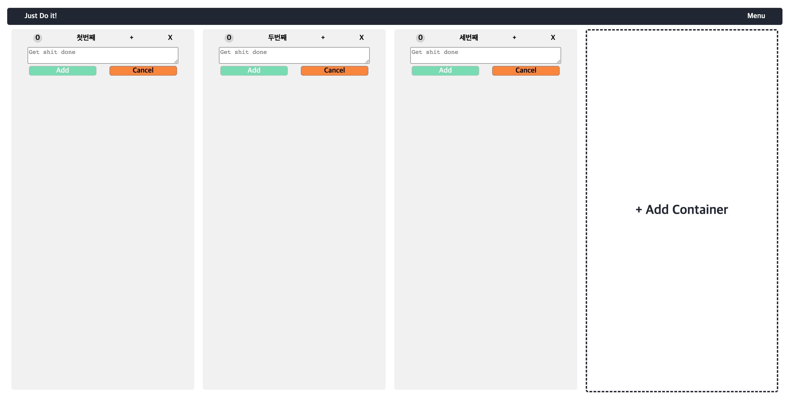
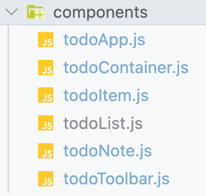
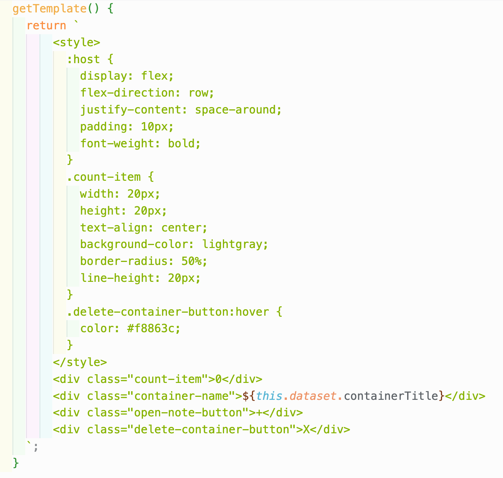

## 🔨 프로젝트 일지

> 정보 전달보단 프로젝트를 진행하며 겪은 점들, 느낀 점들을 기록한 일지

### `Project`: Get Shit Done

나만의 ToDo리스트를 만들기 위해 시작한 프로젝트<br/>
`Get Shit Done`은 `그냥 닥치고 해`라는 의미로 평상시 스스로 다짐하는 문장인데, 투두리스트와 어울린다 생각하여 프로젝트명으로 정하게 되었다.<br/>
이번 프로젝트의 가장 큰 목적과 의의는 웹팩 및 바벨을 통해 각 모듈을 `웹 컴포넌트`로 구성하여 동작하게 하는 것이다!!!

#### 😇 컴포넌트 설계

하... 개인적으로 이 단계가 진짜 막막하고 어려웠다. 컴포넌트를 설계하는 방법은 정말 다양한데, 일단 기본적으로 눈에 보이는 UI를 기준으로 나눠보자 마음먹었다.<br/>



위와 같이 UI를 생각하고 header, main 그 내부 항목들을 쪼갤 수 있는대로 컴포넌트를 나눠보았다.<br/>
결과적으로 아래와 같이 컴포넌트를 나눌 수 있었다.



- todoApp.js: 전체 앱을 나타낸다.
- todoContainer.js: 앱 내에 메모장을 나타낸다.(여러개의 메모장을 생성하게 할 예정)
- todoToolbar.js: 메모에 대한 조작을 하는 툴바 부분
- todoNote.js: 툴바 조작에 따라 메모를 입력할 수 있는 input 부분
- todoList.js: 메모 전체를 감싸고 있는 부분
- todoItem.js: 메모 컴포넌트

흠... 지금 생각해보면 todoNote는 굳이 컴포넌트로 안나누고 처리해도 되었을 것 같다. 확실히 고생은 해도 직접해보니 느끼는 게 많다.

> 이후 UI를 웹 컴포넌트를 사용해 구성해주었고 이후 그에 맞는 로직을 짰다.
> [웹 컴포넌트 개념](https://jaydenlee1116.github.io/%EC%84%B1%EC%9E%A5%EC%9D%BC%EC%A7%80/2209/220922-gl/)만 이해하면 UI를 구성하는 건 크게 어렵지 않다.
> 아래는 예시이다.



> 문제는 로직(기능 구현)을 위한 컴포넌트간의 협력을 이루어내는 부분이었는데... 여기가 진짜 재미도 있지만 헬이었다.ㅋㅋㅋ
> 다음 글에서는 이 로직 짜는 부분을 구석구석 기록해보려한다. 🧐

```toc

```
