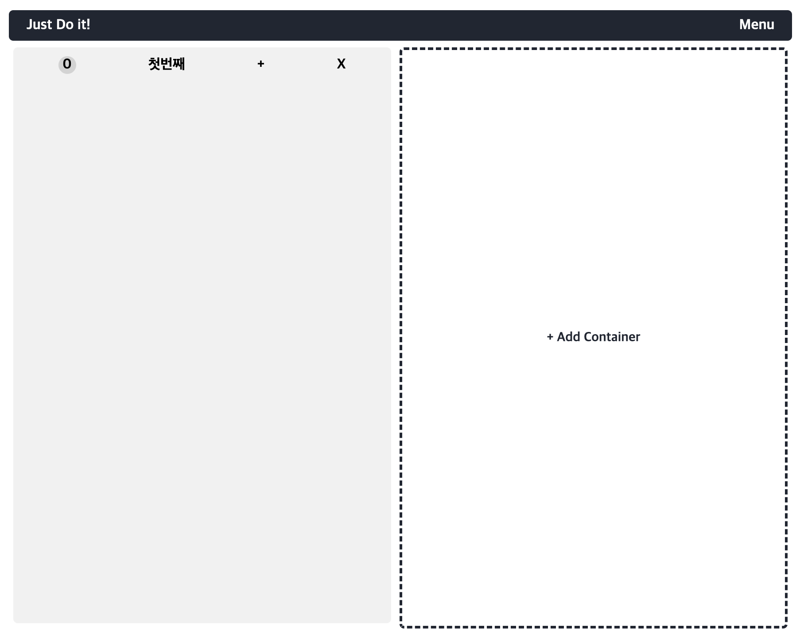

## 🔨 프로젝트 일지

> 정보 전달보단 프로젝트를 진행하며 겪은 점들, 느낀 점들을 기록한 일지

### `Project`: Get Shit Done

나만의 ToDo리스트를 만들기 위해 시작한 프로젝트<br/>
`Get Shit Done`은 `그냥 닥치고 해`라는 의미로 평상시 스스로 다짐하는 문장인데, 투두리스트와 어울린다 생각하여 프로젝트명으로 정하게 되었다.<br/>
이번 프로젝트의 가장 큰 목적과 의의는 웹팩 및 바벨을 통해 각 모듈을 `웹 컴포넌트`로 구성하여 동작하게 하는 것이다!!!

#### 🤪 컴포넌트 로직

먼저 들어가기에 앞서 컴포넌트를 나눈 부분을 다시 보자면, 크게 아래와 같이 나누었다.

- todoApp.js: 전체 앱을 나타낸다.
- todoContainer.js: 앱 내에 메모장을 나타낸다.(여러개의 메모장을 생성하게 할 예정)
- todoToolbar.js: 메모에 대한 조작을 하는 툴바 부분
- todoNote.js: 툴바 조작에 따라 메모를 입력할 수 있는 input 부분
- todoList.js: 메모 전체를 감싸고 있는 부분
- todoItem.js: 메모 컴포넌트

지금 다시 생각해보면 todoItem을 담아둔 todoList는 따로 컴포넌트화 안해도 되지 않았을까 싶다.(이런 게 다 배우는 거니까 🤪)<br/>

##### 🧭 todoApp

여기선 처음에 크게 `컨테이너 생성` 버튼을 두고 클릭시 메모장을 만들어지는 식으로 구성하였다.<br/>
스타일링까지 다루기엔 양이 너무 많으므로 패스하고 전반적인 코드 구조만 보자면 아래와 같다.

```html
<header class="header">
  <span>Just Do it!</span>
  <span class="header__menu">Menu</span>
</header>
<main class="main">
  <div class="create-container-button">+ Add Container</div>
</main>
```

```js
connectedCallback() {
    // 1. create-container-button 클릭 시 컨테이너 생성
    const $createContainerButton = this.shadowRoot.querySelector(
      '.create-container-button'
    );
    const $appMain = this.shadowRoot.querySelector('.main');
    $createContainerButton.addEventListener('click', (event) => {
      const containerTitleInput = prompt(
        '💥 (띄어쓰기 없이)메모장 이름을 적어주세요.'
      )
        .split(' ')
        .join('');
      if (!containerTitleInput) return;
      const $newContainer = document.createElement('todo-container');
      $newContainer.dataset.containerTitle = containerTitleInput;

      // 추후 만들 todo-container 태그를 넣어준다
      $appMain.insertBefore($newContainer, $createContainerButton);

      // 1-1. 메모 컨테이너 5개 이상 시, Add column 삭제
      if ($appMain.children.length >= 6) {
        $createContainerButton.style.display = 'none';
      }
    });
  }
```



위와 같이 `+ Add container`를 누르면 메모장 이름을 물어보는 모달 창이 나오고 메모장이 만들어진다.

##### 🧭 todoContainer

여기서는 크게 복잡한 로직은 없고 App에서 받은 데이터 타이틀을 각 컨테이너 내부 요소들에 dataset으로 전달해주었다.(추후 각 메모장 별 값을 구분하기 위함)

```js
connectedCallback() {
  const containerTitle = this.dataset.containerTitle;
  const $toolBar = this.shadowRoot.querySelector('.todo-toolbar');
  $toolBar.dataset.containerTitle = containerTitle;
  const $note = this.shadowRoot.querySelector('.todo-note');
  $note.dataset.containerTitle = containerTitle;
  }
```

##### 🧭 todoToolbar

메모장을 조작하기 위한 간단한 툴바

```js
connectedCallback() {
    // 1. 툴바 + 버튼 클릭 시, note 열기/닫기
    const $openNoteButton = this.shadowRoot.querySelector('.open-note-button');
    const $todoNote = this.nextElementSibling;

    $openNoteButton.addEventListener('click', (event) => {
      if ($todoNote.style.display === 'none') {
        $todoNote.style.display = 'flex';
      } else {
        $todoNote.style.display = 'none';
      }
    });

    // 2. X 버튼 클릭 시, container 삭제
    const $deleteContainerButton = this.shadowRoot.querySelector(
      '.delete-container-button'
    );
    $deleteContainerButton.addEventListener('click', (event) => {
      if (!confirm('정말 삭제하시겠습니까?')) return;
      const containerTitle = this.dataset.containerTitle;
      const $todoApp = document.querySelector('todo-app');
      const $containerSelected = $todoApp.shadowRoot.querySelector(
        `[
            data-container-title=${containerTitle}
          ]`
      );
      console.log($containerSelected);
      $containerSelected.remove();

      // 2-1. 컨테이너 5개 미만일 때, add column 재생성
      const $appMain = $todoApp.shadowRoot.querySelector('.main');
      const $createContainerButton = $appMain.querySelector(
        '.create-container-button'
      );
      if ($createContainerButton.style.display === 'none') {
        $createContainerButton.style.display = 'block';
      }
    });

    // 3. add column 클릭 시 입력값을 name으로 갖는 container 생성
    const $containerName = this.shadowRoot.querySelector('.container-name');
    $containerName.textContent = this.dataset.containerTitle;
  }
```

2번 container를 지우는 부분을 추후에 리팩토링할 예정이다. shadow DOM이 각각의 DOM을 각각의 컴포넌트로 존재하게 해주어 독립적으로 스타일 적용이 가능하다는 것은 좋았다.
헌데, 말 그대로 컴포넌트 하나하나가 독립적인 객체(OOP 관점에서)로 존재하다보니 하나의 html 구조로 되어있을 때처럼 Node api를 통한 접근이 불가능하다는 점이 불편했다.
각각의 Shadow DOM의 root node가 곧 그 모듈의 태그 즉, custom element이다보니 그 위로 접근하기 위해 dataset을 이용하여 위에서부터 document로 접근해야했다.
이렇게 접근하는 게 뭔가 깔끔한 방법은 아니라, 추후에 좀더 찾아봐야할 것 같다.

> 2편에서 계속...

```toc

```
