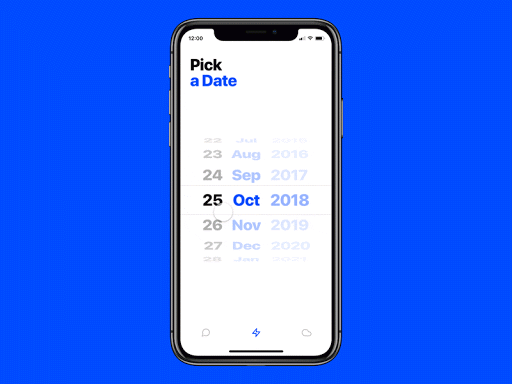
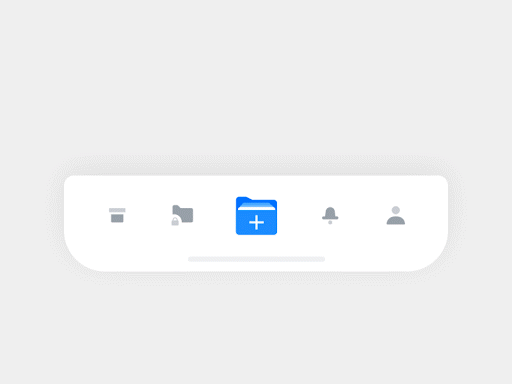

## 🔨 프로젝트 일지

> 정보 전달보단 프로젝트를 진행하며 겪은 점들, 느낀 점들을 기록한 일지

### `Project`: Jayden-Design-System(feat. Challengers)

프론트엔드 취준생의 뭣도 모르고 시작해보는 디자인 시스템 프로젝트.<br/>

#### 시작하게 된 이유?

본론부터 말하자면 `챌린져스` 앱을 웹으로 리브랜딩해보는 프로젝트를 진행 중 멘토님께서 디자인 시스템에 대한 이야기를 해주신 것에서 시작되었다. 백엔드 없이 api를 어떻게라도 짜는 게 쉽지 않았고, 이에 좀더 프론트엔드 개발에 포커싱을 둘 수 있는 디자인 시스템을 시작으로 챌린져스 모킹 웹까지 진행하는 프로젝트를 시작하게 되었다.<br/>
이 프로젝트의 1차적인 최종 목표는 나만의 디자인 시스템을 구현하고 npm 라이버르러로 배포까지 하는 것!!!<br/>

목표 설정

> primary : 나만의 디자인 시스템 구축 및 배포<br/>
> secondary : 디자인 시스템 및 mock data를 사용하여 challengers 웹 서비스 구현

### 그래서 무엇부터 해야할까?

이제 디자인 시스템에 대해서 대략적으로 감은 왔다. 그러나 디자인 시스템을 구축하기 위해 무엇부터 시작해야할지 감이 오질 않았다. 일단은 먼저 UI 컴포넌트의 종류에는 무엇이 있는지 간략하게 공부를 진행했다.(그래야 내가 만들 서비스에서 어떤 컴포넌트를 디자인 시스템에 녹일지 알 수 있을테니까)

#### UI의 종류

UI는 크게 4가지 분류로 나눌 수 있다.

- Input Controls : 유저가 시스템에 정보를 입력할 수 있게 한다.
- Navigation Components : 유저의 서비스 내에서의 이동을 안내하고 돕는다. ex) 햄버거 메뉴, 네브바
- Informational Componens : 유저에게 정보를 제공한다.
- Containers : 관련 컨텐츠들을 한 곳에 묶어주는 역할을 한다.

자, 그럼 이제 본격적으로 UI요소들을 간략하게 정리해보자. 참고로 이 내용들은 거진 아래 레퍼런스의 내용들을 요약/정리한 것이다! 이런 글을 작성해주신 개발자분께 정말정말 감사드린다.

##### 아코디언(Accordian)

- 클릭 시 아코디언 악기처럼 내용들이 펼쳐져서 나오는 인터페이스
- 즉, 컨텐츠의 영역이 확장된다.(뒤에 나올 Dropdown과의 차이점)

##### 벤토 메뉴(Bento Menu)

- 9개의 사각형 모양으로, 클릭 시 여러가지 메뉴가 (주로 모달형태로) 나오게 하는 인터페이스. 흔히 우리가 말하는 햄버거 버튼도 벤토 메뉴의 한 종류

##### 브레드크럼(Breadcrumb)

- 유저가 사이트의 어디에 위치해있는지 알려주는 인터페이스. 핸젤과 그레텔의 빵 부스러기에서 유래했다고 한다.

##### 버튼(Button)

- 우리가 너무 잘 알고 자주 보는 인터페이스. 클릭 시, 특정 동작이 수행된다.(보통은 유저의 정보를 전달)

##### 카드(Card)

- 작은 사각형에 같은 카테고리의 정보들을 담고 있는 일종의 모듈

##### 캐러셀(Carousel)

- 이미지나 카드와 같은 컨텐츠를 탐색할 수 있는 인터페이스. 회전목마를 정면에서 보는 느낌.


##### 체크박스(Checkbox)

- 체크가 되어있거나(true) 아니거나(false)

##### 코멘트(Comment)

- 말 그대로 댓글

##### 드롭다운(Dropdown)

- 아코디언과 굉장히 유사하지만, 드롭다운은 컨텐츠 자체의 크기가 커지지 않는다.
- 아래 컨텐츠를 덮어서 보여지는 느낌

##### 폼(Form)

- 유저가 정보를 입력하여 제출하기 위한 인터페이스. 회원가입 시, 아이디/비밀번호/주소 등등

##### 아이콘(Icon)

- 유저에게 직관적으로 정볼르 전달하기 위해 사용되는 간단한 이미지

##### 인풋 필드(Input Field)

- 유저가 여러 정보를 작성하여 시스템에 전달하기 위한 인터페이스. Form과 같은 제출 양식부터 포털의 검색창 등 다양한 필드가 존재한다.

##### 케밥 메뉴(Kebab Menu)

- 세로로 점 3개가 있는 인터페이스. 주로 설정 옵션 등을 담고 있다.(크롬에도 오른쪽 위에 있음)

##### 로더(Loader)

- 말 그대로 로딩을 나타내는 UI 요소! 사용자에게 현재 시스템이 작업 중인 것을 나타낼 때 사용한다.

##### 미트볼 메뉴(Meatballs Menu)

- 가로로 점 3개가 있는 인터페이스. 보여지는 것 외에 숨겨진 옵션을 볼 수 있다.

##### 모달(Modal)

- 유저와 상호작용 혹은 특정 정보를 제공하기 위해서 제공되는 추가 레이어 창.
- 기본적으로 web이 제공하는 api인 alert, propmt, confirm도 모달 형식

##### 뱃지(Badge)

- 요즘 자주 보이는 UI로, 알림을 나타내는 작은 빨간 점같은 녀석들!!!
- 유저에게 알림을 주는 용도로 사용된다.(뱃지를 보면 클릭 안할 수가 없음)

##### 페이지네이션(Pagenamtion)

- 화면 맨 아래에 1, 2, 3, 4, 5 ... 101과 같이 페이지를 나타내는 인터페이스
- 현재 유저의 위치를 알려주고 다른 위치로 이동할 수 있게 해준다.

##### 픽커(Picker)



##### 프로그래스 바(Progress Bar)

- 특정 작업의 진척도 또는 단계를 시각적으로 보여주는 인터페이스.

##### 라디오 버튼(Radio Buttons)

- 체크박스와 유사하면서도(같이 쓰이는건가..?) 묘하게 다른 녀석
- 체크박스는 각 항목에 대해서 모두 선택한다면, 라디오 버튼은 여러 선택지 중에서 1개를 고를 때 사용한다.

##### 서치 필드(Search Field)

- 보통 내부에 작은 돋보기 아이콘과 함께 정보를 찾을 때 입력하게 되는 인터페이스

##### 사이드바(Sidebar)

- 페이지 측면에서 여러 기능을 제공하는 인터페이스. 항상 보여지기도 하고 버튼 클릭 시 들어갔다 나왔다 하기도 한다.

##### 슬라이더 컨트롤(Slider Controls)

- 음량 조절하는 인터페이스! 로 기억하면 편하다.

##### 스텝퍼(Stepper)

- 주로 증가, 감소 2가지 요소를 사용하여 값을 조정할 수 있다. 이 때, 유저는 개발자가 제공하는 값들 중에서 고를 수 있다.

##### 탭 바(Tab Bar)



##### 툴팁(Tooltip)

- 보통 동그라미에 `i`가 들어가있어서 클릭 시, 유저에게 도움말 혹은 힌트를 제공하는 인터페이스

##### 토글(Toggle)

- 켜고 끌 수 있는 스위치. ON/OFF 스위치.

> 그 동안 그냥 넘어갔었는데, 이렇게 UI를 하나하나 찝어서 보고 인지하니까 새삼 UI에 대해서 정말 몰랐구나 싶었다.

###

## Reference

[32가지 UI요소](https://careerfoundry.com/en/blog/ui-design/ui-element-glossary/)

```toc

```
