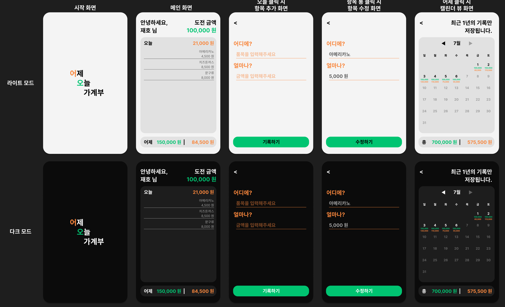

## 🔨 프로젝트 일지

> 정보 전달보단 프로젝트를 진행하며 겪은 점들, 느낀 점들을 기록한 일지

### `Project`: Yestoday(account book)

기획부터 시작해보는 프로젝트!!! 이번 프로젝트는 가계부 웹앱을 만들기로 결정했다.<br/>
다만, 이미 은행 어플을 통해 어느정도 가계부 역할을 하는 상세한 기능들이 제공되기에 새로운 기획을 생각해보았다.<br/>
간략한 컨셉은 다음과 같다.

- 유저는 오늘 `도전할 소비 금액`을 설정한다. 소비 시 해당 금액과 내용을 입력한다.
- 메인 화면에는 `어제`와 `오늘`에 대한 정보가 나온다.
- `어제`를 클릭하면 최근 1년 간의 데이터를 캘린더 뷰로 볼 수 있다.

처음 피그마로 간단하게 디자인을 만들어보았다.



#### 🦾 프로젝트 목표

- MVC 패턴 및 옵저버 패턴
- 라우터 구현
- 꼭꼭꼭 왜 이렇게 코드를 작성해야하고 어떻게 프로젝트를 구성할지 미리 생각하고 작성하도록 하자
- 가능하면 다양한 개발 환경을 시도해보자
- 욕심 더 부려서 Jest를 이용하여 테스트 코드까지 작성해보기
- 욕심 부릴 수 있는 프로젝트를 만들어보자

#### 🤩 개발 환경 세팅

이번 개발 환경 세팅에서는 기본적으로 웹팩, 바벨을 설정하고 git add 및 commit 시 lint 작업을 해주는 eslint 설정까지 해보았다.<br/>
욕심같아서는 Jest까지 구성하고 싶은데, 당장 TDD로 프로젝트를 진행할 것도 아니라서 일단은 공부만 하고 제외했다.<br/>
eslint와 prettier도 같이 적용하려했는데, 이미 vscode extension으로 prettier를 사용하고 있던터라 개발환경에는 따로 구성할 필요를 못느꼈다.

##### Webpack config

```js
const path = require('path');

module.exports = {
  mode: 'development',
  entry: './src/app.js',
  output: {
    filename: 'bundle.js',
    path: path.resolve(__dirname, 'dist'),
  },
  module: {
    rules: [
      {
        test: /\.m?js$/,
        loader: 'babel-loader',
        exclude: /(node_modules|bower_components)/,
      },
      {
        test: /\.s[ac]ss$/i,
        use: ['style-loader', 'css-loader', 'sass-loader'],
      },
    ],
  },
};
```

##### Babel config

```json
{
  "presets": [
    [
      "@babel/preset-env",
      {
        "modules": "auto",
        "useBuiltIns": "entry",
        "corejs": "3"
      }
    ]
  ]
}
```

###### Eslint config

```js
module.exports = {
  env: {
    browser: true,
    es2021: true,
    node: true,
  },
  extends: 'eslint:recommended',
  overrides: [],
  parserOptions: {
    ecmaVersion: 'latest',
    sourceType: 'module',
  },
  rules: {},
};
```

사실 그동안 대충 넘어갔던 Babel config에서 다양한 설정값들에 대해서 이해할 수 있었다.

```toc

```
