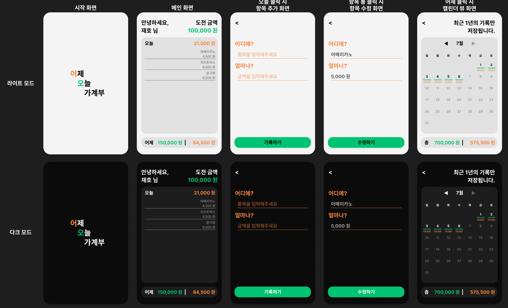

## 🔨 프로젝트 일지

> 정보 전달보단 프로젝트를 진행하며 겪은 점들, 느낀 점들을 기록한 일지

### `Project`: Yestoday(account book)

기획부터 시작해보는 프로젝트!!! 이번 프로젝트는 가계부 웹앱을 만들기로 결정했다.<br/>
다만, 이미 은행 어플을 통해 어느정도 가계부 역할을 하는 상세한 기능들이 제공되기에 새로운 기획을 생각해보았다.<br/>
간략한 컨셉은 다음과 같다.

- 유저는 오늘 `도전할 소비 금액`을 설정한다. 소비 시 해당 금액과 내용을 입력한다.
- 메인 화면에는 `어제`와 `오늘`에 대한 정보가 나온다.
- `어제`를 클릭하면 최근 1년 간의 데이터를 캘린더 뷰로 볼 수 있다.

처음 피그마로 간단하게 디자인을 만들어보았다.



#### 🦾 프로젝트 목표

- MVC 패턴 및 옵저버 패턴
- 라우터 구현
- 꼭꼭꼭 왜 이렇게 코드를 작성해야하고 어떻게 프로젝트를 구성할지 미리 생각하고 작성하도록 하자
- 가능하면 다양한 개발 환경을 시도해보자
- 욕심 더 부려서 Jest를 이용하여 테스트 코드까지 작성해보기
- 욕심 부릴 수 있는 프로젝트를 만들어보자

#### 😂 MV\*패턴과 옵저버 패턴 그리고 폴더 구조

개념 참고 [참고](https://jaydenlee1116.github.io/%EC%97%90%ED%94%84%EB%9E%A9/221004-fl/)

프로젝트를 시작하기 전에 환경을 세팅하고 `자 이제 시작해볼까?!` 패기롭게 손을 올렸으나, MV\* 패턴이나 옵저버 패턴은 알겠는데...

- `그래서 이제 프로젝트를 위한 디렉토리 구조는 어떻게 짜야하지?`
- `머리로는 개념이 이해가 됐는데, 이걸 코드로 어떻게 녹여내야하지`

하... 특히 위의 문제들은 누가 해결해줄 수 있는 것도 아니고 구글링한다고 딱 지금 내 프로젝트에 맞게 정답이 나온느 것도 아니라서, 정말 많이 헤맸다.<br/>
결론적으로 일단은 MVC 패턴, 옵저버 패턴을 고려하여 아래와 같은 디렉토리 구조를 짰다.


- interfaces: 옵저버 패턴을 적용하기 위해 옵저버 패턴에서 observable 모듈에 대한 인터페이스를 만들어 주었다.

```js
export default class Observable {
  constructor() {
    this._observers = new Set();
  }
  subscribe(observer) {
    this._observers.add(observer);
  }
  unsubscribe(observer) {
    this._observers = [...this._observers].filter((subscriber) => subscriber !== observer);
  }
  notify(data) {
    // 여기서 subscriber는 함수
    this._observers.forEach((subscriber) => subscriber(data));
  }
}
```

- models: 모델은 데이터를 관리하는 영역으로 위의 observable 모듈을 상속하며 각각의 데이터를 담당한다.

  - ChallengeMoney.model.js: 도전 금액에 관한 데이터 담당
  - SpendItem.model.js: 소비 품목(이름 + 금액)에 관한 데이터 담당
  - Date.model.js: 날짜에 대한 데이터 담당

- views: 위의 model 모듈들을 활용하여 다양한 view를 갖는다. 이 때, 페이지 별로 나누어서 폴더를 구성하고 다양한 view를 만들었다.


- app.js: 웹펙 entry이기도 하면서 모든 모듈들을 가져와 최종 로직을 담당할 파일

> 사실 정말 별 거 아닐 수 있는 내용이고, 틀렸을 수도(?) 있지만 정말 혹시라도 혹여라도 프로젝트를 시작하기에 앞서 폴더 구조에 대한 감이 오지 않는 분들한테 도움이 되면 좋겠다. <br/>

```toc

```
