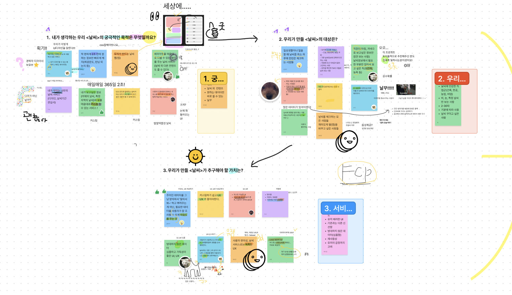
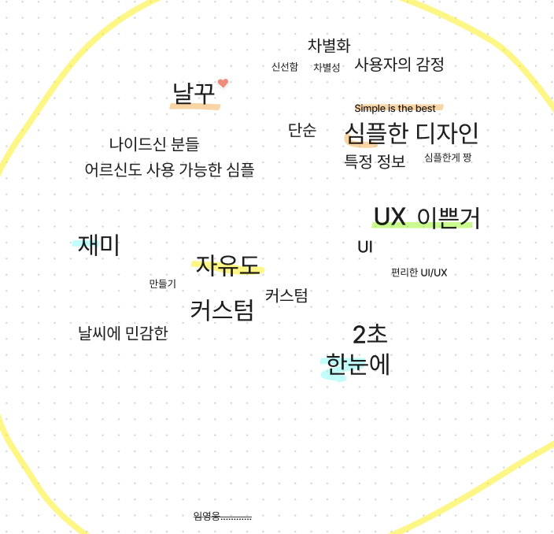
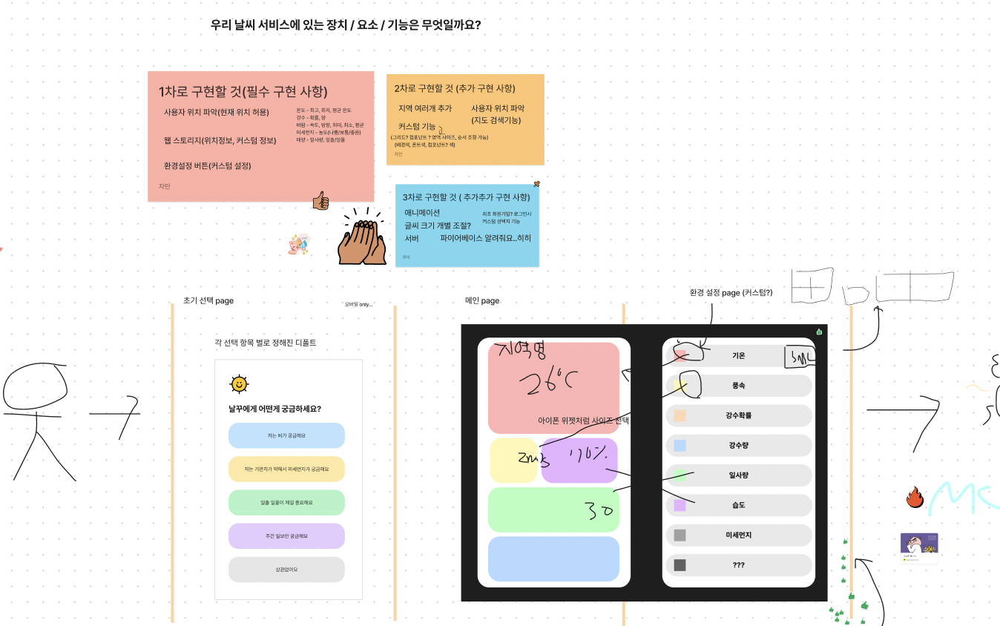

## 🔨 프로젝트 일지

> 정보 전달보단 프로젝트를 진행하며 겪은 점들, 느낀 점들을 기록한 일지

### `Project`: 테오의 스프린트 12기

프론트엔드 개발자로 구글링하다보면 누구나 한번쯤은 들어가보았을 [테오의 블로그](https://velog.io/@teo)<br/>
이번 프로젝트는 테오가 운영하는 `테오의 스프린트 12기`에 참여한 기록이다.<br/>
짧다면 짧은 5일의 기간 동안 처음 보는 사람들과 팀을 이뤄, `협업(테오가 제일 강조하는 부분)`을 배울 수 있는 좋은 기회라고 생각한다!

#### 😆 지도 그리기

좋은 협업이란 무엇일까? 협업을 위해 서로의 생각을 맞추고 합의하기 위한 방법으로 함께 지도 그리기를 진행했다.<br/>

- 각자 생각 써보기(타이머 사용)
- 중요한 점들 마구마구 하이라이트
- 적은 내용을 바탕으로 돌아가면서 발표한다.
- 모두의 생각을 듣고 나서 생각들을 시각화한다.
- 서로의 생각에 반박 혹은 너무 빠르게 결정/정리하지 않고 더 살을 붙여나가는 작업을 한다.

위의 방법을 토대로 크게 `목적과 대상 찾기`, `우리 서비스가 추구해야할 가치`에 대해 이야기를 나누었다.



이 내용들을 토대로 공통된 키워드만 쏙쏙 뽑아보았다!



#### 😶‍🌫️ 화면 별로 구성해보기

이제 정말 대략적으로 UI, UX에 대한 고민을 하고 고민해보는 시간을 가졌다!



#### 👻 회고

혼자 피그마를 통해 프로젝트를 기획해본 적은 있었는데, 피그젬을 통해 실시간으로 기획을 공유하니 되게 효율적이고 재미있게 서로의 생각을 공유할 수 있었다. 😆<br/>
아직은 대략적인 그림이지만, 점점 뭔가 아이디어가 구체화되어가고 살이 붙는다는 느낌?!<br/>
실제 제품, 서비스를 개발할 때도 이런 식으로 서로의 생각을 계속 계속 공유하고 맞춰나가는 작업이 정말 중요하겠다고 생각이 들었다.<br/>
무엇보다 각자 하는 말은 다 비슷한 거 같은데, 디테일하게 기능을 말해보고 시각화해보니 정말 정말 다들 다르게 생각하고 있었다는 거!!! 이게 정말 신기하고 재미있고 한편으로 많은 대화를 통해 맞춰나가야겠구나 생각이 들었다.<br/>
각자가 생각하는 것을 말하고 공통된 설계도를 만드는 것. 개인적으로 2일차에는 `왜 협업과 대화가 필요한가`를 배울 수 있는 하루였다.

```toc

```
