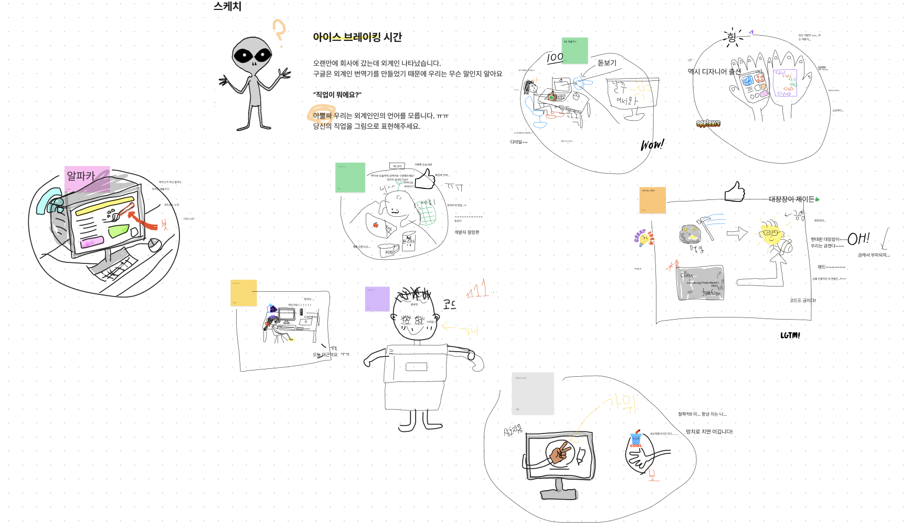
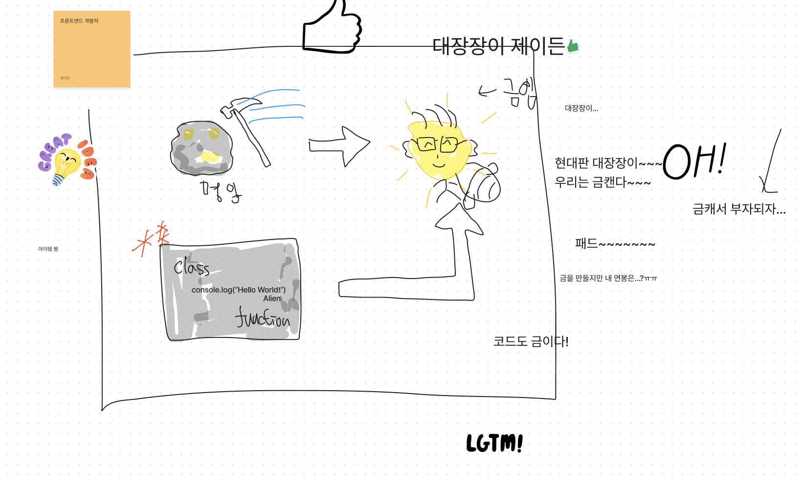
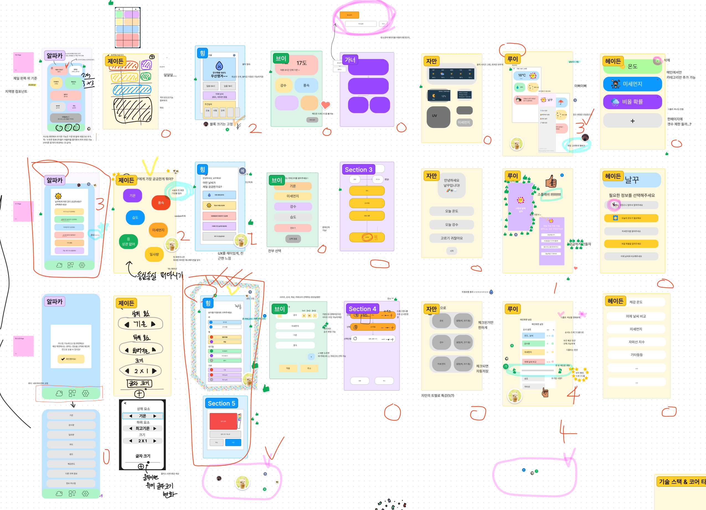
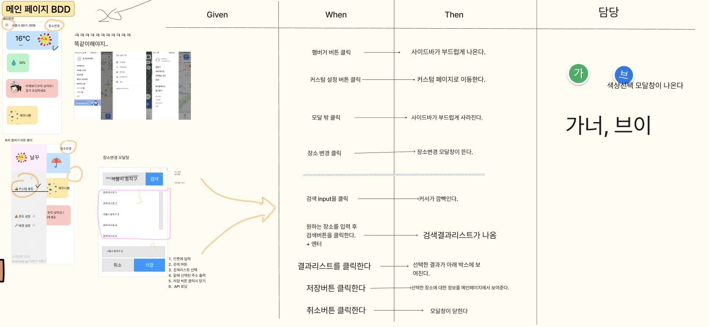

## 🔨 프로젝트 일지

> 정보 전달보단 프로젝트를 진행하며 겪은 점들, 느낀 점들을 기록한 일지

### `Project`: 테오의 스프린트 12기

프론트엔드 개발자로 구글링하다보면 누구나 한번쯤은 들어가보았을 [테오의 블로그](https://velog.io/@teo)<br/>
이번 프로젝트는 테오가 운영하는 `테오의 스프린트 12기`에 참여한 기록이다.<br/>
짧다면 짧은 5일의 기간 동안 처음 보는 사람들과 팀을 이뤄, `협업(테오가 제일 강조하는 부분)`을 배울 수 있는 좋은 기회라고 생각한다!

#### 😆 아이스 브레이킹

시작에 앞서서, 테오가 준비해주신 질문으로 간단한 아이스 브레이킹을 진행했다.(정말 사소해보이지만, 이런 작은 장치들이 팀원 간의 화합을 도와주는 것 같다.)<br/>
`외계인에게 우리의 직업(개발자)를 그림으로 설명한다면?` 이라는 주제로 각자 발표를 진행했다.ㅋㅋㅋㅋㅋ




팀원들이 생각하는 다양한 개발자의 모습도 재미있었고 서로의 그림을 꾸며주고 더해주는 게 웃겼다. ㅋㅋㅋㅋㅋㅋㅋㅋㅋ<br/>
나의 그림은 돌에서 금을 채취하듯이, 개발자는 코드를 통해 금(좋은 서비스)을 만든다는 컨셉이다. 팀원들의 낙서로 금덩이가 꿀벌처럼 되어버렸지만ㅋㅋㅋㅋㅋ 너무 유쾌하고 재미있는 시간이었다.

#### 😉 실전 스케치

개인적으로 정말 정말 정말 필요하다고 생각했던 시간!!!!!! 그 동안 공유한 내용들을 토대로, 각자가 페이지 하나하나를 좀더 디테일하게 그려보고 발표하며 생각을 맞추는 시간이었다.<br/>
이 시간에 각자가 갖고 있던 아주 세밀한 생각들을 조율할 수 있었고 더 다양한 서비스나 기능, 화면에 대한 고민을 진득하게 할 수 있었다!(매우매우 유용한 시간이었다.)



또한 이 때, UX 최고결정권자와 PL(Project Leader)을 뽑았다. 아래와 같은 취지였다.

> 서두에 설명했던대로 결정권자 없는 상태로 의견교환만 하게 된다면 나중에는 의견이 대립이 되면서 산으로 갈 공산이 높습니다. 누군가는 결정을 해야하고 우리는 수평적이게 투표를 통해서 더 잘하는 사람이 결정을 할 수 있도록 하였습니다. 수평적인 팀워크에서는 언제나 무언가를 제일 잘하는 사람이 제일 잘할 수 있도록 해주는 것이 중요하며 이는 권위나 직급이 아니라 역할을 수행하는 것이라는 것을 다시 한번 기억해주세요.

> 개발하는 기간동안 또 결정을 해야하는 일이 생긴다면 UX최종결정권자와 PL의 기술스택과 태스크 결정권에 대해서는 존중을 해주시기 바랍니다. 결정을 하는 데 드는 에너지는 분석을 하는 에너지보다 훨씬 더 큰 에너지 소모가 있다고 합니다. 미루는게 아니라 서로 같이 치열하게 고민하되 결정권을 존중하고 결정된 결과를 잘 따라주기를 바랍니다.

#### 😆 BDD와 SDD

테오가 직접 카카오에서도 진행하는 `BDD(Behavior Driven Development)`와 `SDD(Schema Driven Development)`을 설명해주었고 이에 맞춰 개발 계획을 세워보았다.<br/>

##### BDD

BDD는 `행위 주도 개발`로 실제 서비스를 이용하는 유저의 입장에서 입각해서 개발 테스크를 구분하는 방법이다. <br/>

- Given
- When
- Then

위의 3개를 나누고, 먼저 When부터 시작한다. 쉬운 설명을 위해 예시를 들어보겠다.<br/>

```
When: 시작 버튼을 클릭한다.(시작버튼을 클릭할 때)
-> Then(1): 화면 배경이 변한다.
-> Then(2): 타이머가 시작된다.

이렇게 하나의 When에 대해 2개 이상의 Then이 나온다면 Given을 통해 나눠준다.
그렇게 해서 테스크 하나에 각각 1개씩의 Given, When, Then이 들어가게 된다.
```



이런 식으로 진행이되고 각 테스크를 배분하여 개발을 진행한다.

##### SDD

SDD는 `스키마(데이터) 주도 개발`로서 MV\*패턴에서 M(Model)과 V(View)의 데이터 스키마를 정하고 데이터의 흐름을 따라가면서 개발을 진행하는 방법이다.<br/>
이번 프로젝트에서는 데이터의 복잡도가 높지않아 따로 진행하지 않았지만, 프로젝트 후반부에 갈수록 SDD를 진행했으면 훨씬 도움됐을 거란 생각이 들었다.<br/>
api를 통해 필요한 데이터를 정립하고, 각 화면 단에서 어떤 데이터가 필요한지 스키마 테이블로 정리하는 작업이 더해졌다면 후반부에서 데이터를 선정하는 시간이 단축됐을 것이라 생각된다.

#### 회고

BDD, SDD와 같은 개발 방법을 배운 게 도움이 많이 되었다. 막연하게 TDD, BDD, SDD 등에 대해서는 들어봤지만 이렇게 직접 적용하여 협업을 해보니 확실히 각인이 된 것 같다. 다음 진행하게 될 프로젝트에도 이를 적용시켜서 해볼 수 있겠다는 생각이 들었다. 이제 기획의 시간은 끝이 나고 온전히 개발 시간이 남았다! 💯

```toc

```
