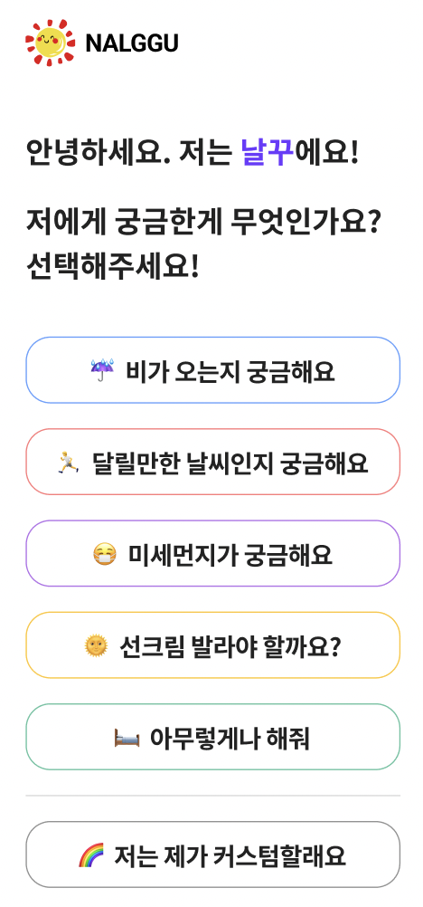

## 🔨 프로젝트 일지

> 정보 전달보단 프로젝트를 진행하며 겪은 점들, 느낀 점들을 기록한 일지

### `Project`: 테오의 스프린트 12기

프론트엔드 개발자로 구글링하다보면 누구나 한번쯤은 들어가보았을 [테오의 블로그](https://velog.io/@teo)<br/>
이번 프로젝트는 테오가 운영하는 `테오의 스프린트 12기`에 참여한 기록이다.<br/>
짧다면 짧은 5일의 기간 동안 처음 보는 사람들과 팀을 이뤄, `협업(테오가 제일 강조하는 부분)`을 배울 수 있는 좋은 기회라고 생각한다!

#### 😆 개발에 앞서

테오가 4일차에 보내주신 메일에 너무 좋은 내용들이 많아서 기록해둔다.

- 웹 서비스에 완성은 없다. 언제나 미완성인 상태로 업데이트를 할 수 있는 형태를 취하게 된다.
- 티저와 데모 사이트를 먼저 오픈하고 그럴듯하게 돌아가는 Tour(Demo)를 만들어, 실제 서비스를 릴리즈하고 고도화하는 과정을 겪게 된다.


자동차를 만든다고 할 때, 부품 하나하나를 추가하면서 아직 굴러가지 못하는 상태가 아니라 먼저 굴러가는 보드를 만들고 자전거가 되고 자동차가 되듯!!!!!<br/>
시작은 허술하고 미비할 수 있지만, 일단 그 기능이 돌아가게끔 하는 것! 그러면 잘 가는지 테스트도 해볼 수 있고, 어떤 디자인을 입히는 게 예쁜지 생각도 해볼 수 있을테니!

#### 개발 시작

알파카와 함께 첫 화면을 맡았다.



위와 같은 화면을 만들고, 위의 5개 버튼을 클릭 시 해당하는 컨셉의 날씨 정보 배치 데이터가 다음 페이지로 전달되어야한다.<br/>
또한, 마지막 6번째 버튼을 클릭 시 유저가 직접 날씨 정보를 배치하고 조정할 수 있는 커스텀 페이지로 이동한다.

각각의 선택지를 클릭하면 로컬스토리지처럼 리코일을 통해 전역으로 데이터 순서에 대한 정보가 담기게끔 로직을 짰다.

```tsx
import { atom } from 'recoil';
import { recoilPersist } from 'recoil-persist';
const { persistAtom } = recoilPersist();

export interface StartData {
  sort: string;
  category: string;
  title: string;
  size: string;
  color: string;
}

export const startState = atom<StartData[]>({
  key: 'startState',
  default: [],
  effects_UNSTABLE: [persistAtom],
});
```

```tsx
import React from 'react';
import styled from 'styled-components';

interface Props {
  title: string;
  icon: string;
  color: string;
}

// 선택지 컴포넌트

const StartSelectBox: React.FC<Props> = ({ title, icon, color }) => {
  return (
    <Wrapper color={color}>
      <Icon>{icon}</Icon>
      <Title>{title}</Title>
    </Wrapper>
  );
};

interface ColorProps {
  color: string;
}

const Wrapper = styled.div<ColorProps>`
  display: flex;
  border: solid ${(props) => props.color} 2px;
  justify-content: center;
  align-items: center;
  height: 5rem;
  width: 100%;
  margin-bottom: 2rem;
  border-radius: 30px;
  cursor: pointer;

  @media screen and (max-width: 32rem) {
    height: 3rem;
  }
`;

const Icon = styled.div`
  font-size: 2.5rem;
  margin-right: 1rem;
  @media screen and (max-width: 32rem) {
    font-size: 1.5rem;
  }
`;

const Title = styled.span`
  font-size: 1.5rem;
  font-weight: bold;
  @media screen and (max-width: 32rem) {
    font-size: 1rem;
  }
`;

export default StartSelectBox;
```

```tsx
import React from 'react';
import { useNavigate } from 'react-router-dom';
import { useRecoilState } from 'recoil';
import styled from 'styled-components';
import StartSelectBox from '../../component/start/startSelectBox';
import { startState } from '../../store/state/startData';
import theme from '../../styles/theme';

interface Props {
  title: string;
  icon: string;
  color: string;
  onClick: () => void;
}

const Start = () => {
  const colorChip = ['#FF7A7A', '#B470EA', '#FFC42E', '#61C3A0', '#929292'];
  const [startData, setStartData] = useRecoilState(startState);
  const presetData = {
    presets: [
      { id: '1', title: '비가 오는지 궁금해요', icon: '☔', color: '#609FFF' },
      {
        id: '2',
        title: '달릴만한 날씨인지 궁금해요',
        icon: '🏃',
        color: '#FF7A7A',
      },
      {
        id: '3',
        title: '하늘 상태가 궁금해요',
        icon: '🌤️',
        color: '#B470EA',
      },
      {
        id: '4',
        title: '꿉꿉하진 않은지 궁금해요',
        icon: '🌫️',
        color: '#FFC42E',
      },
      { id: '5', title: '아무렇게나 해주세요', icon: '🛏️', color: '#61C3A0' },
    ],
    selfCustom: [{ title: '제가 커스텀할래요', icon: '🌈', color: '#929292' }],
  };

  const initialData = [
    [
      {
        sort: '비',
        category: 'POP',
        title: '강수확률',
        size: '2',
        color: colorChip[Math.floor(Math.random() * colorChip.length)],
      },
      {
        sort: '비',
        category: 'PCP',
        title: '1시간 강수량',
        size: '2',
        color: colorChip[Math.floor(Math.random() * colorChip.length)],
      },
      {
        sort: '비',
        category: 'PTY',
        title: '강수형태',
        size: '2',
        color: colorChip[Math.floor(Math.random() * colorChip.length)],
      },
      {
        sort: '대기',
        category: 'SKY',
        title: '하늘상태',
        size: '1',
        color: colorChip[Math.floor(Math.random() * colorChip.length)],
      },
      {
        sort: '대기',
        category: 'TMP',
        title: '1시간 기온',
        size: '1',
        color: colorChip[Math.floor(Math.random() * colorChip.length)],
      },
      {
        sort: '바람',
        category: 'VEC',
        title: '풍향',
        size: '1',
        color: colorChip[Math.floor(Math.random() * colorChip.length)],
      },
      {
        sort: '바람',
        category: 'WSD',
        title: '풍속',
        size: '1',
        color: colorChip[Math.floor(Math.random() * colorChip.length)],
      },
    ],
    [
      {
        sort: '비',
        category: 'POP',
        title: '강수확률',
        size: '2',
        color: colorChip[Math.floor(Math.random() * colorChip.length)],
      },
      {
        sort: '대기',
        category: 'TMP',
        title: '1시간 기온',
        size: '2',
        color: colorChip[Math.floor(Math.random() * colorChip.length)],
      },
      {
        sort: '바람',
        category: 'WSD',
        title: '풍속',
        size: '2',
        color: colorChip[Math.floor(Math.random() * colorChip.length)],
      },
      {
        sort: '대기',
        category: 'SKY',
        title: '하늘상태',
        size: '1',
        color: colorChip[Math.floor(Math.random() * colorChip.length)],
      },
      {
        sort: '대기',
        category: 'REH',
        title: '습도',
        size: '1',
        color: colorChip[Math.floor(Math.random() * colorChip.length)],
      },
      {
        sort: '바람',
        category: 'VEC',
        title: '풍향',
        size: '1',
        color: colorChip[Math.floor(Math.random() * colorChip.length)],
      },
      {
        sort: '강수',
        category: 'SNO',
        title: '1시간 신적설',
        size: '1',
        color: colorChip[Math.floor(Math.random() * colorChip.length)],
      },
    ],
    [
      {
        sort: '대기',
        category: 'SKY',
        title: '하늘상태',
        size: '2',
        color: colorChip[Math.floor(Math.random() * colorChip.length)],
      },
      {
        sort: '대기',
        category: 'TMP',
        title: '1시간 기온',
        size: '2',
        color: colorChip[Math.floor(Math.random() * colorChip.length)],
      },
      {
        sort: '비',
        category: 'PCP',
        title: '1시간 강수량',
        size: '2',
        color: colorChip[Math.floor(Math.random() * colorChip.length)],
      },
      {
        sort: '바람',
        category: 'VEC',
        title: '풍향',
        size: '1',
        color: colorChip[Math.floor(Math.random() * colorChip.length)],
      },
      {
        sort: '바람',
        category: 'WSD',
        title: '풍속',
        size: '1',
        color: colorChip[Math.floor(Math.random() * colorChip.length)],
      },
      {
        sort: '대기',
        category: 'REH',
        title: '습도',
        size: '1',
        color: colorChip[Math.floor(Math.random() * colorChip.length)],
      },
      {
        sort: '비',
        category: 'POP',
        title: '강수확률',
        size: '1',
        color: colorChip[Math.floor(Math.random() * colorChip.length)],
      },
    ],
    [
      {
        sort: '대기',
        category: 'REH',
        title: '습도',
        size: '2',
        color: colorChip[Math.floor(Math.random() * colorChip.length)],
      },
      {
        sort: '비',
        category: 'POP',
        title: '강수확률',
        size: '2',
        color: colorChip[Math.floor(Math.random() * colorChip.length)],
      },
      {
        sort: '대기',
        category: 'TMP',
        title: '1시간 기온',
        size: '2',
        color: colorChip[Math.floor(Math.random() * colorChip.length)],
      },
      {
        sort: '바람',
        category: 'VEC',
        title: '풍향',
        size: '1',
        color: colorChip[Math.floor(Math.random() * colorChip.length)],
      },
      {
        sort: '바람',
        category: 'WSD',
        title: '풍속',
        size: '1',
        color: colorChip[Math.floor(Math.random() * colorChip.length)],
      },
      {
        sort: '대기',
        category: 'SKY',
        title: '하늘상태',
        size: '1',
        color: colorChip[Math.floor(Math.random() * colorChip.length)],
      },
      {
        sort: '비',
        category: 'PCP',
        title: '1시간 강수량',
        size: '1',
        color: colorChip[Math.floor(Math.random() * colorChip.length)],
      },
    ],
    [
      {
        sort: '대기',
        category: 'SKY',
        title: '하늘상태',
        size: '2',
        color: colorChip[Math.floor(Math.random() * colorChip.length)],
      },
      {
        sort: '대기',
        category: 'TMP',
        title: '1시간 기온',
        size: '2',
        color: colorChip[Math.floor(Math.random() * colorChip.length)],
      },
      {
        sort: '비',
        category: 'POP',
        title: '강수확률',
        size: '2',
        color: colorChip[Math.floor(Math.random() * colorChip.length)],
      },
      {
        sort: '비',
        category: 'PCP',
        title: '1시간 강수량',
        size: '1',
        color: colorChip[Math.floor(Math.random() * colorChip.length)],
      },
      {
        sort: '비',
        category: 'REH',
        title: '습도',
        size: '1',
        color: colorChip[Math.floor(Math.random() * colorChip.length)],
      },
      {
        sort: '바람',
        category: 'WSD',
        title: '풍속',
        size: '1',
        color: colorChip[Math.floor(Math.random() * colorChip.length)],
      },
      {
        sort: '바람',
        category: 'VEC',
        title: '풍향',
        size: '1',
        color: colorChip[Math.floor(Math.random() * colorChip.length)],
      },
    ],
  ];

  const navigate = useNavigate();

  const navigateSetup = () => {
    navigate('/setup');
  };

  const navigateMain = () => {
    navigate('/main');
  };

  const setStoreInitialData = (id: string) => {
    setStartData(initialData[Number(id) - 1]);
  };

  return (
    <>
      <Wrapper>
        <LogoWrapper>
          <Logo src="/assets/sun.png" />
          <AppTitle>NALGGU</AppTitle>
        </LogoWrapper>
        <HelloWrapper>
          <Hello>
            안녕하세요. 저는 <span>날꾸</span>에요! <br />
            <br />
            <span className="SubContent">저에게 궁금한게 무엇인가요? 선택해주세요!</span>
          </Hello>
        </HelloWrapper>
        <BoxWrapper>
          {presetData.presets.map((presetData) => (
            <div
              key={presetData.id}
              style={{ width: '100%' }}
              onClick={() => {
                setStoreInitialData(presetData.id);
                navigateMain();
              }}
            >
              <StartSelectBox
                key={presetData.id}
                title={presetData.title}
                icon={presetData.icon}
                color={presetData.color}
              />
            </div>
          ))}
          <Divider></Divider>
          <div style={{ width: '100%' }} onClick={navigateSetup}>
            <StartSelectBox
              title={presetData.selfCustom[0].title}
              icon={presetData.selfCustom[0].icon}
              color={presetData.selfCustom[0].color}
            />
          </div>
        </BoxWrapper>
      </Wrapper>
    </>
  );
};

const Wrapper = styled.div`
  padding-top: 3rem;
  padding-bottom: 3rem;
  display: flex;
  flex-direction: column;
  padding-left: 7rem;
  padding-right: 7rem;
  user-select: none;
  @media screen and (max-width: 32rem) {
    padding-left: 4rem;
    padding-right: 4rem;
  }
`;

const LogoWrapper = styled.div`
  display: flex;
  align-items: center;
  @media screen and (max-width: 32rem) {
    font-size: 0.5rem;
  }
`;

const HelloWrapper = styled.div`
  display: flex;
  justify-content: flex-start;
  margin-top: 2.5rem;
  margin-bottom: 2.5rem;
`;

const Hello = styled.div`
  font-size: 2rem;
  font-weight: bolder;
  span {
    color: #6d39ff;
  }
  @media screen and (max-width: 32rem) {
    font-size: 1.5rem;
  }

  .SubContent {
    color: black;
    font-size: 1.5rem;
    @media screen and (max-width: 32rem) {
      font-size: 1rem;
    }
  }
`;

const AppTitle = styled.span`
  font-size: 2rem;
  font-weight: bold;
  @media screen and (max-width: 32rem) {
    font-size: 1rem;
  }
`;
const Logo = styled.img`
  width: 5rem;
  margin-right: 0.5rem;
  @media screen and (max-width: 32rem) {
    width: 3rem;
  }
`;

const Divider = styled.div`
  width: 100%;
  margin-bottom: 2rem;
  border-top: solid 2px lightgray;
`;

const BoxWrapper = styled.div`
  display: flex;
  flex-direction: column;
  align-items: center;
`;

export default Start;
```

아직 리액트도 서툰데, 타입을 입히고 스타일드 컴포넌트, 리코일 등을 다루는 게 정말 정말 어려웠고 혼자 이해하려고 열심히 구글링하고 찾아보면서 진행했다.<br/>
솔직히 전부 내가 작성한 코드도 아닐뿐더러, 루이와 알파카가 함께 하며 진행하였기에 이 정도 결과가 나올 수 있었다.<br/>

#### 마무리 회고

사실 아직 배울 것이 많은 실력이기에, 이번 프로젝트에서는 많은 사람들을 만나고 협업하는 프로세스를 배우고 싶은 게 가장 최우선이었다.<br/>
루이, 알파카, 힝, 브이, 헤이든, 자만, 가너 모두모두 둥글둥글하고 순둥순둥한 사람들이 모여서 서로 예민한 부분들 하나 없이 즐겁게 프로젝트를 진행할 수 있었다.(서로 아예 모르는 사람들 8명이 모여서 이 정도로 트러블, 마찰 없이 일이 진행되는 게 신기했을 정도)<br/>
또, 개발 공부를 시작하고 이렇게 많은 인원들과 프로젝트를 해본 경험이 없었기에 더더더 값지고 소중한 시간이었다. 정말 약 5일이라는 시간이 후루루루룩 갔고 매일 새벽 늦게까지 스터디카페에서, 게더타운에서 프로젝트도 진행하고 소소한 이야기들도 주고 받은 게 기억에 많이 남는다.<br/>
좀 더 시간이 있고, 좀 더 나라는 사람의 실력이 높아지면 더더 의미있고 완성도 있는 서비스를 만들 수 있을 것이란 확신을 얻었고 팀원들을 보며 더 큰 의욕도 키울 수 있었다.<br/>
이렇게 좋은 경험을 하게 해준 테오에게 정말 감사드리고, 우리 날꾸를 함께만든 7명의 팀원들에게도 정말 정말 감사드린다.


> 사실 더 길게 자세히 적을 수 있지만, 일단은 이 정도로 적고 추후 더 추가되는 내용으로 정리하려 한다. 😁

```toc

```
